

## Valerio Pascucci

Valerio Pascucci is the founding Director of the [Center for Extreme Data Management Analysis and Visualization](http://www.cedmav.com/) (CEDMAV) of the University of Utah. Valerio is also a Faculty of the [Scientific Computing and Imaging Institute](http://www.sci.utah.edu/), a Professor of the School of Computing, University of Utah, and a DOE Laboratory Fellow, of the Pacific Northwest National Laboratory.

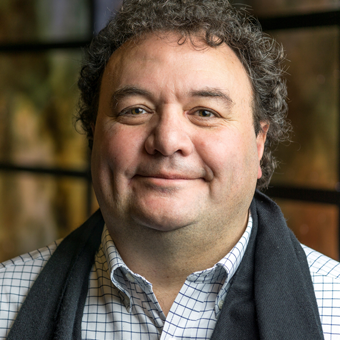 

 

## Michela Taufer

Michela Taufer holds the Jack Dongarra Professorship in High Performance Computing within the Department of Electrical Engineering and Computer Science at the [University of Tennessee, Knoxville](https://www.utk.edu/). 

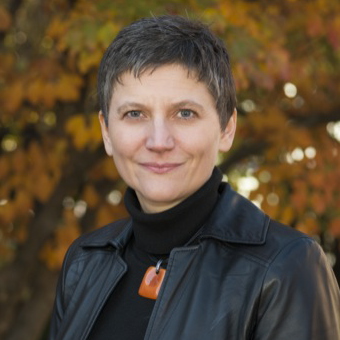

 

## Frank Wuerthwein

Frank Würthwein is the Director of the [San Diego Supercomputer Center](https://www.sdsc.edu/) and the Executive Director of the [Open Science Grid](https://opensciencegrid.org/). He is also a physics professor at [UC San Diego](https://ucsd.edu/)

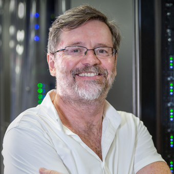

 

## Alex Szalay

Alex Szalay is a Bloomberg Distinguished Professor of physics and astronomy and computer science at the [Johns Hopkins University](https://www.jhu.edu/). He is the Director of the Institute for [Data Intensive Science](https://idies.jhu.edu/).

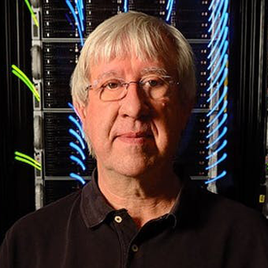

 

## John Allison 

John E. Allison, is a Professor of Materials Science and Engineering at The [University of Michigan](https://umich.edu/) where he is Director of the [Center for PRedictive Integrated Structural Materials Science](http://www.prisms-center.org/) (PRISMS).

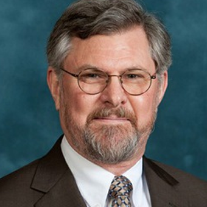

 

## Giorgio Scorzelli  

Giorgio Scorzelli is Director of Software Development at the [Center for Extreme Data Management Analysis and Visualization](http://www.cedmav.com/) (CEDMAV). Director of Software Development of of the [National Science Data Fabric](http://nationalsciencedatafabric.org/) (NSDF). 

 

## Glenn Tarcea

Glenn Tarcea is Research Computer Specialist at the [University of Michigan](https://umich.edu/).
University of Michigan

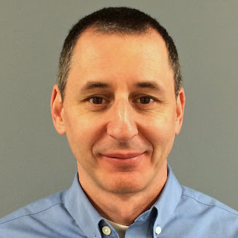

 

## Attila Gyulassy  

Attila Gyulassy is Research Scientist at the [Scientific Computing and Imaging Institute](http://www.sci.utah.edu/).

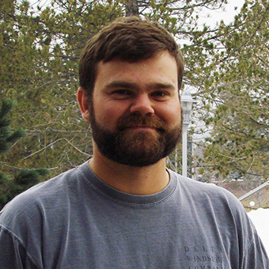

 

## Ivan Rodero  

Ivan Rodero is Associate Director and Associate Research Professor at the [Rutgers Discovery Informatics Institute](https://rdi2.rutgers.edu/) (RDI2) at Rutgers, the State University of New Jersey.

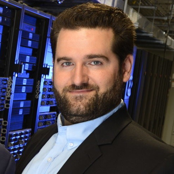

 

## John Goodhue  

John Goodhue is the Executive Director of the [Massachusetts Green High Performance Computing Center](https://www.mghpcc.org/)

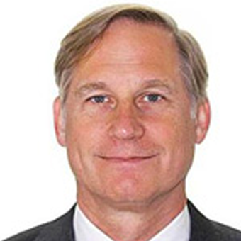

 

## Christine Kirkpatrick 

Christine Kirkpatrick  leads the San Diego [San Diego Supercomputer Center](https://www.sdsc.edu/) (SDSC) Research Data Services Division. She oversees the infrastructure (cloud, networking, storage), data center/colocation facility, and data initiatives group. Christine co-Chairs the Federated Infrastructure Working Group, is part of the [Open Storage Network](https://www.openstoragenetwork.org/) leadership, and represents various FAIR and data initiatives including [GO FAIR US](https://gofair.us/), the [West Hub](https://www.westbigdatahub.org/) and [CODATA](https://codata.org/). 

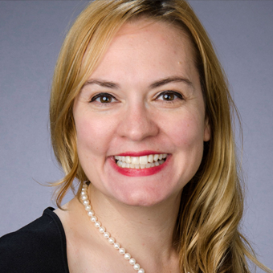

 

## Kevin Coakley

Kevin is a Senior Storage Systems Engineer in the IT Division at the [San Diego Supercomputer Center](https://www.sdsc.edu/) (SDSC). Kevin works with researchers at SDSC, across campus, and other UC schools to create purpose-built compute and storage platforms using open-source software. Kevin co-Chairs the Federated Infrastructure Working Group and is a senior technical partner on the [Open Storage Network](https://www.openstoragenetwork.org/).

 

## Danny Saba

Danny Saba is a Systems Integration Engineer at [San Diego Supercomputer Center](https://www.sdsc.edu/) (SDSC) at the [University of California San Diego](https://ucsd.edu/). Danny plans, designs, develops, modifies, and deploys complex systems integration solutions. Danny is working with science drivers on integrating and tuning resources for a streamlined NSDF.

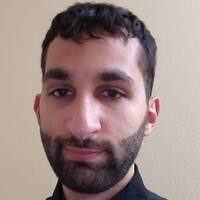

 

## Julianne Christopher-Ohlin 

Julie is a Project Manager in the Research Data Services division at the [San Diego Supercomputer Center](https://www.sdsc.edu/) (SDSC). Julie works with PIs at SDSC to coordinate the grant proposal processes, to manage funding requirements, and to track goal objectives. Julie supports the Federated Infrastructure Working Group.

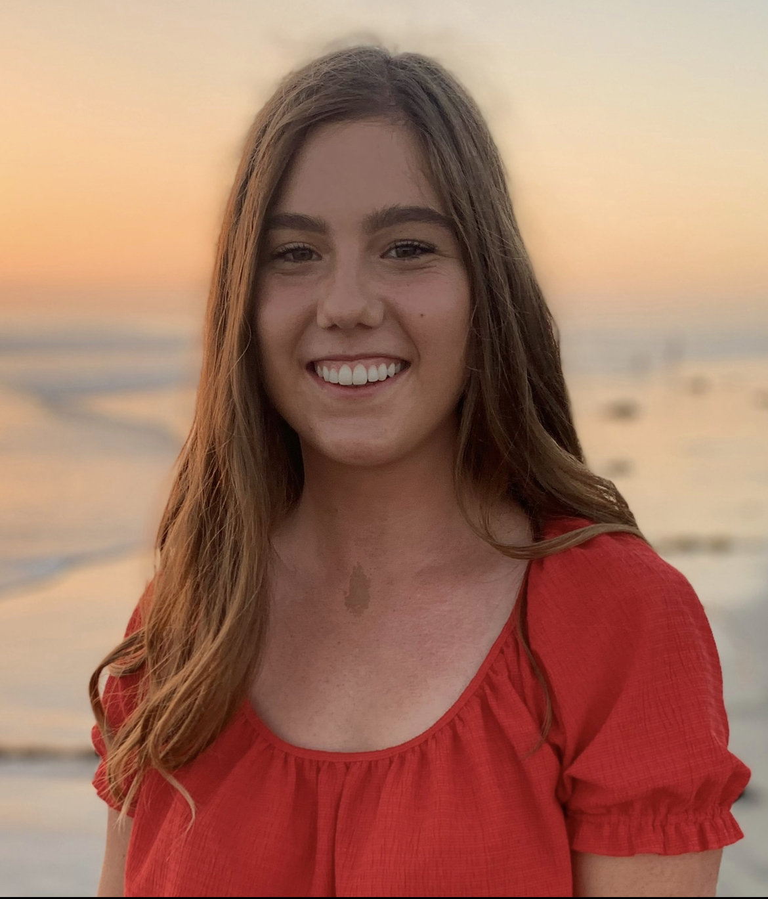

 

## Colby Walsworth 

Colby Walsworth is a Senior Cloud Engineer at [San Diego Supercomputer Center](https://www.sdsc.edu/) (SDSC) at the [University of California San Diego](https://ucsd.edu/). Colby works with researchers at UCSD and outside to help facilitate computing workflows using the SDSC cloud compute platform.

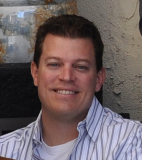

 

## Naweiluo Zhou

Naweiluo Zhou is a Postdoctoral Researcher at the [University of Tennessee, Knoxville](https://www.utk.edu/).

 

## Jakob Luettgau

Jakob Luettgau is a Postdoctoral Researcher at the [University of Tennessee, Knoxville](https://www.utk.edu/).

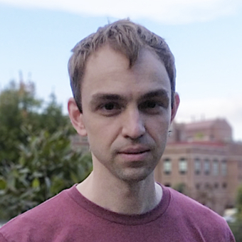

 

## Paula Fernanda Olaya Garcia

Jakob Luettgau is a Doctoral Student at the  [University of Tennessee, Knoxville](https://www.utk.edu/).

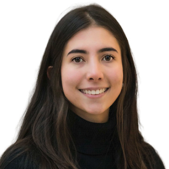

 

## Daniel Balouek Thomert

Daniel Balouek-Thomert is a Research Associate at the Rutgers Discovery Informatics Institute[Rutgers Discovery Informatics Institute](https://rdi2.rutgers.edu/) (RDI2).

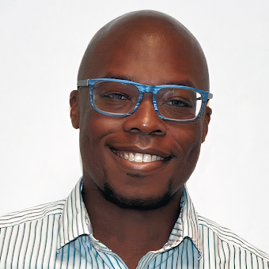

 

## Steve Petruzza

Steve Petruzza is a Research Assistant at the [Scientific Computing and Imaging Institute](http://www.sci.utah.edu/) and an Assistant Professor in the Computer Science department at [Utah State University](https://www.usu.edu/).

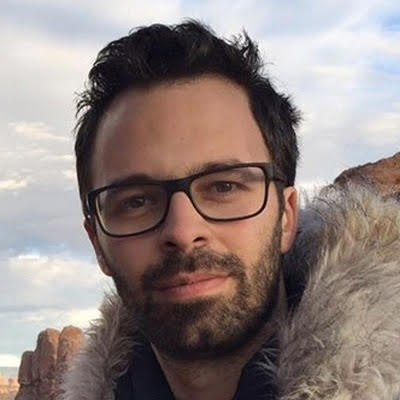

 

## Owen Koppe

Owen Koppe is a Research Assistant at the [Scientific Computing and Imaging Institute](http://www.sci.utah.edu/) and an undergraduate at the University of Utah.

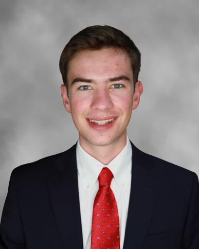

 

## Deborah Dent

Deborah Dent  is the Chief Information Officer at [Jackson State University](https://www.jsums.edu/).

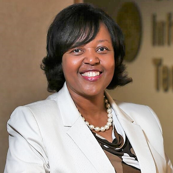

 

## Damian Clarke

Damian Clarke is  Chief Information Officer and  Associate Professor at the [Meharry Medical College](https://home.mmc.edu/).

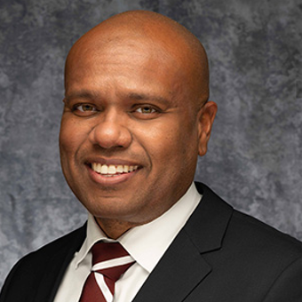

 

## Brian Schuster

Brian Schuster is Associate Professor at the [University of Texas at El Paso](https://www.utep.edu/).

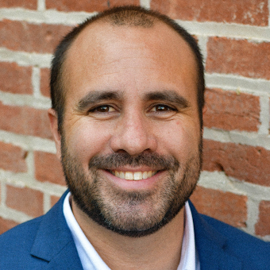

 

<!--
## Karan Bathia
Google Cloud Liason

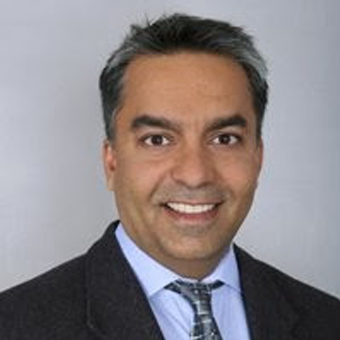

 
-->

## Masa Prodanovic

Masa Prodanovic is Associate Professor at [University of Texas)](https://www.utexas.edu/) at Austin.
University of Texas

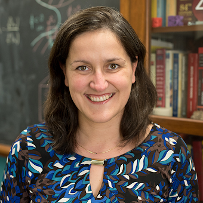

 

## Seelam Seetharami

Seelam Seetharami is a Principal Research Staff Member at [IBM Research](https://research.ibm.com/).

 

## I-hsin Chung

I-hsin Chung is a Research Staff Member at [IBM Research](https://research.ibm.com/).

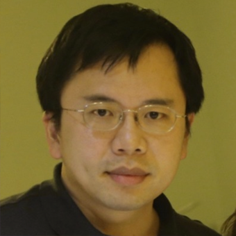

 
