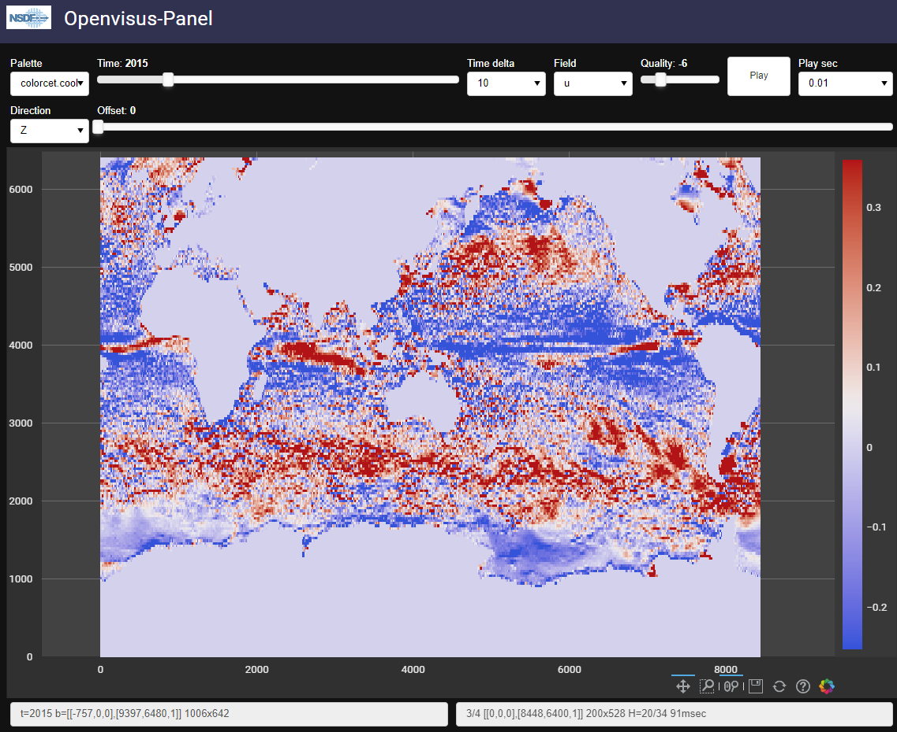
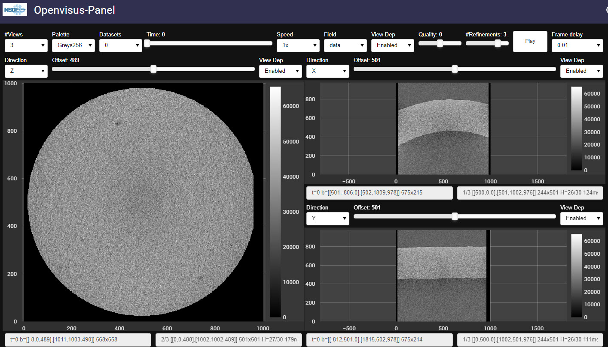
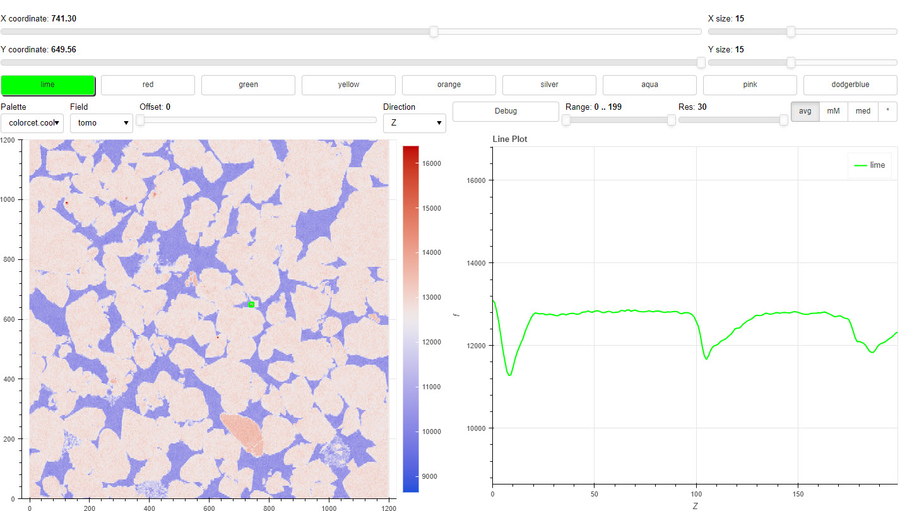
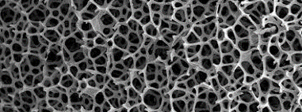
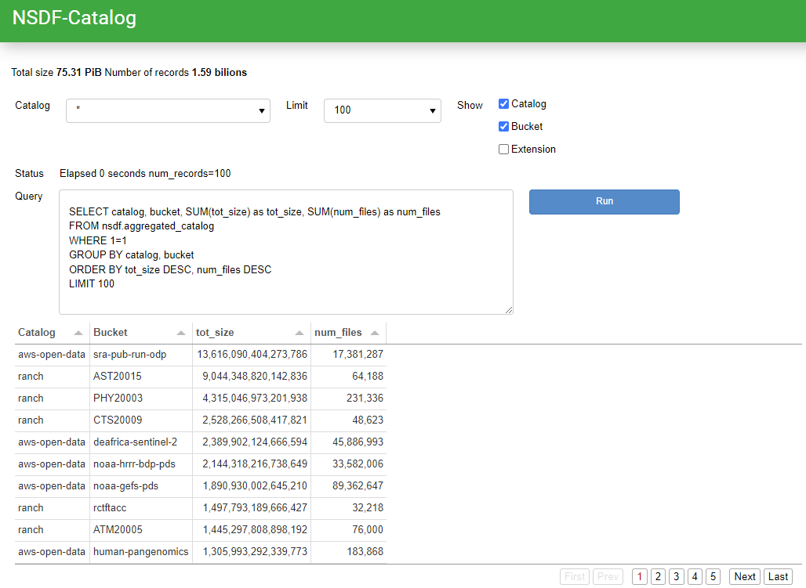
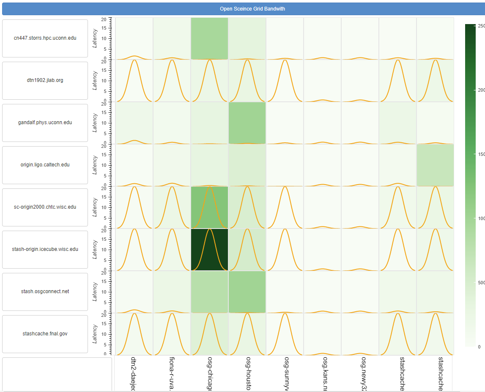
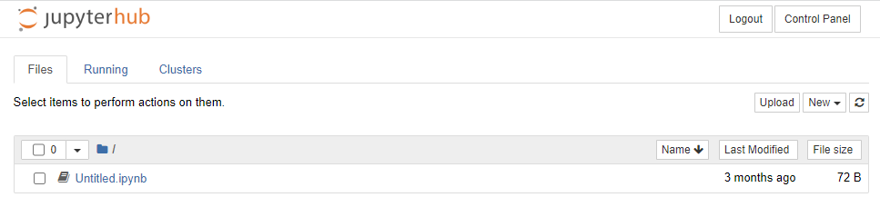
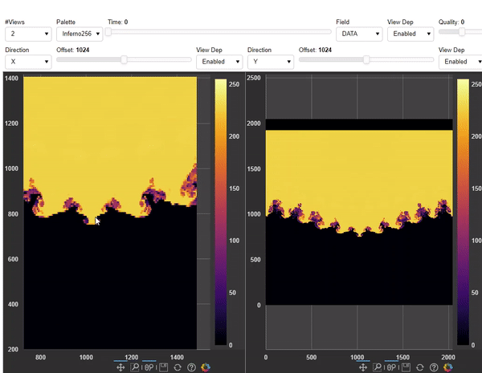
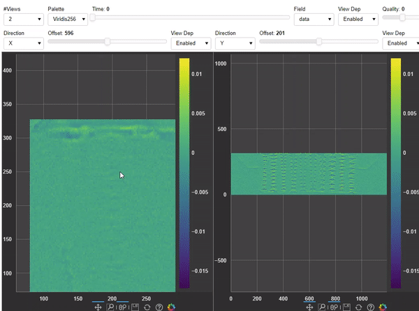
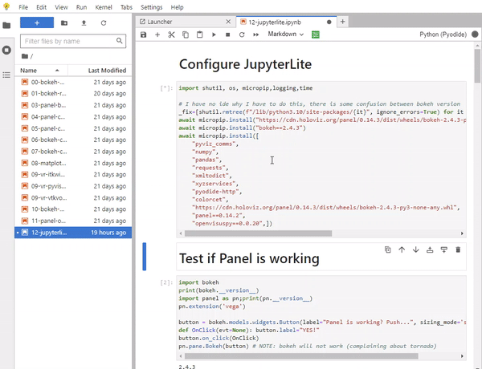

# NASA

[DEMO](http://services.nationalsciencedatafabric.org/nasa) 

Over 200TB of NASA climate data is now accessible through the collaboration between Seal Storage Technology and the University of Utah's Scientific Computing and Imaging Institute (SCI), enabling researchers around the world to access and visualize the data with zero egress fees.

Press release [Here](
https://www.prnewswire.com/in/news-releases/seal-storage-technology-and-the-university-of-utah-announce-nasa-climate-data-democratization-partnership-301795817.html) and [Here](https://www.sealstorage.io/blog/utah)

 

 

# NASA bellows

[DEMO](http://services.nationalsciencedatafabric.org/bellows)

 

 

# CHESS

[DEMO](http://services.nationalsciencedatafabric.org/chess) 

 

 

# MATERIAL SCIENCE

[DEMO@CHPC2](http://chpc2.nationalsciencedatafabric.org:10003/materialscience/run) 
[EMO@CHPC3][http://chpc2.nationalsciencedatafabric.org:10003/materialscience/run)
[DEMO@SERVICES](http://services.nationalsciencedatafabric.org/materialscience) 

We present a framework for analyzing internal material structures (e.g., cracks) to mitigate these bottlenecks. We demonstrate the effectiveness of our framework for a workflow
performing synchrotron X-ray computed tomography reconstruction and segmentation of a silica-based structure.

 

 

# CATALOG

**DoubleCloud is a National Science Data Democratization Consortium (NSDDC) member and generously hosts the NSDF Catalog for free.** 

[DEMO](http://catalog.nationalsciencedatafabric.org:10002/catalog/run) 

Multi-federation Catalog for Petabytes of Community Data
As part of the NSF-funded National Science Data Fabric (NSDF) initiative, we are developing a lightweight software library to index large-amounts of scientific data and facilitate discoverability.

Documentation is [Here](http://www.sci.utah.edu/publications/Lue2022a/catalog.pdf) and [Here](https://nationalsciencedatafabric.org/catalog3d.html)

 

 

# OSDF

[DEMO](http://osdf.nationalsciencedatafabric.org:10011/osdf/run)

The Open Science Data Federation (OSDF) is an OSG service designed to support the sharing of filesstaged in autonomous "origins", for efficient access to those files from anywhere in the world via aglobalnamespace and network of caches.

 

 

# NSDF JUPYTERHUB 

 

 

[jupyter-1](http://chpc1.nationalsciencedatafabric.org) [jupyter-2](http://chpc2.nationalsciencedatafabric.org) [jupyter-3](http://chpc3.nationalsciencedatafabric.org)

# WASM

OpenVisus running in WebAssembly.

Remember:
- Use Google Chrome
- First time it can take up to 2 minutes to run
- Gets data from CEDMAV HTTPS OpenVisus server
- Needs a resize of the window  

##  David WASM

OpenVisus running in Panel dashboard in Chrome through WebAssembly (WASB).
Try the PyScript Panel [Here]({{ site.baseurl }}/david_subsampled.html)

 

 

## 2kbit1 WASM

OpenVisus running in Panel dashboard in Chrome through WebAssembly (WASB).
Try the PyScript Panel [Here]({{ site.baseurl }}/2kbit1.html)

 

 

## Chess WASM

OpenVisus running in Panel dashboard in Chrome through WebAssembly (WASB).
Try the PyScript Panel [Here]({{ site.baseurl }}/chess_zip.html)

 

 

## JupyterLite WASM

OpenVisus running in Jupyter Notebook in Chrome through WebAssembly (WASB).
Try the `12-jupyterlite.ipynb` Notebook  **[Here]({{ site.baseurl }}/jupyterlite/index.html)**

 

 

