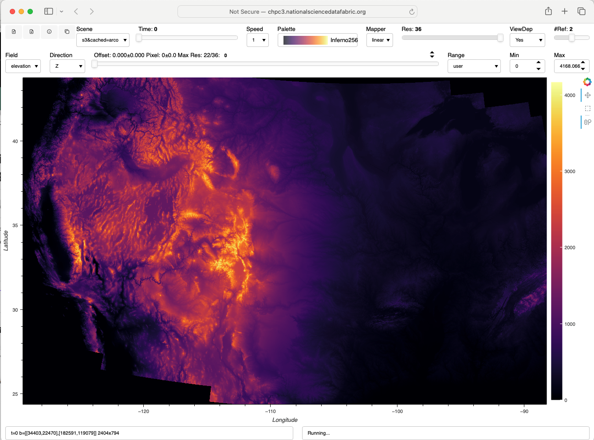
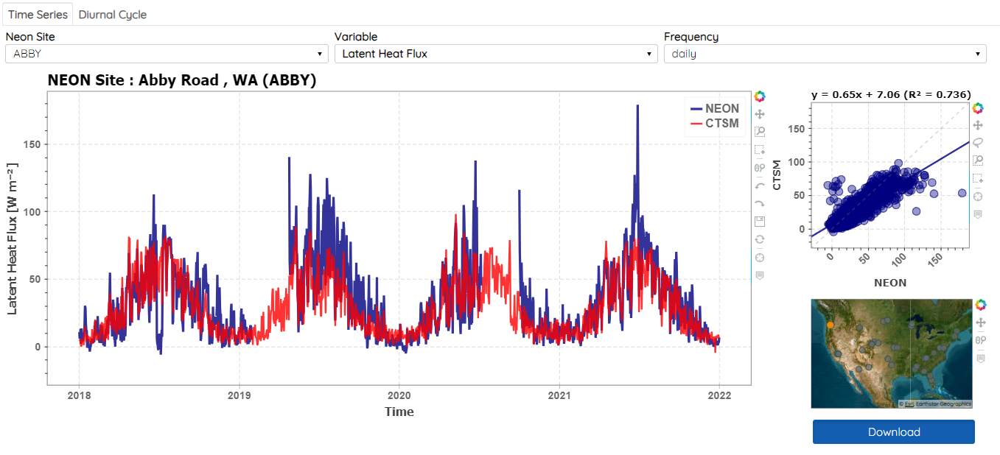
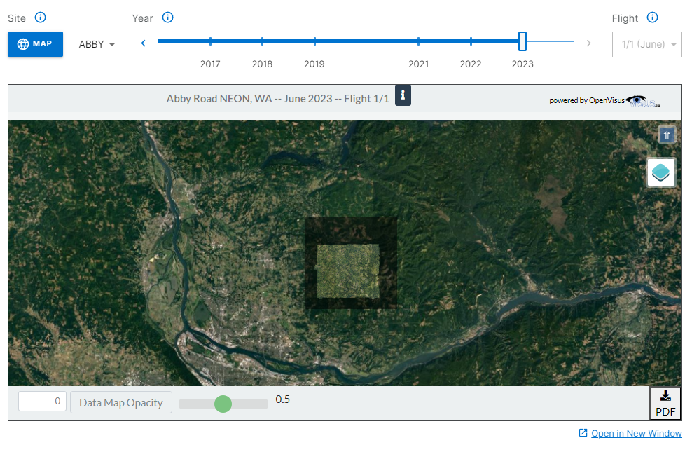
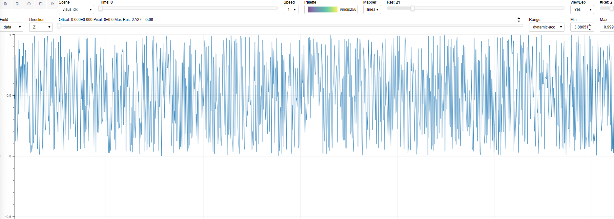

# Climate Modeling

[NASA](http://services.nationalsciencedatafabric.org/nasa) 
[NASA2](http://services.nationalsciencedatafabric.org/nasa2) 
[BELLOWS](http://services.nationalsciencedatafabric.org/bellows)

Over 200TB of Climate Modeling data is now accessible through the collaboration between Seal Storage Technology and the University of Utah's Scientific Computing and Imaging Institute (SCI), enabling researchers around the world to access and visualize the data with zero egress fees.

<div align="center">
 
</div> 

<div align="center">
 
</div> 

# GEOTiled: End-to-End Analysis and Visualization of Large Scientific Data

[CONUS 30M - DEMO](http://chpc3.nationalsciencedatafabric.org:8989/dashboards) 
[Tutorial - Recording](https://drive.google.com/file/d/1-dB0YyPbEOFqG0jdIH6Y1Bmfq_EGEW3b/view?usp=share_link) 

GEOTiled is a scalable, modular workflow that generates large datasets of high-resolution terrain parameters.

<div align="center">
 
</div> 

# CHESS

[DEMO](http://services.nationalsciencedatafabric.org/chess) 

<div align="center">
 
</div> 


# MATERIAL SCIENCE

[DEMO@CHPC2](http://chpc2.nationalsciencedatafabric.org:10003/materialscience/run) 

[DEMO@CHPC3](http://chpc3.nationalsciencedatafabric.org:10003/materialscience/run)

We present a framework for analyzing internal material structures (e.g., cracks) to mitigate these bottlenecks. We demonstrate the effectiveness of our framework for a workflow
performing synchrotron X-ray computed tomography reconstruction and segmentation of a silica-based structure.

<div align="center">
 
</div> 


# CATALOG

**DoubleCloud is a National Science Data Democratization Consortium (NSDDC) member and generously hosts the NSDF Catalog for free.** 

[DEMO](http://services.nationalsciencedatafabric.org/catalog) 

Multi-federation Catalog for Petabytes of Community Data
As part of the NSF-funded National Science Data Fabric (NSDF) initiative, we are developing a lightweight software library to index large amounts of scientific data and facilitate discoverability.

Documentation is [Here](http://www.sci.utah.edu/publications/Lue2022a/catalog.pdf) and [Here](https://nationalsciencedatafabric.org/catalog3d.html)

<div align="center">
 
</div> 

# OSDF

[DEMO](http://services.nationalsciencedatafabric.org/osdf)

The Open Science Data Federation (OSDF) is an OSG service designed to support the sharing of files staged in autonomous "origins", for efficient access to those files from anywhere in the world via a global namespace and network of caches.

<div align="center">
 
</div> 

# NCAR 

[DEMO](https://ncar.nationalsciencedatafabric.org/neon-demo/v1)

The National Center for Atmospheric Research (NCAR) is a Federally Funded Research and Development Center, sponsored by NSF. NCAR is a focal point for research in the field of atmospheric sciences and is located in Boulder, Colorado. About 750 scientists and support personnel work at the center.

<div align="center">
 
</div> 

# NEON

[DEMO](https://data.neonscience.org/data-products/DP3.30010.001)

The NSF National Ecological Observatory Network (NEON) has a large amount of image data from Airborne Observation Platforms (AOP) that is publicly available to their users.

`This viewer allows for interactive exploration of remotely sensed data from the Airborne Observation Platform (AOP). Change the field site and flight for this data product using the tools below to stream different data into view. Pan and zoom in the view to stream higher-resolution imagery. This pilot data viewer is provided through a collaboration with the Visus Project at the Univeristy of Utah and more updates are planned for the future.``

<div align="center">
 
</div> 

# 1D SIGNALS

[DEMO](http://services.nationalsciencedatafabric.org/signal1d)

```
8GB 1D signal
1,073,741,824 float64 samples
```

<div align="center">
 
</div> 

# NSDF JUPYTERHUB 

<div align="center">
 
</div> 

Links:
- [chpc1](http://chpc1.nationalsciencedatafabric.org) 
- [chpc2](http://chpc2.nationalsciencedatafabric.org) 
- [chpc3](http://chpc3.nationalsciencedatafabric.org)

# (DEPRECATED) WASM

OpenVisus running in WebAssembly.

Remember:
- Use Google Chrome
- First time it can take up to 2 minutes to run
- Gets data from CEDMAV HTTPS OpenVisus server
- Needs a resize of the window  

##  David WASM

OpenVisus running in Panel dashboard in Chrome through WebAssembly (WASB).
Try the PyScript Panel [Here]({{ site.baseurl }}/david_subsampled.html)

<div align="center">
 
</div> 

## 2kbit1 WASM

OpenVisus running in Panel dashboard in Chrome through WebAssembly (WASB).
Try the PyScript Panel [Here]({{ site.baseurl }}/2kbit1.html)

<div align="center">
 
</div> 

## Chess WASM

OpenVisus running in Panel dashboard in Chrome through WebAssembly (WASB).
Try the PyScript Panel [Here]({{ site.baseurl }}/chess_zip.html)

<div align="center">
 
</div> 

## JupyterLite WASM

OpenVisus running in Jupyter Notebook in Chrome through WebAssembly (WASB).
Try the `12-jupyterlite.ipynb` Notebook  **[Here]({{ site.baseurl }}/jupyterlite/index.html)**

<div align="center">
 
</div> 
<br>
<br>
<br>
