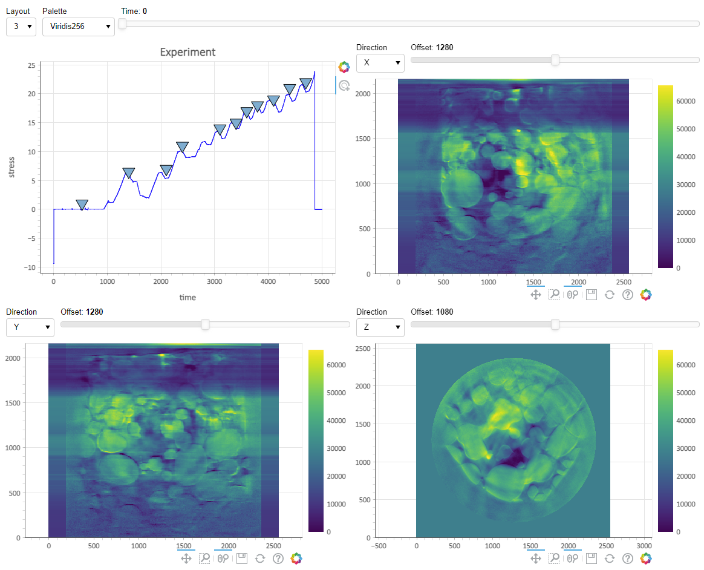

<!--
seee https://about.gitlab.com/blog/2016/07/19/markdown-kramdown-tips-and-tricks/
-->

{::options parse_block_html="true" /}

# Who we are

(test)

We are on the cusp of tremendous discoveries in data-driven science, thanks to ongoing investments from NSF and other agencies into shared experimental and computing facilities, including synchrotron light sources, various telescopes, Lepton and Hadron colliders, X-Ray and Neutron Imaging, multispectral satellite imagery, neutrino detectors, and light, confocal, electron and X-Ray microscopes. 

These investments are increasing data generation by orders of magnitude. However, because of traditional funding models and barriers between application domains, scientists still deploy domain-specific data repositories and computational workflows siloed in vertical ecosystems built only for the scientists’ specific projects. As data-driven sciences become more complex, the lack of integration limits the scientists’ ability to manage the ever-increasing amount of data. 

Several national reports have stressed the need for a shared set of services, and major facilities recognize the benefits of adopting such an integrated approach to data.

To address this challenge, we are building a National Science Data Fabric (NSDF) and introducing a novel trans-disciplinary approach for integrated data delivery and access to shared storage, networking, computing, and educational resources that will democratize data-driven scientific discovery.

# Intellectual Merit

The NSDF pilot **connects an open network of institutions**, including minority serving institutions, by deploying a federated data fabric testbed configurable for individual and shared scientific use.

The NSDF pilot **offers a shared, modular, containerized data delivery environment**, operating at the best economies of scale, the NSDF pilot demonstrates a key technology to fill the *missing middle* in our current computational infrastructure. 

The NSDF pilot **builds a shared resource for equity in data access** across a diversity of disciplines, institutions, and people.

The NSDF pilot embraces the motto of the [Minority Serving Cyberinfrastructure Consortium](https://www.ms-cc.org/) (MS-CC) of **accomplishing together what we cannot do separately**. 

The NSDF pilot **connects data sources** with compute and networking components through a software stack that democratizes data delivery and empowers end users with scalable, easy-to-use, integrated, and extendable tools. 

# Broader Impacts

The NSDF pilot provides a platform and a model for equity in access to data and CI resources for a broad class of disciplines including materials sciences, earth sciences, comparative connectomics, astronomy, social sciences, biology, chemistry, medicine, physics, and economics. 

The NSDF testbed directly enables fast-paced design and testing of new materials benefiting society at large in critical fields such as energy, security, environment, and healthcare. 

The NSDF pilot  supports  the [IceCube neutrino observatory](https://icecube.wisc.edu/) and the XenonNT dark matter detector advances the understanding of the evolution of galaxies and the nature of “dark matter” and “dark energy.

<table style="border: 0px;">
<tr style="border: 0px;">
<td style="border: 0px;"></td>
<td style="border: 0px;">This material is based upon work supported by the National Science Foundation under Grant No. 2138811.</td>
</tr>
</table>

