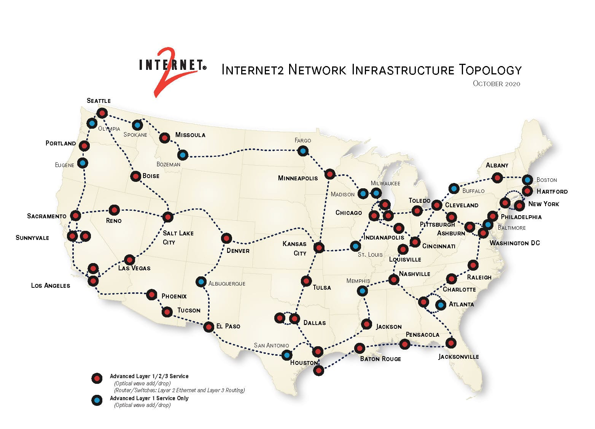
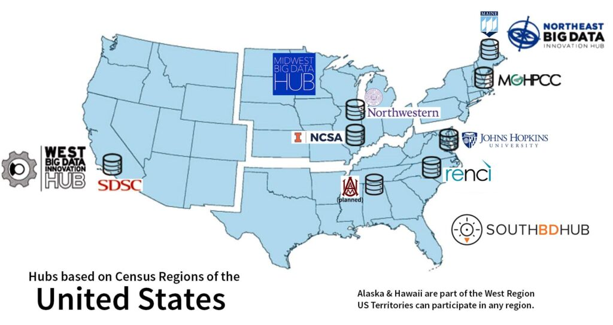
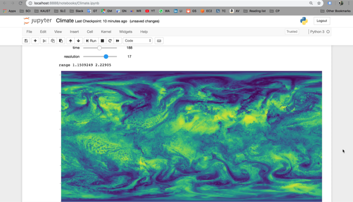
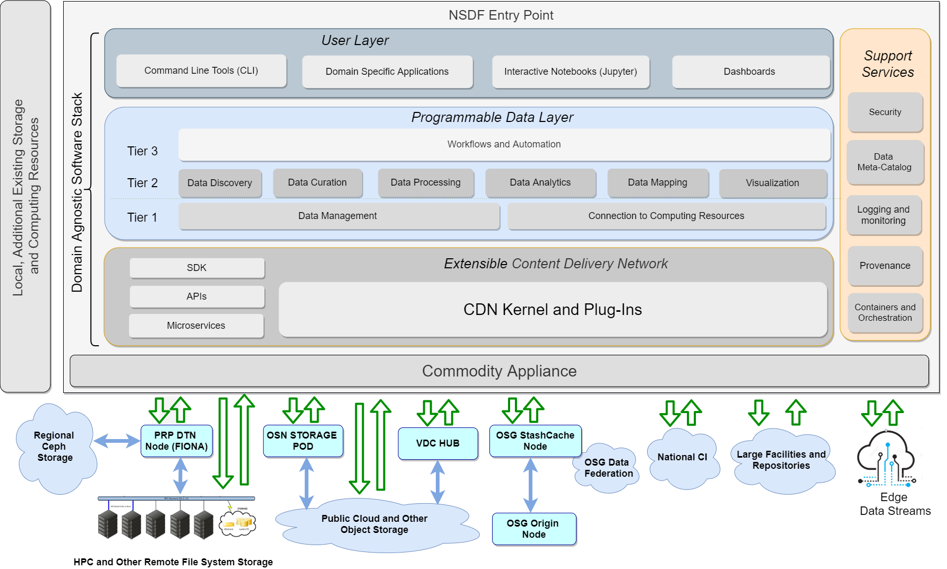

# High Speed Network

The NSDF pilot relies on a *high speed network* infrastructure provided by the [Internet2](https://internet2.edu/) alliance.

High Speed Network infrastructures support data transfer to, from, or between storage resources and entry points. These operations take place over Internet2 and its 100Gbps backbone, leveraging [NSF](https://www.nsf.gov/) investments
such as [XSEDE resources](https://www.xsede.org/ecosystem/resources). 

Internet2 delivers betweens 400 Gbps and 1.6 Tbps of capacity to each of 48 nodes throughout the continental US and will support substantial
growth beyond the currently delivered 10PB a day (2EB a year). 

<!--

# Open Storage Network

-->

# Workforce education and outreach

The NSDF pilot relies on *set of workforce education and outreach activities* using a holistic and agile deployment to validate the effectiveness of the NSDF pilot and gather community feedback.

To verify that the NSDF infrastructure can deliver the services to diverse communities as envisioned, in this program we will collaborate with Professor [Brian Schuster](https://hb2504.utep.edu/Home/Profile?username=bschuster) at [the University of Texas El Paso](https://www.utep.edu/) to demonstrate the potential of information repositories such as Materials Commons for re-use of data in teaching and research
projects. 

The students at this Hispanic-serving institution will have direct access to cutting edge materials characterization data and diagnostic techniques with a few mouse clicks. 

These real-life materials examples will offer immediate educational enrichment and an opportunity to immerse themselves in four dimensional
experimental and computational data that is the foundation of modern materials by design.

# Entry Points

The NSDF pilot relies on *Entry Points* providing a uniform set of services for small, medium, and large target computing centers and cloud providers, academic and commercial.

NSDF Entry Point is provided to the user with its domain agnostic software stack and a set of recommendations for a possible commodity appliance that depends on the level of services expected.

