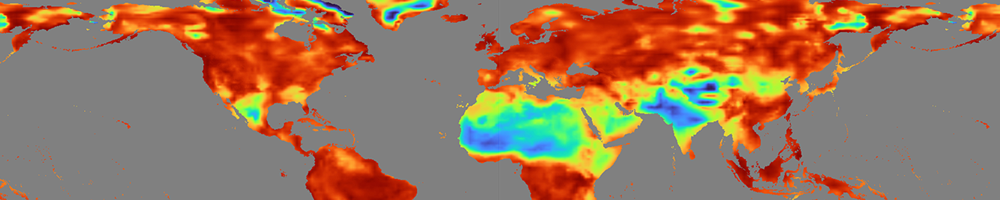

# Assessing Extreme Weather Statistics using NASA Earth eXchange Global Daily Downscaled Projections (NEX-GDDP-CMIP6)

This ARSET training focuses on assessing projected statistics of extreme heat and cold wave events and extreme precipitation excess and deficit events.

 [Link](https://www.earthdata.nasa.gov/learn/trainings/assessing-extreme-weather-statistics-using-nasa-earth-exchange-global-daily)

# NASA ARSET: Applied Remote Sensing Training

NASA’s Applied Remote Sensing Training (ARSET) program is part of NASA’s Capacity Building efforts, designed to empower individuals and organizations worldwide to use Earth science data for environmental management and decision-making. NSDF is providing a platform and cyberinfrastructure support for ARSET to share training resources and materials.

## What is ARSET?

ARSET provides free training on how to access, analyze, and apply NASA satellite data for real-world applications. The program focuses on remote sensing techniques and their use in areas such as:

- Water resources management
- Disaster response
- Land cover and land use change
- Air quality monitoring
- Climate change adaptation

## Who Can Participate?

ARSET trainings are open to:

- Government agencies
- Non-governmental organizations (NGOs)
- Academic institutions
- Private sector professionals
- Anyone interested in learning about remote sensing

## Training Formats

ARSET offers:

- **Webinars:** Live, interactive online sessions with NASA experts.
- **Self-paced courses:** Recorded modules and resources for flexible learning.
- **Workshops:** In-person or virtual events for hands-on experience.

## How to Get Started

Visit the [NASA ARSET website](https://appliedsciences.nasa.gov/what-we-do/capacity-building/arset) to:

- Browse upcoming and past trainings
- Access training materials and resources
- Register for webinars and courses

## Why ARSET Matters

By making NASA Earth science data accessible and understandable, ARSET helps communities and organizations make informed decisions for a more sustainable future.

---
*Learn more at [NASA ARSET](https://appliedsciences.nasa.gov/what-we-do/capacity-building/arset)
