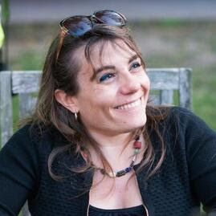

# The third National Science Data Fabric (NSDF) in-person meeting held in San Diego, California on April 12-13.

**University of California, San Diego**  
San Diego Supercomputer Center 
10100 Hopkins Drive, La Jolla, CA 92093 

# Keynote

Keynote Speaker: **Maria Elena Monzani, Stanford U.**

Title: *Data-Intensive search for Dark Matter with the LUX-ZEPLIN experiment*

### Abstract

The nature and origin of dark matter are among the most compelling mysteries of contemporary science. There is strong evidence for dark matter from its role in shaping the galaxies and galaxy clusters that we observe in the universe. Still, physicists have tried to detect dark matter particles for over three decades with little success.

This talk will describe the leading effort in that search, the LUX-ZEPLIN (LZ) detector. LZ is an instrument that is superlative in many ways. It consists of 10 tons of liquified xenon gas, maintained at almost atomic purity and stored in a refrigerated titanium cylinder a mile underground in a former gold mine in Lead, South Dakota.

​During its science run, LZ is projected to accumulate a massive dataset of many petabytes of data and record several billions of particle interactions, only a handful of which might be produced by potential dark matter candidates (if nature cooperates). Identifying the dark matter signals in this amassment of data represents an extreme “needle in a haystack” problem and requires leveraging advanced detector design and state-of-the-art machine learning algorithms. The talk will present challenges in constructing this large-scale underground experiment and interpreting its data, along with the prospects LZ presents for finally discovering the dark matter particle and recently released results from its initial search for new physics.

### Bio

Maria Elena Monzani is a dark matter data wrangler. Her research field is Astroparticle physics, which focuses on topics at the intersection between particle physics and astrophysics/cosmology, using the tools of data-intensive science. She received a dual Ph.D. from the University of Milano and the University of Paris 7, performing research with the Borexino experiment that measured neutrinos produced by the Sun. She then held a postdoctoral position at Columbia University before joining SLAC in 2007 to work on the Fermi Gamma-ray Space Telescope. Today, Monzani is a lead scientist at SLAC and a senior Kavli Institute for Particle Astrophysics and Cosmology member at Stanford. She leads the software computing effort for the LZ Dark Matter Experiment and the science operations team for the Fermi satellite. She is also an Adjunct Scholar at the Vatican Observatory and enjoys discussing the shared philosophical foundations of scientific and religious endeavors.

# Schedule 

## Wed April 12

**Session 1 - Welcome, Vision, and Keynote (Session Chair: Michela Taufer)**

|-------|-----|--------------|---------------------|---------------------|
|9:00	| 9:15|	U Utah       |	Valerio	Pascucci   | The state of NSDF |
|9:15	| 9:30|	UCSD         |	Frank 	Wuerthwein | Updates on NRP |
|9:30	|10:00|	Stanford U.  |	Maria Elena Monzani| Data-Intensive search for Dark Matter with the LUX-ZEPLIN experiment |
|10:00	|10:30|	Coffee Break | | |

**Session 2 (Session Chair: Valerio Pascucci)**	

|-------|-----|-----------------|-----------------------|---------------------|
|10:30	|10:45	|Alluxio	    | Shouwei 	Chen	    | How to Bring Data Locality to I/O-intensive Workloads on Cloud |
|10:45	|11:00	|U Utah	        | Aashish	Panta	    | Using Jupyter Notebooks for 200TB NASA Datasets |
|11:00	|11:15	|SEAL Storage	| Sal	Malik	        | Web3 in the Real World: Decentralized Cloud Storage Use Cases |
|11:15	|11:30	|Alluxio	    | Bin Fan 	            | Efficient Data Access and Migration Across Clouds |
|11:30	|11:45	|UCSD	        | Stefaan	Vervaet	    | How Decentralized Storage and Blockchain Preserve & Enable Scientific Research |
|11:45	|12:00	|UCSD	        | Karen	Stocks     	    | R2R Challenges managing large data from the US Academic Research Fleet |
|12:00	|13:30	|Lunch	        |                       |  |

**Session 3 (Session Chair: Ivan Rodero)**

|-------|-------|-----------------|---------------------------|---------------------|
|13:30	| 13:45	|U Hawaii         | Sean 	Cleveland         | Needs for pacific regional CI |
|13:45	| 14:00	|UCSD             | Amarnath 	Gupta         | A Data Fabric For Social Good? |
|14:00	| 14:15	|LLNL             | Peer-Timo	Bremer        | Distributed Data Access in the National Security Complex |
|14:15	| 14:30	|U Chicago        | Kyle  Chard               | Linking scientific instruments and computation: Patterns, technologies, and experiences |
|14:30	| 14:45	|UCSD,OSG         | Fabio  Andrijauskas       | Open Science Data Federation |
|14:45	| 15:00	|NCSA             | Luigi Marini              | Clowder: Open Source, Customizable, Data and Workflow Management |
|15:00	| 15:30	|Coffee Break | | | 	

**Session 4 (Session Chair: Christine Kirkpatrick)**

|-------|-------|-----------|-------------------------|---------------------|
|15:30	| 15:45	| U Utah	           | Attila	Gyulassy	      | Community Feedback on Data Worflows |
|15:45	| 16:00	| U Utah	           | Ivan	Rodero	          | NSDF Authentication and Authorization Infrastructure |
|16:00	| 16:15	|Sandia National Labs  | Jay	Lofstead	      | Metadata Management to Aid Data Discovery |
|16:15	| 16:30	| U Utah	           | Giorgio Scorzelli	      | Updates on the NSDF OpenVisus |
|16:30	| 16:45	| UTK	               | Heberth	Martinez	  | Monitoring Latency and Throughput across Distributed Resources in NSDF |
|16:45	| 17:00	| UTK	               | Jakob	Luettgau          | Updates on the NSDF Catalog |
					
*NSDF Dinner*
					
## Thursday April 13

**Session 5 (Session Chair: Glenn Tarcea)** 

|-------|-------|-----------------|---------------------|---------------------|
|9:00	| 9:15	|UCSD	                         | Michael	Corn	          | Framing Research Security and a discussion of risk identification |
|9:15	| 9:30	|Utah State U.	                 | Steve	Petruzza          | Portability of applications to heterogeneous systems and exascale systems |
|9:30	| 9:45	|SDSC/UC San Diego               | Christine	Kirkpatrick	  | Tailoring the National Science Data Fabric to Open Science & FAIR Aims |
|9:45	|10:00	|Morgridge	                     | Brian	Bockelman	      | Kingfisher: Storage Management for Data Federations |
|10:00	|10:15	|protocol.ai	                 | Kenton 	Langstroth	      | Filecoin Network Updates |
|10:15	|10:30	|Ronin Institute	             | Douglas 	Fils	          | Leveraging Structured Data on the Web to address FAIR Principles |
|10:30	|11:00	|Coffee Break                    | | |

**Session 6 (Session Chair: Jakob Luettgau)**

|-------|-------|-----------------|---------------------|---------------------|
|11:00	|11:15	|NVIDIA	               |Pavol 	Klacansky	| Building a large scale community data portal with commodity hardwar |
|11:15	|11:30	|U Utah	               |Owen	Koppe	    | The NSDF-Data-Portal |
|11:30	|11:45	| UTK	               | Paula  Olaya	    | Composing Scientific Workflows in the Cloud at Large Scale |
|11:45	|12:00	|U Michigan	           |Glenn 	Tarcefa    	| Updates on Materials Commons and NSDF |
|12:00	|12:15	|Cornell, CHESS	       |Devin 	Bougie    	| The CHESS - NSDF Collaboration: Updates  |
|12:15	|12:30	|U Hawaii	           |Curt	Dodds	    | Everything, Everywhere All at Once, All the Time - Challenges for Astronomy |
|12:30	|12:45	|All	               |Valerio Pascucci - Michela Taufer -  Giorgio Scorzelli - Christine Kirkpatrick | Closing remarks |

## LODGING

The NSDF AHM will not have a dedicated room block; however, there are a number of hotels near the SDSC.

## LOCAL HOTELS

There are many hotel options surrounding UC San Diego and SDSC. 
The few listed below are located just off campus and may offer a university rate. 
Be sure to ask if a “UCSD Rate” is available when contacting the hotel. 
An extended list of hotels can be found on the [SDSC Visitor page](https://www.sdsc.edu/).

- [Estancia La Jolla Hotel and Spa](https://www.estancialajolla.com/) La Jolla Cove 
9700 N. Torrey Pines Road, La Jolla, CA 92037  
(858) 550-1000 

- [Sheraton La Jolla Hotel](https://www.marriott.com/en-us/hotels/sanjs-sheraton-la-jolla-hotel), Torrey Pines  
3299 Holiday Ct., La Jolla, CA 92037 
(858) 453-5500 / (800) 345-9995 

- [The Residence Inn](https://www.marriott.com/en-us/hotels/lajca-residence-inn-san-diego-la-jolla)  
8901 Gilman Drive, La Jolla, CA 92037  
(858) 587-1770 / (800) 331-3131 

## VENUE

SDSC is located on the UC San Diego Campus in La Jolla. 

San Diego Supercomputer Center’s Auditorium E-B212 located on the ground floor of SDSC’s east entrance, just off the driveway on Hopkins Dr, close to the Hopkins Parking Structure, Northwest end of UC San Diego campus.

[Google maps exact location](https://www.google.com/maps/place/32%C2%B053'04.0%22N+117%C2%B014'20.9%22W/@32.884443,-117.2413197,17z/data=!3m1!4b1!4m5!3m4!1s0x0:0x0!8m2!3d32.884443!4d-117.239131)

The San Diego International Airport (SAN) is the closest airport to UC San Diego and SDSC.

For driving directions see the [visitors page on the SDSC website](http://www.sdsc.edu/about_sdsc/visitor_info.html)

 

## TRANSPORTATION 

**VISITOR PARKING: PARKING PERMITS ARE REQUIRED TO PARK ON UC SAN DIEGO CAMPUS**

- Visiting UC faculty and staff who hold annual permits at their home campuses are eligible for up  to 5 consecutive days of complimentary parking at UC San Diego. 
Visit [this link](http://transportation.ucsd.edu/parking/visitor/reciprocity.html) for more details.
- For non-UC visitors, please see more details [here](http://transportation.ucsd.edu/parking/visitor/conference.html). Purchase permits at a very reasonable rate.
- The most convenient parking location is the Hopkins parking structure located on Hopkins Dr and Voigt Dr, just south of SDSC.
- *Parking legally is the attendee’s responsibility.  The penalty for an improperly parked car is at least $65 per day.  We cannot be held responsible for citations issued for parking in an incorrect space or improperly displaying your permit*.

For cab or shuttle Pick-up/Drop-off: [10100 Hopkins Drive, La Jolla, CA 92093](https://www.google.com/maps?q=San+Diego+Supercomputer+Center,+10100+Hopkins+Drive,+La+Jolla,+CA&hl=en&sll=32.824552,-117.108978&sspn=0.439681,0.874786&oq=san&hq=San+Diego+Supercomputer+Center,+10100+Hopkins+Drive,+La+Jolla,+CA&t=m&z=14)

SDSC is located just south of the RIMAC Arena.

Rideshare: [Lyft](https://www.lyft.com/rider) or [Uber](https://www.uber.com/us/en/ride/) Use *“San Diego Supercomputer Center”* as destination.

A taxi or transportation service can be used from the airport. 
Helpful link for taxi service in San Diego:
- [SD Taxi Cab Services](http://www.taxifarefinder.com/)
- Yellow Cab: (619) 444-4444
- Orange Cab: (619) 223-5555
- SD Taxi Service: (619) 342-6494
- San Diego Cab: (619) 226-8294
- [Terramoto Transportation Downtown San Diego](http://www.terramoto.net/) - 619.269.7397
- [Torrey Pines Limo](http://www.torreypineslimo.com/) - 858.997.6866
- [Super Shuttle](http://www.supershuttle.com/Locations/SANAirportShuttleSanDiego.aspx) - 800.974.8885

[Public Transportation surrounding UC San Diego](https://transportation.ucsd.edu/alternatives/transit/)

  
