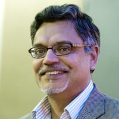
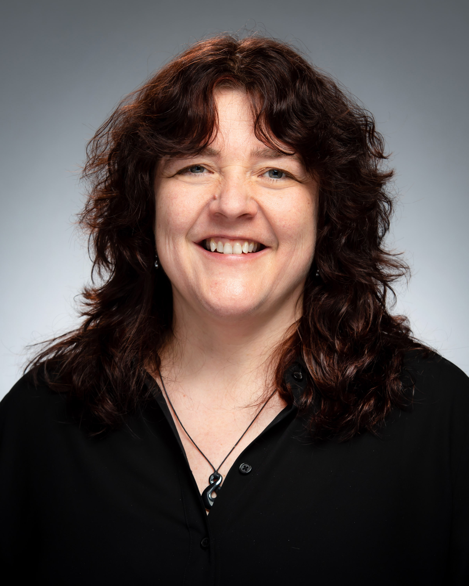

# The Fourth National Science Data Fabric (NSDF) in-person meeting held in San Diego, California on February 28, 29 and March 1.

**University of California, San Diego**  
San Diego Supercomputer Center 
9836 Hopkins Dr, La Jolla, CA 92037 

# Keynote

Keynote Speaker: **Chaitan Baru, Senior Advisor, TIP Directorate, NSF**

Title: _The Prototype Open Knowledge Network (Proto-OKN) Fabric_

 

### Abstract

In September 2023, NSF announced an investment of $26.7 million in 18 projects for its Building the Prototype Open Knowledge Network (Proto-OKN) program, in collaboration with five other U.S. government agencies. The 18 funded projects are expected to work together over the next 3 years, as a single cohort to create an open knowledge network that is a publicly accessible, interconnected set of data repositories and associated knowledge graphs that will enable data-driven, artificial intelligence-based solutions for a broad set of societal and economic challenges.
NASA, NIH, the National Institute of Justice, NOAA and the U.S. Geological Survey are partnering with NSF on this effort, along with an additional 15 U.S. federal and state agencies that are working closely with the awardees to ensure that Proto-OKN supports each agency's data strategy while addressing use cases associated with agency data. Of the 18 projects, 15 are focusing on use cases representing agency applications, two projects are focusing on creating the Proto-OKN Fabric to provide the technological platform, and one project is providing education and training materials and coordination across the entire effort.
This talk will describe the concepts, ideas, and technologies in the emerging Proto-OKN Fabric. For project focusing on data cyberinfrastructure, the identification and pursuit of sustainability strategies and an engaged, early user/customer base, is even more essential than the technological concepts and infrastructure. The Proto-OKN initiative constitutes an investment by the TIP Directorate to advance key technologies — data and AI, in this case — while addressing pressing national, societal and geostrategic challenges, as authorized by the CHIPS and Science Act of 2022.

### Bio

Chaitan Baru is a Senior Advisor in NSF's new Technology, Innovation, and Partnerships (TIP) Directorate where he assists with strategy and ideation of new programs. He first joined NSF in 2014, as Senior Advisor for Data Science in the CISE Directorate where he co-chaired the NSF Harnessing the Data Revolution (HDR) Big Idea and led the BIGDATA program. He returned to NSF in 2019 as Senior Advisor for the NSF Convergence Accelerator and as a member of the team that launched the program. Prior to joining NSF in 2022, Chaitan had a 25-year career at the San Diego Supercomputer Center, University of California San Diego.

# Keynote

Keynote Speaker: **Sandra Gesing, Senior Researcher at the San Diego Supercomputer Center, Executive Director of the US Research Software Engineer Association (US-RSE)**

Title: _Ushering in a New Era with Unconventional Paths and Hidden Contributors Driving Discoveries in Academia and National Labs_

 

### Abstract

Over the past decade, academia and national labs have increasingly recognized the crucial role of hidden contributors contributing to accelerating science. The acknowledgement is evident in quite some projects. From the founding of 8 Research Software Engineer Associations worldwide to the dedicated efforts of the Campus Champions and the NSF Center of Excellence for Science Gateways. While it is encouraging that the importance of cyberinfrastructure and research software and the people being in this line of work receive more attention, we still have a long road in front of us for well-defined career paths and incentives. A multi-facet approach is needed to meet researchers and educators as well as the hidden contributors where they are. This keynote will delve into the crucial role of research software engineers, science gateway creators, and research facilitators in advancing research and computational activities. Furthermore, It will highlight the importance of fostering a community that encompasses all stakeholders in academia and national labs, advocating for a cultural change and actionable measures on how everyone can contribute to make it happen.

### Bio

Sandra Gesing is the inaugural Executive Director of the US Research Software Engineer Association and a Senior Researcher at the San Diego Supercomputer Center. Her research focuses on science gateways, computational workflows as well as distributed and parallel computing. She is especially interested in sustainability of research software, usability of computational methods and reproducibility of research results. Sustainability of research software has many facets and she advocates for improving career paths for research software engineers and facilitators and for incentivizing their work via means beyond the traditional academic rewarding system.
Before her positions at US-RSE and SDSC, she was a senior research scientist at the Discovery Partners Institute (DPI), University of Illinois System, Chicago and she was an associate research professor at the University of Notre Dame, Indiana, US. Before she moved to the US, she was a research associate at the University of Edinburgh, UK, and at the University of Tübingen, Germany. Additionally, she has perennial experience as a project manager and system developer in industry in the US and Germany. As head of a system programmer group, she has long-term software projects. She received her Master’s degree in computer science from extramural studies at the FernUniversität Hagen and her PhD in computer science from the University of Tübingen, Germany.

# Schedule

You can find the program [here](./assets/pdf/2024%20NSDF%20AHM%20Agenda%20V9.pdf)

## Wednesday, February 28

|----|----|---|
| UTK | Michela Taufer   _An Introduction to the National Science Data Fabric_   | |

**Sesion Chair:** Michela Taufer

|----|----|---|
| UTK   Utah | Heberth Martinez  Aashish Panta Michela Taufer <a href="nsdf_tutorial" >_Tutorial: Using NSDF for End-to-End Analysis of Scientific Data_</a>    |  |

**Sesion Chair:** Attila Gyulassy

|----|----|---|
| Globus | Kyle Chard  _Globus Platform as a Service_   |  |
| Voltron | Fernanda Foertter  _Decomposing Data Systems for Better Performance_   |  |
| NCSA | Kenton McHenry  _Democratized Data Discovery and Access: Helping Communities and Repositories Adopt Science on Schema_   |  |
| Ronin | Doug Fils  _Building Blocks of Integration: An Exploration of CODATA CDIF Goals with NSDF Architecture_   |  |

## Thursday, February 29, 2024

**Sesion Chair:** Christine Kirkpatrick

|----|----|---|
| SDSC | Marty Kandes   _Near-Field and Far-Field Data Distribution for ICICLE: Intelligent CyberInfrastructure with Computational Learning in the Environment_    | |
| HDSI/UCSD | Arum Kumar   _HDSI DataPlanet: Spurring Data-Intensive Collaborations_    | |
| Utah State U | Steve Petruzza   _Multi-layer Caching and Parallel Streaming for Large Scale Point Cloud Data on the Web_   | |
| ORNL | Olga Kuchar   _Data Lifecycle Technologies at Oak Ridge Leadership Computing_    | |
| U. Wisconsin Madison | Miron Livny   _An Overview of Pelican, OSDF, and OSPool_    | |

**Sesion Chair:** Michela Taufer

|----|----|
| 11:00-12:00 | **Keynote: The Prototype Open Knowledge Network (Proto-OKN) Fabric**   Chaitan Baru, NSF |
| 12:00-12:15 | **Group Photo** |
| 12:15-13:30 | **Lunch & Poster Presentations** |

**Sesion Chair:** Steve Petruzza

|----|----|
| 13:30-13:45 | **Large Research Data Storage on Blockchain Technology**   Scott Doughman and Sal Malik, Seal Storage |
| 13:45-14:00 | **The HDF5 Framework: Practical Tools for Managing Data**   Scot Breitenfield, HDF |
| 14:00-14:15 | **VisStore: Seamless Acquisition, Storage, and Distribution of Massive Imagery blending Cloud, Local and HPC Storage**   Amy Gooch, ViSOAR |
| 14:15-14:30 | **Monitoring the Open Science Data Federation**   Fabio Andrijauskas, SDSC |
| 14:30-14:45 | **Open Data, Large-Scale Compute, and Scientific Foundation Models**   Michael Mahoney, ICSI, LBNL, and UC Berkeley |
| 14:45-15:00 | **Q&A** |
| 15:00-15:30 | **Coffee Break** |

**Sesion Chair:** Amy Gooch

|----|----|
| 15:30-15:45 | **Visualizing CHESS Data with NSDF Dashboards**   Werner Sun, CHESS |
| 15:45-16:00 | **Integrating with Materials Commons**   Glenn Tarcea, U Michigan and CHESS |
| 16:00-16:15 | **Sally Ride Windows on Earth**   Dan Barstow, Windows on Earth |
| 16:30-16:45 | **Sharing Data across Deep Underground Experiments**   Amy Roberts, U Colorado Denver |
| 16:45-17:00 | **Applications of Deep Learning for Fragment Size Analysis**   Erwin Cazares, UTEP |
| 18:30 | **Dinner at Aqua Mare**   2282 Carmel Valley Rd., Del Mar, CA 92014 |

## Friday, March 1, 2024

|----|----|
| 8:00-9:00 | **Breakfast** |

**Sesion Chair:** Michela Taufer

|----|----|
| 9:00-10:00 | **Keynote: Ushering in a New Era with Unconventional Paths and Hidden Contributors Driving Discoveries in Academia and National Labs**   Sandra Gesing, SDSC |
| 10:00-10:30 | **Coffee Break** |

**Sesion Chair:** Lauren Whitnah

|----|----|
| 10:30-10:45 | **Technology Adoption Research and the Cyberinfrastructure Community**   Kerk Kee, Texas Tech U and CI Compass |
| 10:45-11:00 | **National Data Platform: Data and AI Services for All**   Ilkay Altinas, SDSC |
| 11:00-11:15 | **Opportunities and Challenges at HBCUs**   Dennis Sigur, Dillard U |
| 11:15-11:30 | **Democratizing Spatial Data for Climate Change Risk Assessment across Native American Nations**   Gustavo Ovando-Montejo, Utah State U Blanding |
| 11:30-11:45 | **A Report on New Directions in User Community Interviews**   Atilla Gyulassy, Utah   Lauren Whitnah, UTK   Julie Christopher, SDSC |
| 11:45-12:00 | **Q&A** |
| 12:00-13:30 | **Boxed Lunch** |

## HOTELS

The meeting hotels include:

- [La Jolla Shores Hotel](https://www.ljshoreshotel.com/?gad_source=1&gclid=CjwKCAiAg9urBhB_EiwAgw88mS2u7SZ5x3zWrnbHdUaFg46MNv6zQi93bOsM5IWg7fVdsmn9Yxz-wBoC34UQAvD_BwE) 8110 Camino Del Oro La Jolla, California, 92037  
  (855) 923-8058 
  A limited number of rooms at a discounted rate of \$269 per night will be available until February 9, 2024. Please call the hotel directly for more information. 

- [The Residence Inn](https://www.marriott.com/en-us/hotels/lajca-residence-inn-san-diego-la-jolla)  
  8901 Gilman Drive, La Jolla, CA 92037  
  (858) 587-1770 / (800) 331-3131 
  Rates: \$264-\$460 per night  

- [Sheraton La Jolla Hotel](https://www.marriott.com/en-us/hotels/sanjs-sheraton-la-jolla-hotel), Torrey Pines  
  3299 Holiday Ct., La Jolla, CA 92037 
  (858) 453-5500 / (800) 345-9995 
  Rates: \$268-\$412 per night  

## VENUE

SDSC is located on the UC San Diego Campus in La Jolla.

San Diego Supercomputer Center’s Auditorium E-B212 located on the ground floor of SDSC’s east entrance, just off the driveway on Hopkins Dr, close to the Hopkins Parking Structure, Northwest end of UC San Diego campus.

[Google maps exact location](https://www.google.com/maps/place/32%C2%B053'04.0%22N+117%C2%B014'20.9%22W/@32.884443,-117.2413197,17z/data=!3m1!4b1!4m5!3m4!1s0x0:0x0!8m2!3d32.884443!4d-117.239131)

The San Diego International Airport (SAN) is the closest airport to UC San Diego and SDSC.

For driving directions see the [visitors page on the SDSC website](http://www.sdsc.edu/about_sdsc/visitor_info.html)

## TRANSPORTATION

**VISITOR PARKING: PARKING PERMITS ARE REQUIRED TO PARK ON UC SAN DIEGO CAMPUS**

- Visiting UC faculty and staff who hold annual permits at their home campuses are eligible for up to 5 consecutive days of complimentary parking at UC San Diego.
  Visit [this link](https://transportation.ucsd.edu/visit/visitor/index.html) for more details.
- For non-UC visitors, please see more details [here](http://transportation.ucsd.edu/parking/visitor/conference.html). Purchase permits at a very reasonable rate.
- The most convenient parking location is the Hopkins parking structure located on Hopkins Dr and Voigt Dr, just south of SDSC.
- _Parking legally is the attendee’s responsibility. The penalty for an improperly parked car is at least $65 per day. We cannot be held responsible for citations issued for parking in an incorrect space or improperly displaying your permit_.

For cab or shuttle Pick-up/Drop-off: [9836 Hopkins Dr, La Jolla, CA 92037](https://www.google.com/maps/place/9836+Hopkins+Dr,+La+Jolla,+CA+92093/@32.8843652,-117.2416557,17z/data=!3m1!4b1!4m6!3m5!1s0x80dc07000e937b01:0xfac41c054f3d574e!8m2!3d32.8843607!4d-117.2390808!16s%2Fg%2F11ssf73b61?hl=en&entry=ttu)

SDSC is located just south of the RIMAC Arena.

Rideshare: [Lyft](https://www.lyft.com/rider) or [Uber](https://www.uber.com/us/en/ride/) Use _“San Diego Supercomputer Center”_ as destination.

A taxi or transportation service can be used from the airport.
Helpful link for taxi service in San Diego:

- [SD Taxi Cab Services](http://www.taxifarefinder.com/)
- Yellow Cab: (619) 444-4444
- Orange Cab: (619) 223-5555
- SD Taxi Service: (619) 342-6494
- San Diego Cab: (619) 226-8294
- [Terramoto Transportation Downtown San Diego](http://www.terramoto.net/) - 619.269.7397
- [Torrey Pines Limo](http://www.torreypineslimo.com/) - 858.997.6866
- [Super Shuttle](http://www.supershuttle.com/Locations/SANAirportShuttleSanDiego.aspx) - 800.974.8885

[Public Transportation surrounding UC San Diego](https://transportation.ucsd.edu/alternatives/transit/)

  
