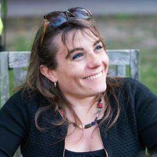

# The Fourth National Science Data Fabric (NSDF) in-person meeting held in San Diego, California on February 28, 29 and March 1.

**University of California, San Diego**  
San Diego Supercomputer Center 
10100 Hopkins Drive, La Jolla, CA 92093 

<!-- # Keynote

Keynote Speaker: **Maria Elena Monzani, Stanford U.**

Title: *Data-Intensive search for Dark Matter with the LUX-ZEPLIN experiment*

### Abstract

The nature and origin of dark matter are among the most compelling mysteries of contemporary science. There is strong evidence for dark matter from its role in shaping the galaxies and galaxy clusters that we observe in the universe. Still, physicists have tried to detect dark matter particles for over three decades with little success.

This talk will describe the leading effort in that search, the LUX-ZEPLIN (LZ) detector. LZ is an instrument that is superlative in many ways. It consists of 10 tons of liquified xenon gas, maintained at almost atomic purity and stored in a refrigerated titanium cylinder a mile underground in a former gold mine in Lead, South Dakota.

​During its science run, LZ is projected to accumulate a massive dataset of many petabytes of data and record several billions of particle interactions, only a handful of which might be produced by potential dark matter candidates (if nature cooperates). Identifying the dark matter signals in this amassment of data represents an extreme “needle in a haystack” problem and requires leveraging advanced detector design and state-of-the-art machine learning algorithms. The talk will present challenges in constructing this large-scale underground experiment and interpreting its data, along with the prospects LZ presents for finally discovering the dark matter particle and recently released results from its initial search for new physics.

### Bio

Maria Elena Monzani is a dark matter data wrangler. Her research field is Astroparticle physics, which focuses on topics at the intersection between particle physics and astrophysics/cosmology, using the tools of data-intensive science. She received a dual Ph.D. from the University of Milano and the University of Paris 7, performing research with the Borexino experiment that measured neutrinos produced by the Sun. She then held a postdoctoral position at Columbia University before joining SLAC in 2007 to work on the Fermi Gamma-ray Space Telescope. Today, Monzani is a lead scientist at SLAC and a senior Kavli Institute for Particle Astrophysics and Cosmology member at Stanford. She leads the software computing effort for the LZ Dark Matter Experiment and the science operations team for the Fermi satellite. She is also an Adjunct Scholar at the Vatican Observatory and enjoys discussing the shared philosophical foundations of scientific and religious endeavors. -->

# Schedule

will be defined

<!-- ## Wed April 12

**Session 1 - Welcome, Vision, and Keynote (Session Chair: Michela Taufer)**

|----|----|---|
| U Utah | Valerio Pascucci  *The state of NSDF*    |  |
| UCSD | Frank Wuerthwein  *Updates on NRP*  |  |
| Stanford U. | Maria Elena Monzani  *Data-Intensive search for Dark Matter with the LUX-ZEPLIN experiment*   |  |

**Session 2 (Session Chair: Valerio Pascucci)**

|----|----|---|
|Alluxio | Shouwei Chen   *How to Bring Data Locality to I/O-intensive Workloads on Cloud*   |  |
|U Utah | Aashish Panta   *Testing Compressions with OpenVisus*   |  |
|SEAL Storage | Sal Malik   *Web3 in the Real World: Decentralized Cloud Storage Use Cases*    |  |
|Alluxio | Bin Fan   *Efficient Data Access and Migration Across Clouds*    |  |
|protocol.ai | Kenton Langstroth   *Filecoin for researchers*   |  |
|UCSD | Karen Stocks   *R2R Challenges managing large data from the US Academic Research Fleet*   |  |

**Session 3 (Session Chair: Ivan Rodero)**

|----|----|---|
|U Hawaii | Sean Cleveland   *Needs for pacific regional CI*   |  |
|UCSD | Amarnath Gupta   *A Data Fabric For Social Good?*   |  |
|LLNL | Peer-Timo Bremer   *Distributed Data Access in the National Security Complex*   |  |
|U Chicago | Kyle   *Linking scientific instruments and computation: Patterns, technologies, and experiences*   |  |
|UCSD,OSG | Fabio Andrijauskas   *Open Science Data Federation*    |  |
|NCSA | Luigi Marini   *Clowder: Open Source, Customizable, Data and Workflow Management*    |  |

**Session 4 (Session Chair: Christine Kirkpatrick)**

|----|----|---|
|U Utah | Attila Gyulassy  *Community Feedback on Data Worflows*   |  |
|U Utah | Ivan Rodero   *NSDF Authentication and Authorization Infrastructure*   |  |
|Sandia National Labs | Jay Lofstead  *Metadata Management to Aid Data Discovery*   |  |
|U Utah | Giorgio Scorzelli *Updates on the NSDF OpenVisus*  |  |
|UTK | Heberth Martinez *Monitoring Latency and Throughput across Distributed Resources in NSDF*    |  |
|UTK | Jakob Luettgau   *Updates on the NSDF Catalog*    |  |

*NSDF Dinner*

## Thursday April 13

**Session 5 (Session Chair: Glenn Tarcea)**

|----|----|---|
|UCSD | Michael Corn *Framing Research Security and a discussion of risk identification*   |  |
|Utah State U. | Steve Petruzza   *Portability of applications to heterogeneous systems and exascale systems*   |  |
|SDSC/UC San Diego | Christine Kirkpatrick *Tailoring the National Science Data Fabric to Open Science & FAIR Aims*    |  |
|Morgridge | Brian Bockelman   *Kingfisher: Storage Management for Data Federations*    |  |
|Ronin Institute | Douglas Fils  *Leveraging Structured Data on the Web to address FAIR Principles*    |  |

**Session 6 (Session Chair: Jakob Luettgau)**

|----|----|---|
|NVIDIA | Pavol Klacansky  *Building a large scale community data portal with commodity hardware*    |  |
|U Utah | Owen Koppe   *The NSDF-Data-Portal*  |  |
|UTK | Paula Olaya   *Composing Scientific Workflows in the Cloud at Large Scale*    |  |
|U Michigan | Glenn Tarcea  *Materials Commons Updates and Thinking Big By Thinking Small*   |  |
|Cornell, CHESS | Devin Bougie   *The CHESS - NSDF Collaboration: Updates*   |  |
| Hawaii | Curt Dodds  *Everything, Everywhere All at Once, All the Time - Challenges for Astronomy*    |  |  -->

<!-- ## LODGING

The NSDF AHM will not have a dedicated room block; however, there are a number of hotels near the SDSC. -->

## HOTELS

will be defined

<!-- There are many hotel options surrounding UC San Diego and SDSC.
The few listed below are located just off campus and may offer a university rate.
Be sure to ask if a “UCSD Rate” is available when contacting the hotel.
An extended list of hotels can be found on the [SDSC Visitor page](https://www.sdsc.edu/).

- [La Jolla Shores Hotel](https://www.ljshoreshotel.com/?gad_source=1&gclid=CjwKCAiAg9urBhB_EiwAgw88mS2u7SZ5x3zWrnbHdUaFg46MNv6zQi93bOsM5IWg7fVdsmn9Yxz-wBoC34UQAvD_BwE) 8110 Camino Del Oro La Jolla, California, 92037  
(855) 923-8058 

- [The Residence Inn](https://www.marriott.com/en-us/hotels/lajca-residence-inn-san-diego-la-jolla)  
8901 Gilman Drive, La Jolla, CA 92037  
(858) 587-1770 / (800) 331-3131  -->

## VENUE

SDSC is located on the UC San Diego Campus in La Jolla.

San Diego Supercomputer Center’s Auditorium E-B212 located on the ground floor of SDSC’s east entrance, just off the driveway on Hopkins Dr, close to the Hopkins Parking Structure, Northwest end of UC San Diego campus.

[Google maps exact location](https://www.google.com/maps/place/32%C2%B053'04.0%22N+117%C2%B014'20.9%22W/@32.884443,-117.2413197,17z/data=!3m1!4b1!4m5!3m4!1s0x0:0x0!8m2!3d32.884443!4d-117.239131)

The San Diego International Airport (SAN) is the closest airport to UC San Diego and SDSC.

For driving directions see the [visitors page on the SDSC website](http://www.sdsc.edu/about_sdsc/visitor_info.html)

## TRANSPORTATION

**VISITOR PARKING: PARKING PERMITS ARE REQUIRED TO PARK ON UC SAN DIEGO CAMPUS**

- Visiting UC faculty and staff who hold annual permits at their home campuses are eligible for up to 5 consecutive days of complimentary parking at UC San Diego.
  Visit [this link](http://transportation.ucsd.edu/parking/visitor/reciprocity.html) for more details.
- For non-UC visitors, please see more details [here](http://transportation.ucsd.edu/parking/visitor/conference.html). Purchase permits at a very reasonable rate.
- The most convenient parking location is the Hopkins parking structure located on Hopkins Dr and Voigt Dr, just south of SDSC.
- _Parking legally is the attendee’s responsibility. The penalty for an improperly parked car is at least $65 per day. We cannot be held responsible for citations issued for parking in an incorrect space or improperly displaying your permit_.

For cab or shuttle Pick-up/Drop-off: [10100 Hopkins Drive, La Jolla, CA 92093](https://www.google.com/maps?q=San+Diego+Supercomputer+Center,+10100+Hopkins+Drive,+La+Jolla,+CA&hl=en&sll=32.824552,-117.108978&sspn=0.439681,0.874786&oq=san&hq=San+Diego+Supercomputer+Center,+10100+Hopkins+Drive,+La+Jolla,+CA&t=m&z=14)

SDSC is located just south of the RIMAC Arena.

Rideshare: [Lyft](https://www.lyft.com/rider) or [Uber](https://www.uber.com/us/en/ride/) Use _“San Diego Supercomputer Center”_ as destination.

A taxi or transportation service can be used from the airport.
Helpful link for taxi service in San Diego:

- [SD Taxi Cab Services](http://www.taxifarefinder.com/)
- Yellow Cab: (619) 444-4444
- Orange Cab: (619) 223-5555
- SD Taxi Service: (619) 342-6494
- San Diego Cab: (619) 226-8294
- [Terramoto Transportation Downtown San Diego](http://www.terramoto.net/) - 619.269.7397
- [Torrey Pines Limo](http://www.torreypineslimo.com/) - 858.997.6866
- [Super Shuttle](http://www.supershuttle.com/Locations/SANAirportShuttleSanDiego.aspx) - 800.974.8885

[Public Transportation surrounding UC San Diego](https://transportation.ucsd.edu/alternatives/transit/)

  
