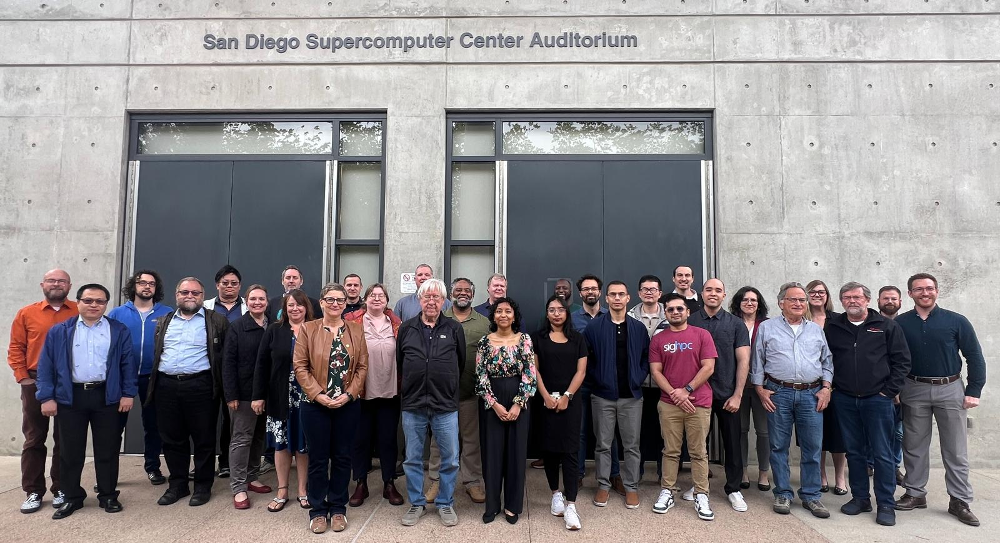

<h3> Fifth National Science Data Fabric (NSDF)  All-Hands Meeting “Maximizing Returns on Investment of the National Science Data Fabric:
 Driving Practical Impact and Sustainable Innovation”   San Diego, CA on May 5 - 7, 2025</h3>

The [National Science Data Fabric](https://nationalsciencedatafabric.org) (NSDF) is an NSF-supported pilot that connects an open network of institutions, including minority-serving institutions, by constructing a continuous integration platform for equitable data use and data-driven sciences. 

For the fifth NSDF All-Hands Meeting, we gather new and existing members of the NSDF community in San Diego, CA to address challenges of data democratization. This year's theme will be **“Maximizing Returns on Investment of the National Science Data Fabric: Driving Practical Impact and Sustainable Innovation”** and we will meet from May 5-7, 2025.  

<!-- Swiper -->
<link rel="stylesheet" href="https://cdn.jsdelivr.net/npm/swiper@11/swiper-bundle.min.css" />

	

		 

		

			

        

          
        <i>Attendees to the Fifth National Science Data Fabric (NSDF) AHM (2025).</i>
        

			

		

		

		

		

	

	
	

# KEYNOTE

Keynote Speaker: **Miron Livny, director of the Center for High Throughput Computing (CHTC), the John P. Morgridge Professor of Computer Science and a Vilas Research Professor at the University of Wisconsin-Madison**

Title: *Is your Data Handler Trustworthy?*

 

<h3>Abstract</h3>

The PATh project offers a variety of distributed data handling services. Researchers
who place their workloads at PATh Access Points leverage these services to bring input
data to their applications and to ship results back to archival sites. They also employ
them to copy the applications, in most cases in the form of container images, to
execution sites provided by the Open Science Pool (OSPool). Owners of Object Stores
who federate datasets they host via the Open Science Data Federation (OSDF) use
these services to make locally stored objects available to remote consumers for
frequent reuse.

In the past 12 months PATh services have performed more than 3B Object transfers
across more than 100 institutions. The distributed nature of the infrastructure requires
objects to be copied across institution boundaries and to be buffered in memory or disk
at multiple locations. These operations clearly introduce concerns about data integrity
and access control. Do the researchers and Object providers who use these services
believe that the PATh services are trustworthy?

The talk will review our ongoing effort to develop data handling services that we believe
to be trustworthy. A key element of our current development work is transitioning our
software tools and infrastructure into capability-based authorization. We hope that
facilitating trust relationships through capabilities will help researchers and data
providers to entrust their objects with the PATh services. Namely, to believe that the
OSDF and the OSPool data handling services are trustworthy.

<h3>Bio</h3>

Miron Livny received a B.Sc. degree in Physics and Mathematics in 1975 from the Hebrew University and M.Sc. and Ph.D. degrees in Computer Science from the Weizmann Institute of Science in 1978 and 1984, respectively. Since 1983 he has been on the Computer Sciences Department faculty at the University of Wisconsin-Madison, where he is currently the John P. Morgridge Professor of Computer Science and a Vilas Research Professor. He serves as the director of the Center for High Throughput Computing (CHTC), is leading the HTCondor Software Suite effort and serves as the technical director of the OSG. He is a member of the scientific leadership team of the Morgridge Institute of Research where he leads the Research Computing theme.

Dr. Livny's research focuses on distributed processing and object management systems and involves close collaboration with researchers from a wide spectrum of disciplines. He pioneered the area of High Throughput Computing (HTC) and developed frameworks and software tools that have been widely adopted by academic, government and commercial organizations around the world. 

Livny is the recipient of the 2006 ACM SIGMOD Test of Time Award the 2013 HPDC Achievement Award the 2020 IEEE TCDP Outstanding Technical Achievement Award, 2020 IEEE TCDP High Impact Paper Award and the 2023 UW-Madison Vilas Research Professor award. 

# KEYNOTE

Keynote Speaker: **Ryan Coffee**

Title: *Breaking the fourth wall: experimental introspection via audience participation.*

 

<h3>Abstract</h3>
Science is undergoing a transformation; it is moving away from slow iteration of test, observe, report, and repeat. Given the rate of experimental phase space search that is becoming prevalent in today's scientific detector systems, real-time adaptation is finding its way into accelerator controls and detector autonomy.  This development raises an interesting question regarding the role of human intellect in real-time decision making for experimental campaigns of the not-so-distant future. As we survey a couple of current examples for some of the emerging and envisioned methods of stream processing along the stages of data acquisition, we will reveal some benefits and some dangers of incorporating domain specific analysis for autonomous information extraction. By envisioning some of the enabling technologies, we hope to reveal where magic should be avoided and mechanics adopted. We hope to use such technologies to break the fourth wall of observation, allowing scientists to become live participants in the exponential acceleration of our endeavor to innovate; live participation may even help us avoid the Theatre of the Absurd.

<h3>Bio</h3>

Ryan earned his Bachelor of Arts in Philosophy and Bachelor of Science in Physics from the University of Arkansas followed by a PhD in Atomic, Molecular and Optical (AMO) Physics from the University of Connecticut. He joined the PULSE Institute at Stanford/SLAC in 2006 and led the first laser pumped, x-ray probed experiment at the Linac Coherent Light Source (LCLS) in 2009. Since then, he has become Senior Research Scientist in PULSE and LCLS with an emphasis on AMO science and novel instrumentation and the requisite computational methods for streaming data processing at the sensor edge, in particular targeting the million frames per second LCLS-II.

In that context he has been a core member of the SLAC AI Initiative since its inception with particular emphasis on Machine Learning for real-time information extraction. With projects ranging from x-ray spectroscopy in molecules, ultrafast materials response, radiographic medical imaging, and tokamak plasma fusion, he has become an adamant proponent of data and model marketplaces for cross-domain innovation sharing with built in provenance and value tracking for an intelligent adaptive data and model retention.

Beyond SLAC, Ryan is driving an integrative approach to instrumentation and co-design of computing infrastructure across the portfolio of Department of Energy labs and facilities as well as technologies across the computing industry. From diagnostic and detector development to algorithms and AI accelerators, from the sensor Edge to Leadership Computing Facilities, he is leveraging his hobbies and his passions to drive the bleeding edge of basic science to address the emerging challenges of automation in industry and agriculture for a better future for his daughters.

# Monday, May 5	

| Affiliation	|  Members and Titles	|  Presentation |  
|-------------|---------------------|---------------|
| UTK	|  Michela Taufer  **National Science Data Fabric**  DOI: [10.5281/zenodo.15482302](https://doi.org/10.5281/zenodo.15482302)	|  | 
		
 

| Affiliation	|  Members and Titles	|  Presentation |  
|-------------|---------------------|---------------|
|UTK | Jack Marquez and Kin Hong NG  **Recent Advancements with NSDF Use Cases: Collaborations with Oak Ridge National Laboratory**   DOI: [10.5281/zenodo.15529300](https://doi.org/10.5281/zenodo.15529300) |	 | 
|Utah	| Aashish Panta   **Recent Advancements with NSDF Use Cases: Collaborations with NASA and CHESS**   DOI: [10.5281/zenodo.15529313](https://doi.org/10.5281/zenodo.15529313) |  | 

 

## Session Chair: Michela Taufer		

| Affiliation	|  Members and Titles	|  Presentation |  
|-------------|---------------------|---------------|
| ANL	 | Kyle Chard  **Transforming Scientific Discovery with AI/ML and Globus**   DOI: [10.5281/zenodo.15445705](https://doi.org/10.5281/zenodo.15445705) |  | 
| UCSD	 | Fabio Andrijauskas **Open Data Science Data Federation and Pelican Platform**   DOI: [10.5281/zenodo.15445431](https://doi.org/10.5281/zenodo.15445431) |  | 
| ORNL	 | Patrick Widener **DataFed: Data Navigation and Management for Virtual Research Environments**  DOI: [10.5281/zenodo.15445652](https://doi.org/10.5281/zenodo.15445652) |  | 
| LBNL |  Wei Zhang  **Advancing Scientific Data Discovery and Management: From Human to AI-Centric Data Cognition**  DOI: [10.5281/zenodo.15445630](https://doi.org/10.5281/zenodo.15445630) |  | 

 

# Tuesday, May 6	

| Affiliation	|  Members and Titles	|  Presentation |  
|-------------|---------------------|---------------|
|U of Wisconsin Madison	| Miron Livny   **Is Your Data Handler Trustworthy?**   DOI: [10.5281/zenodo.15444476](https://doi.org/10.5281/zenodo.15444476)|  | 

 

## Session Chair: Christine Kirkpatrick		

| Affiliation	|  Members and Titles	|  Presentation |  
|-------------|---------------------|---------------|
| NCAR	| Thomas Hauser   **An Integrated Research Data Commons and On-Premise Cloud Infrastructure for Earth Science at NSF NCAR**   DOI: [10.5281/zenodo.15443976](https://doi.org/10.5281/zenodo.15443976) |  | 
| NSF & NERSC	| Katie Antypas   **OAC Data Investments and the NAIRR Pilot**  DOI: [10.5281/zenodo.15443403](https://doi.org/10.5281/zenodo.15443403) |  | 
| ARPA-H	| Ileana Hancu   **INDEX: ImagiNg Data EXchange**  DOI: [10.5281/zenodo.15444145](https://doi.org/10.5281/zenodo.15444145)|  | 

## Posters		

| Affiliation	|  Members and Titles	|  Presentation |  
|-------------|---------------------|---------------|
| UTK	| Michael Sutherlin  **Bridging Humanities and AI through Interdisciplinary Collaboration**  DOI: [10.5281/zenodo.15427235](https://doi.org/10.5281/zenodo.15427235 )|  | 
| Dillard	| Dennis Sigur  **Understanding the Characteristics of African American Ph.D. Earners Using UMETRICS Data**   DOI: [10.5281/zenodo.15443051](https://doi.org/10.5281/zenodo.15443051) |  | 
| U of Vanderbilt	| Zhimin Li   **Training Implicit Neural Representations Via Classification Loss for Scientific Data Compression**   DOI: [10.5281/zenodo.15443076](https://doi.org/10.5281/zenodo.15443076)|  | 
| UTK	| Jack Marquez   **NSDF Public Outreach**   DOI: [10.5281/zenodo.15428210](https://doi.org/10.5281/zenodo.15428210)	|  | 
| UTK	| Kin Hong NG   **Enabling Real-Time Insight: Building a Multi-Service System for Monitoring Autonomous Experiments**   DOI: [10.5281/zenodo.15442847](https://doi.org/10.5281/zenodo.15442847)	|  | 
|  Utah State U	| Steve Petruzza   **Insights on the State of Scientific Data Management: Interviews with Scientists by the National Science Data Fabric (NSDF)**   DOI: [10.5281/zenodo.15442996](https://doi.org/10.5281/zenodo.15442996) |  | 
| ORNL | Marshall McDonnell   **Securely Connecting Multi-Institute Smart Labs and DOE User Facilities Using INTERSECT**   DOI: [10.5281/zenodo.15428238](https://doi.org/10.5281/zenodo.15428238)	|  | 
| UCSD | Christine Kirkpatrick   **Enhancing FAIR Data Assessment with Ontologies, Knowledge Graphs, and Large Language Models**  | | 
| Utah	| Ishrat Jahan Eliza    **Animating Petascale Time-Varying Data on Commodity Hardware via AI assisted scripting**   DOI: [10.5281/zenodo.15428126](https://doi.org/10.5281/zenodo.15428126) |  | 
| Utah | Arleth Salinas   **Recent Advancements with NSDF Use Cases: Collaborations with WIRED**   DOI: [10.5281/zenodo.15427997](https://doi.org/10.5281/zenodo.15427997) |  | 

## Session Chair: Steve Petruzza		

| Affiliation	|  Members and Titles	|  Presentation |   
|-------------|---------------------|---------------|
| ORNL	| Marshall McDonnell   **Neutron Powder Diffraction Experiment Steering in collaboration with NSDF**  DOI: [10.5281/zenodo.15482251](https://doi.org/10.5281/zenodo.15482251) |  | 
| U of Colorado, Denver	| Amy Roberts  **Critical Advances in Dark Matter Physics through Machine-Learning-Ready Data**  DOI: [10.5281/zenodo.15446251](https://doi.org/10.5281/zenodo.15446251)	|  | 
| CHESS	| Kate Shanks  **Leveraging NSDF Tools for Visualization of Large Data Sets at CHESS**  DOI: [10.5281/zenodo.15446269](https://doi.org/10.5281/zenodo.15446269)	|  | 

## Session Chair: Amy Gooch		

| Affiliation	|  Members and Titles	|  Presentation |   
|-------------|---------------------|---------------|
| John Hopkins | Alexander Szalay  **From Sensors to Tensors**  DOI:[10.5281/zenodo.15446549](https://doi.org/10.5281/zenodo.15446549) |  | 
| ORNL | Sean Wilkinson  **Applying the FAIR Principles to Computational Workflows**  DOI: [10.5281/zenodo.15446556](https://doi.org/10.5281/zenodo.15446556)	|  | 
| HDF Group	| Scott Breitenfeld  **Bridging the Gap: Scalable Data Management for Scientific Workflows and IOwarp and HSDS**  DOI: [10.5281/zenodo.15446538](https://doi.org/10.5281/zenodo.15446538)	|  | 
| UCSD | Christine Kirkpatrick  **FAIR for Infrastructure**  DOI: [10.5281/zenodo.15446564](https://doi.org/10.5281/zenodo.15446564)	|  | 

#  Wednesday, May 7	

| Affiliation	|  Members and Titles	|  Presentation |   
|-------------|---------------------|---------------|
| SLAC | Ryan Coffee  **Breaking the Fourth Wall: Experimental Introspection Via Audience Participation**  DOI: [10.5281/zenodo.15444594](https://doi.org/10.5281/zenodo.15444594)|  | 

## Session Chair: Michael Sutherlin		

| Affiliation	|  Members and Titles	|  Presentation |   
|-------------|---------------------|---------------|
| Utah State Univ. |	Steve Petruzza  **Enabling Fast and Accurate Crowdsourced Annotation for Elevation-Aware Flood Extent Mapping**  DOI: [10.5281/zenodo.15446586](https://doi.org/10.5281/zenodo.15446586) |  | 
| Utah	| Amy Gooch  **Enabling Storage, Sharing and Archiving of Petascale Data**  DOI: [10.5281/zenodo.15446598](https://doi.org/10.5281/zenodo.15446598) |  | 
| Sandia | Jay Lofstead  **Mentoring through Imposter Syndrome**  DOI: [10.5281/zenodo.15446604](https://doi.org/10.5281/zenodo.15446604) |  | 
| UCSD	| Ilkay Altintas  **Opportunities to Collaborate with the National Data Platform**  DOI: [10.5281/zenodo.15446578](https://doi.org/10.5281/zenodo.15446578)	|  | 

# SCHEDULE

You can find the program [here](https://drive.google.com/file/d/1LIZWbYAuP-mfBY9BpqhJuoaBfAmgmwdz/view?usp=drive_link)

# LOCATION

**University of California, San Diego**  
San Diego Supercomputer Center 
9836 Hopkins Dr, La Jolla, CA 92037 

# HOTELS

The meeting hotels include:

- [La Jolla Shores Hotel](https://www.ljshoreshotel.com/?gad_source=1&gclid=CjwKCAiAg9urBhB_EiwAgw88mS2u7SZ5x3zWrnbHdUaFg46MNv6zQi93bOsM5IWg7fVdsmn9Yxz-wBoC34UQAvD_BwE) 8110 Camino Del Oro La Jolla, California, 92037  
  (855) 923-8058 

- [The Residence Inn](https://www.marriott.com/en-us/hotels/lajca-residence-inn-san-diego-la-jolla)  
  8901 Gilman Drive, La Jolla, CA 92037  
  (858) 587-1770 / (800) 331-3131 

- [Sheraton La Jolla Hotel](https://www.marriott.com/en-us/hotels/sanjs-sheraton-la-jolla-hotel), Torrey Pines  
  3299 Holiday Ct., La Jolla, CA 92037 
  (858) 453-5500 / (800) 345-9995 

## VENUE

SDSC is located on the UC San Diego Campus in La Jolla. Address: 9836 Hopkins Dr, La Jolla, CA 92037.

San Diego Supercomputer Center’s Auditorium E-B212 located on the ground floor of SDSC’s east entrance, 
just off the driveway on Hopkins Dr, close to the Hopkins Parking Structure, Northwest end of UC San Diego campus.

[Google maps exact location](https://www.google.com/maps/place/32%C2%B053'04.0%22N+117%C2%B014'20.9%22W/@32.884443,-117.2413197,17z/data=!3m1!4b1!4m5!3m4!1s0x0:0x0!8m2!3d32.884443!4d-117.239131)

The San Diego International Airport (SAN) is the closest airport to UC San Diego and SDSC.

For driving directions see the [visitors page on the SDSC website](http://www.sdsc.edu/about_sdsc/visitor_info.html)

## TRANSPORTATION

**VISITOR PARKING: PARKING PERMITS ARE REQUIRED TO PARK ON UC SAN DIEGO CAMPUS**

- Visiting UC faculty and staff who hold annual permits at their home campuses are eligible for up to 5 consecutive days of complimentary parking at UC San Diego.
  Visit [this link](https://transportation.ucsd.edu/visit/visitor/index.html) for more details.
- For non-UC visitors, please see more details [here](http://transportation.ucsd.edu/parking/visitor/conference.html). Purchase permits at a very reasonable rate.
- The most convenient parking location is the Hopkins parking structure located on Hopkins Dr and Voigt Dr, just south of SDSC.
- *Parking legally is the attendee’s responsibility. The penalty for an improperly parked car is at least $65 per day. We cannot be held responsible for citations issued for parking in an incorrect space or improperly displaying your permit. More information on [Parking Citation Penalties](https://transportation.ucsd.edu/contact/citations/penalties.html)*

For cab or shuttle Pick-up/Drop-off: [9836 Hopkins Dr, La Jolla, CA 92037](https://www.google.com/maps/place/9836+Hopkins+Dr,+La+Jolla,+CA+92093/@32.8843652,-117.2416557,17z/data=!3m1!4b1!4m6!3m5!1s0x80dc07000e937b01:0xfac41c054f3d574e!8m2!3d32.8843607!4d-117.2390808!16s%2Fg%2F11ssf73b61?hl=en&entry=ttu)

SDSC is located just south of the RIMAC Arena.

Rideshare: [Lyft](https://www.lyft.com/rider) or [Uber](https://www.uber.com/us/en/ride/) Use _“San Diego Supercomputer Center”_ as destination.

A taxi or transportation service can be used from the airport.
Helpful link for taxi service in San Diego:

- [SD Taxi Cab Services](http://www.taxifarefinder.com/)
- Yellow Cab: (619) 444-4444
- Orange Cab: (619) 223-5555
- SD Taxi Service: (619) 342-6494
- San Diego Cab: (619) 226-8294
- [Terramoto Transportation Downtown San Diego](http://www.terramoto.net/) - 619.269.7397
- [Torrey Pines Limo](http://www.torreypineslimo.com/) - 858.997.6866
- [Super Shuttle](http://www.supershuttle.com/Locations/SANAirportShuttleSanDiego.aspx) - 800.974.8885

[Public Transportation surrounding UC San Diego](https://transportation.ucsd.edu/alternatives/transit/)

# EXPRESSION OF INTEREST IN PARTICIPATING

The meeting is an invitation only event. Still, we are looking for new members. Are you new to NSDF or interested in joining us? We are currently gathering expressions of interest to participate. Please complete the form by March 1, 2025, to let us know if you would like to attend.

Expressions of Interest Form: [https://forms.gle/idjUT269RGTQkfZF7](https://forms.gle/idjUT269RGTQkfZF7).

# QUESTIONS

If you have any questions, please email Michael Sutherlin at[msuther5@utk.edu](msuther5@utk.edu).

  
