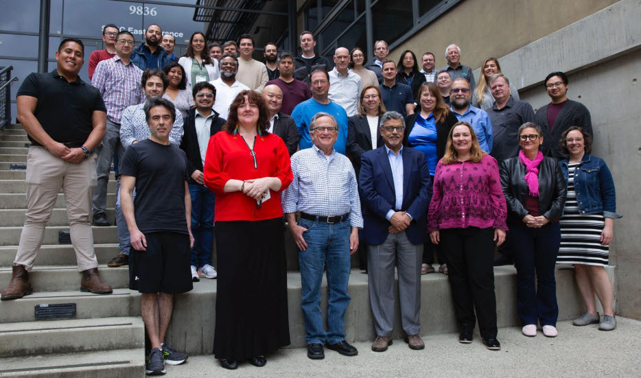
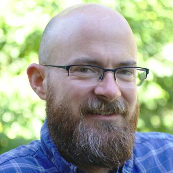

<h3> Fifth National Science Data Fabric (NSDF)  All-Hands Meeting“Broadening Engagement in Science”   San Diego, CA on May 5 - 7, 2025</h3>

The [National Science Data Fabric](https://nationalsciencedatafabric.org) (NSDF) is an NSF-supported pilot that connects an open network of institutions, including minority-serving institutions, by constructing a continuous integration platform for equitable data use and data-driven sciences. 

For the fifth NSDF All-Hands Meeting, we gather new and existing members of the NSDF community in San Diego, CA to address challenges of data democratization. This year's theme will be **“Broadening Engagement in Science,”** and we will meet from May 5-7, 2025.  

<!-- Swiper -->
<link rel="stylesheet" href="https://cdn.jsdelivr.net/npm/swiper@11/swiper-bundle.min.css" />

	

		 

		

			

        

          
        <i>Attendees to the Fourth National Science Data Fabric (NSDF) AHM (2004).</i>
        

			

		

		

		

		

	

	
	

# EXPRESSION OF INTEREST IN PARTICIPATING

The meeting is an invitation only event. Still, we are looking for new members. Are you new to NSDF or interested in joining us? We are currently gathering expressions of interest to participate. Please complete the form by March 1, 2025, to let us know if you would like to attend. 

Expressions of Interest Form: [https://forms.gle/idjUT269RGTQkfZF7](https://forms.gle/idjUT269RGTQkfZF7).

# KEYNOTE

Keynote Speaker: **Miron Livy, director of the Center for High Throughput Computing (CHTC), the John P. Morgridge Professor of Computer Science and a Vilas Research Professor at the University of Wisconsin-Madison**

Title: *Is Your Data Handling Trustworthy?*

 

<h3>Abstract</h3>

Coming soon.

<h3>Bio</h3>

Miron Livny received a B.Sc. degree in Physics and Mathematics in 1975 from the Hebrew University and M.Sc. and Ph.D. degrees in Computer Science from the Weizmann Institute of Science in 1978 and 1984, respectively. Since 1983 he has been on the Computer Sciences Department faculty at the University of Wisconsin-Madison, where he is currently the John P. Morgridge Professor of Computer Science and a Vilas Research Professor. He serves as the director of the Center for High Throughput Computing (CHTC), is leading the HTCondor Software Suite effort and serves as the technical director of the OSG. He is a member of the scientific leadership team of the Morgridge Institute of Research where he leads the Research Computing theme.

Dr. Livny's research focuses on distributed processing and object management systems and involves close collaboration with researchers from a wide spectrum of disciplines. He pioneered the area of High Throughput Computing (HTC) and developed frameworks and software tools that have been widely adopted by academic, government and commercial organizations around the world. 

Livny is the recipient of the 2006 ACM SIGMOD Test of Time Award the 2013 HPDC Achievement Award the 2020 IEEE TCDP Outstanding Technical Achievement Award, 2020 IEEE TCDP High Impact Paper Award and the 2023 UW-Madison Vilas Research Professor award. 

# KEYNOTE

Keynote Speaker: **Ryan Coffee**

Title: *Information Ecosystems from Sensor to NSDF*

 

<h3>Abstract</h3>
Coming soon…

<h3>Bio</h3>

Ryan earned his Bachelor of Arts in Philosophy and Bachelor of Science in Physics from the University of Arkansas followed by a PhD in Atomic, Molecular and Optical (AMO) Physics from the University of Connecticut. He joined the PULSE Institute at Stanford/SLAC in 2006 and led the first laser pumped, x-ray probed experiment at the Linac Coherent Light Source (LCLS) in 2009. Since then, he has become Senior Research Scientist in PULSE and LCLS with an emphasis on AMO science and novel instrumentation and the requisite computational methods for streaming data processing at the sensor edge, in particular targeting the million frames per second LCLS-II.

In that context he has been a core member of the SLAC AI Initiative since its inception with particular emphasis on Machine Learning for real-time information extraction. With projects ranging from x-ray spectroscopy in molecules, ultrafast materials response, radiographic medical imaging, and tokamak plasma fusion, he has become an adamant proponent of data and model marketplaces for cross-domain innovation sharing with built in provenance and value tracking for an intelligent adaptive data and model retention.

Beyond SLAC, Ryan is driving an integrative approach to instrumentation and co-design of computing infrastructure across the portfolio of Department of Energy labs and facilities as well as technologies across the computing industry. From diagnostic and detector development to algorithms and AI accelerators, from the sensor Edge to Leadership Computing Facilities, he is leveraging his hobbies and his passions to drive the bleeding edge of basic science to address the emerging challenges of automation in industry and agriculture for a better future for his daughters.

# SCHEDULE

You can find the program [here](https://drive.google.com/file/d/1tLASQO6WUcg_7sovWnc0WrCsgYiS4q3S/view)

# LOCATION

**University of California, San Diego**  
San Diego Supercomputer Center 
9836 Hopkins Dr, La Jolla, CA 92037 

# HOTELS

The meeting hotels include:

- [La Jolla Shores Hotel](https://www.ljshoreshotel.com/?gad_source=1&gclid=CjwKCAiAg9urBhB_EiwAgw88mS2u7SZ5x3zWrnbHdUaFg46MNv6zQi93bOsM5IWg7fVdsmn9Yxz-wBoC34UQAvD_BwE) 8110 Camino Del Oro La Jolla, California, 92037  
  (855) 923-8058 

- [The Residence Inn](https://www.marriott.com/en-us/hotels/lajca-residence-inn-san-diego-la-jolla)  
  8901 Gilman Drive, La Jolla, CA 92037  
  (858) 587-1770 / (800) 331-3131 

- [Sheraton La Jolla Hotel](https://www.marriott.com/en-us/hotels/sanjs-sheraton-la-jolla-hotel), Torrey Pines  
  3299 Holiday Ct., La Jolla, CA 92037 
  (858) 453-5500 / (800) 345-9995 

## VENUE

SDSC is located on the UC San Diego Campus in La Jolla. Address: 9836 Hopkins Dr, La Jolla, CA 92037.

San Diego Supercomputer Center’s Auditorium E-B212 located on the ground floor of SDSC’s east entrance, 
just off the driveway on Hopkins Dr, close to the Hopkins Parking Structure, Northwest end of UC San Diego campus.

[Google maps exact location](https://www.google.com/maps/place/32%C2%B053'04.0%22N+117%C2%B014'20.9%22W/@32.884443,-117.2413197,17z/data=!3m1!4b1!4m5!3m4!1s0x0:0x0!8m2!3d32.884443!4d-117.239131)

The San Diego International Airport (SAN) is the closest airport to UC San Diego and SDSC.

For driving directions see the [visitors page on the SDSC website](http://www.sdsc.edu/about_sdsc/visitor_info.html)

## TRANSPORTATION

**VISITOR PARKING: PARKING PERMITS ARE REQUIRED TO PARK ON UC SAN DIEGO CAMPUS**

- Visiting UC faculty and staff who hold annual permits at their home campuses are eligible for up to 5 consecutive days of complimentary parking at UC San Diego.
  Visit [this link](https://transportation.ucsd.edu/visit/visitor/index.html) for more details.
- For non-UC visitors, please see more details [here](http://transportation.ucsd.edu/parking/visitor/conference.html). Purchase permits at a very reasonable rate.
- The most convenient parking location is the Hopkins parking structure located on Hopkins Dr and Voigt Dr, just south of SDSC.
- *Parking legally is the attendee’s responsibility. The penalty for an improperly parked car is at least $65 per day. We cannot be held responsible for citations issued for parking in an incorrect space or improperly displaying your permit. More information on [Parking Citation Penalties](https://transportation.ucsd.edu/contact/citations/penalties.html)*

For cab or shuttle Pick-up/Drop-off: [9836 Hopkins Dr, La Jolla, CA 92037](https://www.google.com/maps/place/9836+Hopkins+Dr,+La+Jolla,+CA+92093/@32.8843652,-117.2416557,17z/data=!3m1!4b1!4m6!3m5!1s0x80dc07000e937b01:0xfac41c054f3d574e!8m2!3d32.8843607!4d-117.2390808!16s%2Fg%2F11ssf73b61?hl=en&entry=ttu)

SDSC is located just south of the RIMAC Arena.

Rideshare: [Lyft](https://www.lyft.com/rider) or [Uber](https://www.uber.com/us/en/ride/) Use _“San Diego Supercomputer Center”_ as destination.

A taxi or transportation service can be used from the airport.
Helpful link for taxi service in San Diego:

- [SD Taxi Cab Services](http://www.taxifarefinder.com/)
- Yellow Cab: (619) 444-4444
- Orange Cab: (619) 223-5555
- SD Taxi Service: (619) 342-6494
- San Diego Cab: (619) 226-8294
- [Terramoto Transportation Downtown San Diego](http://www.terramoto.net/) - 619.269.7397
- [Torrey Pines Limo](http://www.torreypineslimo.com/) - 858.997.6866
- [Super Shuttle](http://www.supershuttle.com/Locations/SANAirportShuttleSanDiego.aspx) - 800.974.8885

[Public Transportation surrounding UC San Diego](https://transportation.ucsd.edu/alternatives/transit/)

# QUESTIONS

If you have any questions, please email Michael Sutherlin at[msuther5@utk.edu](msuther5@utk.edu).

  
