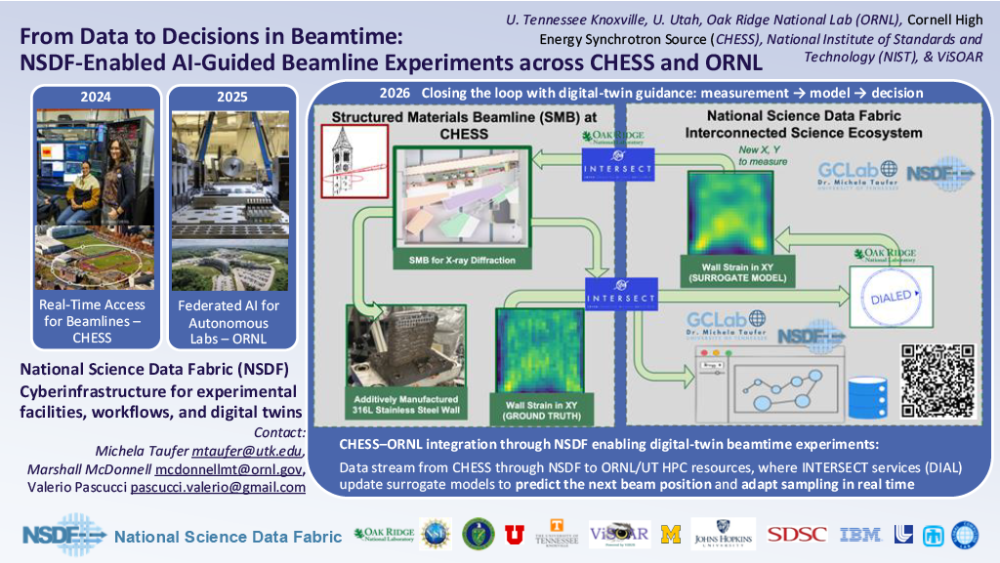

 

 

# NSDF Presented AI-Guided Beamline Experiments at DOE Data Days

At the DOE Data Days, the National Science Data Fabric (NSDF) presented collaborative work with INTERSECT at Oak Ridge National Laboratory (ORNL) and the Cornell High Energy Synchrotron Source (CHESS) on AI-guided beamline experiments. The work demonstrates how NSDF streams experimental data to HPC resources where surrogate AI models guide measurements in real time, enabling a digital-twin loop of measurement → model → decision. Learn more about the event: [https://data-science.llnl.gov/d3](https://data-science.llnl.gov/d3)

  
