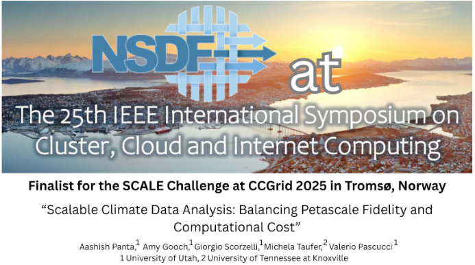

We are proud to announce that the National Science Data Fabric (NSDF) team has been selected as one of the five finalists in the SCALE Challenge at CCGrid 2025, to be held in Kristiansand, Norway.

Our finalist submission, titled “Scalable Climate Data Analysis: Balancing Petascale Fidelity and Computational Cost,” addresses the growing challenge of managing and analyzing massive volumes of climate data generated by remote sensing and simulation.
 
Team Members:

- Aashish Panta, University of Utah
- Amy Gooch, University of Utah
- Giorgio Scorzelli, University of Utah
- Michela Taufer, University of Tennessee at Knoxville
- Valerio Pascucci, University of Utah

The project introduces a scalable ecosystem that integrates multiresolution data management, intelligent data transmission, and machine learning-assisted reconstruction. This innovative approach enables a 99% reduction in storage and computational costs—from $100,000 to just $24—while maintaining high-fidelity results (RMS error of only 1.46°C). Experimental validation on petascale NASA climate datasets confirms that critical climate features are preserved, supporting accurate, cost-effective analysis for scientific research and policy decision-making.
 
Learn more about the SCALE Challenge at CCGrid 2025: [https://site.uit.no/ccgrid2025/scale-challenge](https://site.uit.no/ccgrid2025/scale-challenge)