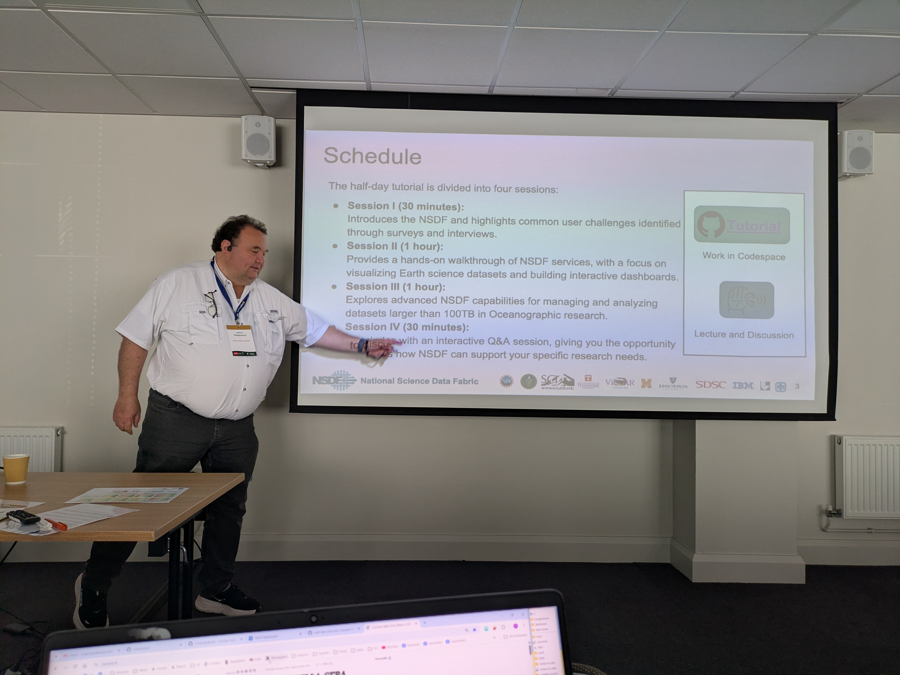
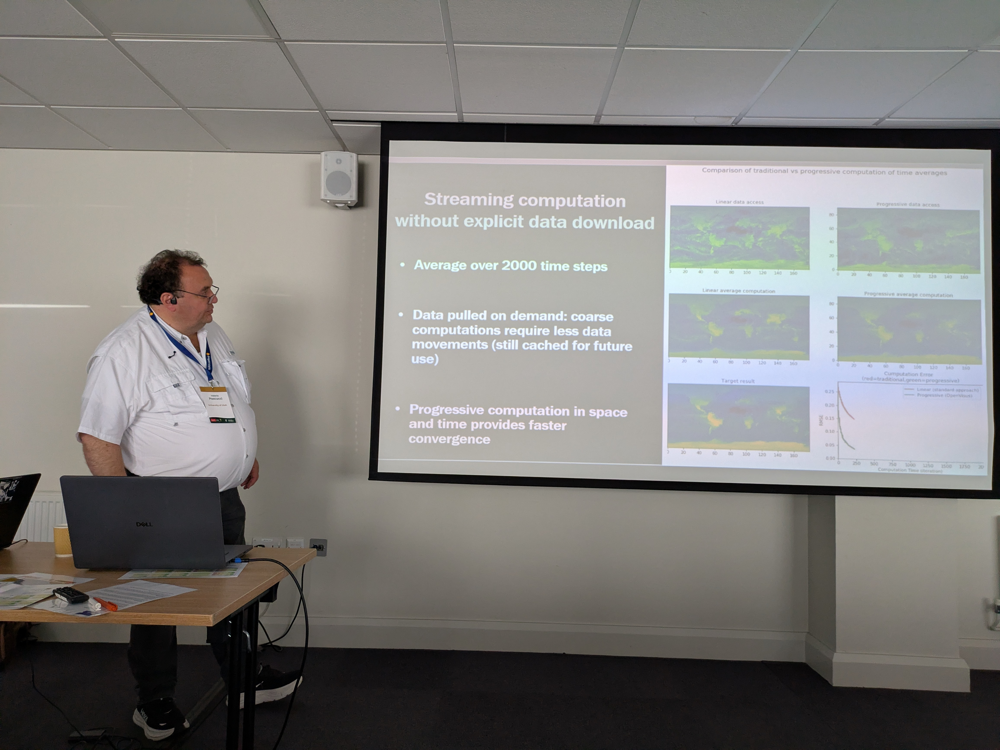

**Presenter:** Valerio Pascucci (University of Utah)

At <a href="https://eurovis.org.uk/">EuroVis 2026</A>, Valerio Pascucci presented on behalf of the <a href="https://nationalsciencedatafabric.org/">National Data Science Fabric</a> (NSDF), showcasing innovative infrastructure designed to accelerate scientific discovery. The session featured a practical, hands-on tutorial where we guided participants through advanced workflows for the interactive visualization of big data.

**Dates**: 8-12 June 2026

**Where**: Nottingham (UK)

    

        <h2>Visual Highlights from the Session</h2>
        

            

                
                
Comparison of Traditional vs. Progressive Computation

            

            

                
                
Half-Day Tutorial Schedule

            

            

                
                
Streaming Computation Without Explicit Download

            

				

                
                
EuroVis 2026

            

        

    

    

        <h2>Schedule Breakdown</h2>
        <table class="schedule-table">
            <thead>
                <tr>
                    <th>Session</th>
                    <th>Focus</th>
                </tr>
            </thead>
            <tbody>
                <tr>
                    <td><strong>Session I (30m)</strong></td>
                    <td>Introduction to NSDF and common user "pain points" identified through surveys.</td>
                </tr>
                <tr>
                    <td><strong>Session II (1h)</strong></td>
                    <td>Hands-on walkthrough: Visualizing Earth science datasets and building interactive dashboards.</td>
                </tr>
                <tr>
                    <td><strong>Session III (1h)</strong></td>
                    <td>Advanced NSDF capabilities for managing datasets >100TB in Oceanographic research.</td>
                </tr>
                <tr>
                    <td><strong>Session IV (30m)</strong></td>
                    <td>Interactive Q&A regarding specific research needs and NSDF support.</td>
                </tr>
            </tbody>
        </table>
    

    

        <h2>Getting Started</h2>
        
Ensure you have the following prerequisites ready for the hands-on portions:

        <ul>
            <li><strong>GitHub Account:</strong> Log in or create one to run the tutorial repository.</li>
            <li><strong>GitHub Codespaces:</strong> Use this to set up your interactive workspace.</li>
            <li><strong>Kernel Selection:</strong> Always select the <strong>★NSDF-Tutorial</strong> Python environment.</li>
        </ul>

		  <a href="https://github.com/nsdf-fabric/EuroVis-Tutorial-2026">GitHub repository</a> 
    

