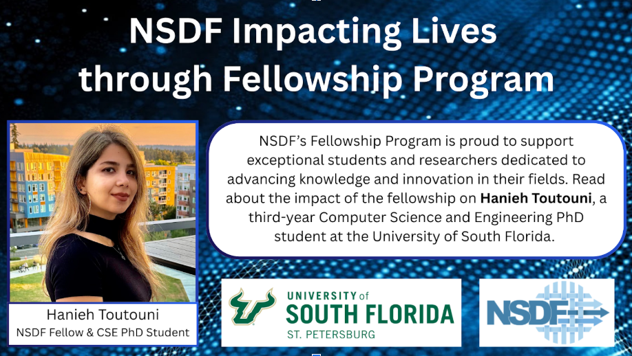

NSDF’s Fellowship Program is proud to support exceptional students and researchers dedicated to advancing knowledge and innovation in their fields. Read about the impact of the fellowship on Hanieh Toutouni, a third-year Computer Science and Engineering PhD student at the University of South Florida. 

[LINK](https://www.usf.edu/ai-cybersecurity-computing/news/2024/csephdstudentawardedannsdffellowship.aspx)