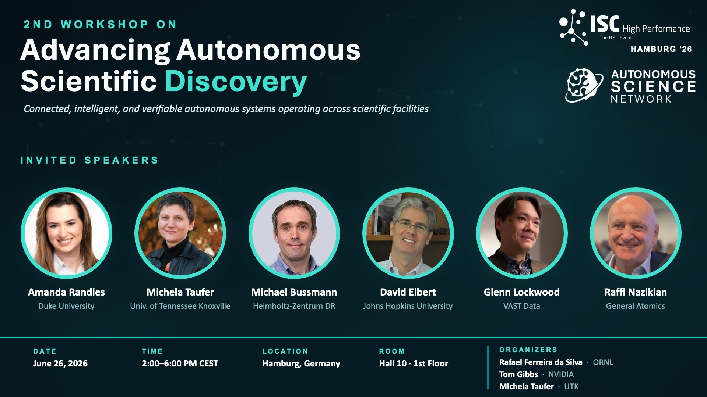

 

**June 2026** 

# NSDF Advances Autonomous Scientific Discovery at ISC 2026

The National Science Data Fabric (NSDF) will be featured at the <a href="https://autonomousscience.org/workshops/a2sd-2026/">2nd Workshop on Advancing Autonomous Scientific Discovery</a> at <a href="https://isc-hpc.com/">ISC 2026</a> in Hamburg, where Michela Taufer will join leading experts to discuss how connected instruments, data, AI, workflows, and HPC can accelerate autonomous scientific discovery

 

  
