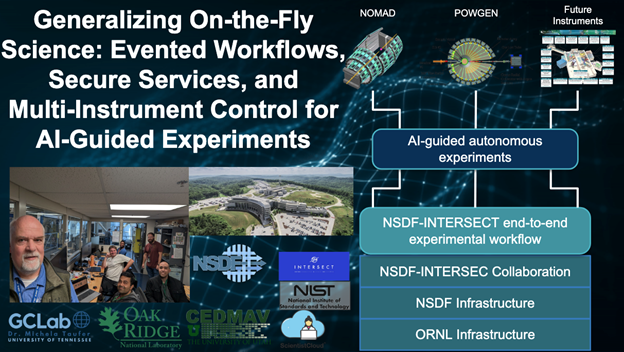

# NSDF and INTERSECT@ORNL Advance Autonomous Powder Diffraction on POWGEN 

Scaling from one beamline to many. We’re turning live experiments into “on-the-fly” science. By connecting instruments to AI, secure data services, and standardized workflows, teams can analyze results as they arrive and automatically steer the next measurement.

<i>NSDF and INTERSECT@ORNL Complete Second AI-guided Autonomous Experiment at POWGEN (Sept 12–13, 2025)</i>

Building on our June 4, 2025, debrief and the first autonomous run targeting spin-flop transitions in α-Fe₂O₃ (hematite), NSDF × INTERSECT returned to ORNL to execute a second AI-guided, runtime-steered powder diffraction experiment, but this time on POWGEN, ORNL’s general-purpose neutron powder diffractometer. This follow-up focused on generalizing the pattern from a single-instrument demonstration to a portable, facility-ready workflow.

POWGEN’s high-resolution powder diffraction complements our earlier work informed by NOMAD data, giving us another instrument to **stress-test eventing, orchestration, and secure service-to-service integration**. The aim is not just one success, but a **reusable playbook** for autonomous experiments across DOE facilities.

## Impact 

- Scientific velocity: Faster hypothesis cycles by iterating during beamtime, not after.
- Reproducibility: Evented, versioned workflows lower the cost of re-running, sharing, and auditing.
- Portability: A domain-agnostic NSDF backbone, combined with domain-specific instrument services, enables “write once, adapt across instruments.” 
- Human-centered autonomy: Dashboards make AI decisions legible, building trust and enabling timely interventions. 

## Architecture highlights

-  Data fabric as the spine: NSDF provides storage, movement, and eventing so analysis lands where compute is available, HPC or cloud, without losing provenance. 
-  Service mesh mindset: Interoperable services exchange events and secrets securely, so teams can plug in domain tools without bespoke glue code.
-  Multi-instrument control surface: Updating EIC to address both NOMAD and POWGEN shows how a single control layer can adapt.

## What’s next
We’ll continue to generalize the event-driven pipeline, strengthen security, and expand multi-instrument support, enabling autonomous, AI-guided workflows to become routine across facilities and scientific domains. Along the way, we’ll share code pointers, slides, and additional materials as they’re packaged for public release.

## Contributors

### NSDF Collaborators:
Jack Marquez, Kin Hong NG, Giorgio Scorzelli, Amy Gooch, Valerio Pascucci, Michela Taufer

### ORNL Team
Ray Gregory, Kaz Gofron, Bogdan Vacaliuc, Zach Thurman, Gregory Cage, Gavin Wiggins, Cody Stiner, Lance Drane, Jesse McGaha, Andrew Ayres, Robert Smith, Marshall McDonnell, Greg Watson, Addi Malviya Thakur, Yuanpeng Zhang, Jue Liu, 

Stephen DeWitt, Ankit Shrivastava, Paul Laiu, Craig Bridges, Ben Mintz, Rob Moore, 

Mathieu Doucet, Matt Tucker, Emily R Van Auken, Luke Daemen, Marie Backman, Darsh Dinger, Melanie Kirkham, Thomas Proffen

### NIST Collaborators:
Austin McDannald, Gilad Kusne, William Ratcliff

 

  