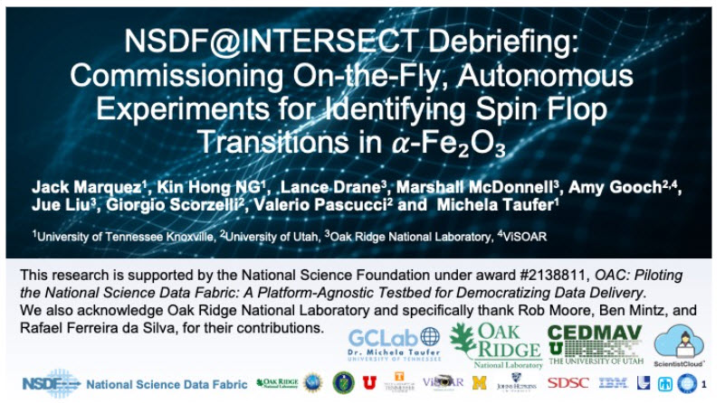

On June 4, 2025, the National Science Data Fabric (NSDF) and Oak Ridge National Laboratory’s INTERSECT program successfully hosted a joint debrief meeting to highlight the **breakthrough in AI-guided autonomous experiments** integrating runtime steering and artificial intelligence (AI) for real-time scientific discovery. 

The team demonstrated how these capabilities enabled the precise identification of spin flop transitions in hematite (α-Fe₂O₃), paving the way for smarter, faster experimentation across DOE facilities.

## About the Experiment
Since January 13, 2025, the NSDF team has partnered with Marshall McDonnell, lead scientist of ORNL’s Autonomous Neutron Diffraction team within INTERSECT, to run an autonomous experiment targeting spin flop transitions in α-Fe₂O₃ (hematite).

This collaboration integrated NSDF’s domain-agnostic infrastructure with INTERSECT’s neutron beamline, enabling:
- Real-time data steering via AI-driven dashboards
- NSDF-backed storage and data services
- A custom end-to-end experimental workflow

The result: a successful on-the-fly experiment demonstrating the power of AI-guided discovery at national user facilities.

## Milestone Success

The teams conducted an autonomous experiment targeting a **spin flop transition in 𝛼-Fe₂O₃ at 260K**, guided by prior NOMAD data and literature.

> “This experiment marks a breakthrough in autonomous experimentation,” said Marshall McDonnell (ORNL).

The collaboration also sparked interdisciplinary excitement:

> “It was very exciting to learn about a different field and see how we can help other domains,” said Jack Marquez (NSDF). “I was thrilled to be in the control room.”

## Next Steps
Energized by this experiment's success, the collaboration is moving forward with a second autonomous experiment in August 2025, leveraging ORNL’s high-resolution Powder Diffractometer (POWGEN) to investigate phase transitions in iron oxide.

## Contributors

- Jack Marquez – University of Tennessee, Knoxville
- Kin Hong NG – University of Tennessee, Knoxville
- Lance Drane – Oak Ridge National Laboratory
- Marshall McDonnell – Oak Ridge National Laboratory
- Amy Gooch – University of Utah / ViSOAR
- Jue Liu – Oak Ridge National Laboratory
- Giorgio Scorzelli – University of Utah
- Valerio Pascucci – University of Utah
- Michela Taufer – University of Tennessee, Knoxville

*“It was a pleasure working with this team from various institutions, coming together and achieving a concrete result so quickly,”* said Valerio Pascucci (PI, NSDF).

*“NSDF services are central to both the experiment’s success and future applications, including AI and enhanced facility integration. NSDF enables scientists to speed up their discoveries,”* added Michela Taufer (Co-PI, NSDF).

# [Watch the full debrief](https://drive.google.com/file/d/12sI5fpdPnGt0Bmr1HvA3gY16g7pyaXIO/view?usp=sharing)

# [Check out the slides](https://drive.google.com/file/d/1BcHy5B_F-K8PqFDuxCwWTvSm7i3GZNkV/view?usp=sharing)

  