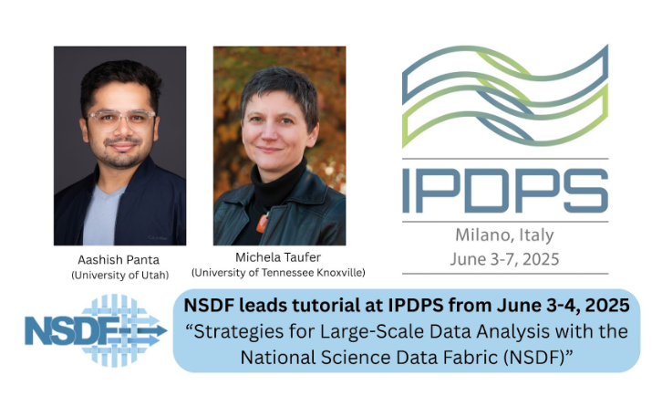

The National Science Data Fabric (NSDF) will be featured at IPDPS 2025 through a tutorial titled **Strategies for Large-Scale Data Analysis with the National Science Data Fabric (NSDF)**. This tutorial will be held on **Tuesday, June 3, and Wednesday, June 4**, during the afternoon sessions.

The tutorial is designed to be hands-on and will be repeated on both days to accommodate more participants.

This session will introduce attendees to the NSDF architecture and demonstrate how it supports scalable, FAIR, and AI-ready workflows across diverse scientific domains. The tutorial will cover key NSDF components and showcase real-world use cases from HPC systems, experimental facilities, and cloud-based infrastructures.

Speakers:

- Michela Taufer, University of Tennessee, Knoxville
- Aashish Panta, University of Utah

The NSDF team is excited to share the latest advancements and engage with the international HPC community in Milan.

[View the full tutorial listing on the IPDPS 2025 website](https://www.ipdps.org/ipdps2025/2025-tutorials.html)
