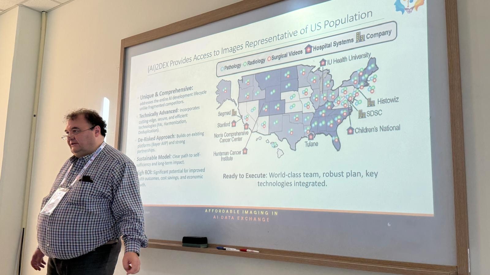

Valerio Pascucci [presented](https://ai2dex.com/) at the 28th International Conference on [Medical Image Computing and Computer-Assisted Intervention (MICCAI 2025)](https://conferences.miccai.org/2025/en/) [1] the tutorial on [COmprehensive Federated Ecosystem (COFE)](https://collaborativefederatedlearningtutorials.github.io/website/schedule/) [2], in collaboration with [Alex Karargyris](https://www.linkedin.com/in/alexandroskarargyris/), [Spyridon Bakas](https://www.linkedin.com/in/sbakas/), [Holger Roth](https://research.nvidia.com/person/holger-roth), [Sergen Cansiz](https://www.linkedin.com/in/sergencansiz/).

The tutorial focused on practical medical imaging applications of federated learning (FL) through its sessions, covering topics such as the MLCommons, NVFlare, MedPerf demonstrations, and various medical imaging FL applications.

Pascucci delivered a presentation focused on []"Clinical Translation of Federated Learning with Regulatory Oversight,"](https://ai2dex.com/) demonstrating the ability to connect advanced machine learning methods to clinical practice while following regulatory requirements in the real world through the [AI2DEX](https://ai2dex.com/) platform [3]. The tutorial provides essential educational value to researchers and practitioners who study artificial intelligence in medical imaging.

[1] The 28th International Conference on Medical Image Computing and Computer Assisted Intervention (MICCAI 2025), September 23rd to 27th 2025, Daejeon, Republic of Korea: [https://conferences.miccai.org/2025/](https://conferences.miccai.org/2025/)

[2] MICCAI 2025 tutorial on Federated Learning for Healthcare: COmprehensive Federated Ecosystem (COFE) [https://collaborativefederatedlearningtutorials.github.io/website/](https://collaborativefederatedlearningtutorials.github.io/website/)

[3] The national platform providing an Affordable Imaging in AI Data EXchange (AI2DEX) data exchange: [https://ai2dex.com/](https://ai2dex.com/)

  