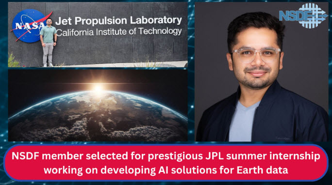

# NSDF Member Selected for Prestigious NASA JPL Summer Internship

We’re thrilled to announce that Aashish Panta, one of the key members of the [National Science Data Fabric (NSDF)](https://nationalsciencedatafabric.org/), has been accepted into a prestigious summer internship at [NASA’s Jet Propulsion Laboratory (JPL)](https://www.jpl.nasa.gov/)! This opportunity places Aashish at the forefront of cutting-edge research in machine learning, large language models (LLMs), and climate science.

From June 9 to August 15, 2025, Aashish will join the Uncertainty Quantification and Statistical Analysis group (398L) at JPL in La Cañada Flintridge, California, working under the mentorship of **Dr. Kyo Lee**. The internship is part of NASA’s broader initiative to harness artificial intelligence in service of Earth science and climate resilience.

# About the Project

Aashish’s internship project is titled **“Machine Learning & LLMs for Downscaled Climate Data via Retrieval-Augmented Generation (RAG),”** and it brings together advanced machine learning methods and NASA’s extensive climate data archives. The goal is to develop intelligent, scalable language models that can interpret and synthesize large and complex climate datasets, especially those derived from various **downscaled climate projections**.

Aashish will contribute to several core components of the project, including:
- **Integrate RAG & LLMs**: Develop a novel RAG framework that taps into NASA’s satellite observations and NEX-DCP30 downscaled products, offering adaptive, ensemble-based climate data analysis.
- **Multi-Model Ensemble**: Combine outputs from multiple downscaled and observational models to handle data variability and improve overall quality.
- **Scalability & Adaptability**: Continuously incorporate newly downscaled products to refine model performance, ensuring the framework remains flexible and broadly applicable.
- **Customized & Composite Models**: Build RAG-enhanced LLMs tailored to individual downscaled products, as well as a composite LLM that synthesizes insights from multiple data sources.
- **Uncertainty Quantification (UQ) & Validation**: Implement rigorous UQ and validation protocols to enhance the reliability of climate analyses and support data-driven decision-making.

# Importance of the Project

This work directly contributes to [NASA’s Earth Science to Action (ES2A)](https://assets.science.nasa.gov/content/dam/science/esd/earth-science-division/earth-science-to-action/ES2A_Booklet_web.pdf)  strategy by exploring new applications of RAG and LLMs, ultimately expanding the reach of NASA’s downscaled climate products and bridging the gap between scientific knowledge and actionable policy.

> I am incredibly excited to contribute to NASA’s science mission, and I am looking forward to learning from and collaborating with experts, solving some of the most important challenges in Earth Science today,” said Aashish Panta (NSDF).

# A Well-Deserved Opportunity

We couldn’t be prouder of Aashish for earning this incredible opportunity. Their selection reflects both Aashish’s technical expertise and his deep commitment to using data science for environmental good.

The project serves as a valuable advancement for Earth science research, and we are excited to hear updates and learn from the insights he will bring back to the National Data Science Fabric.

  