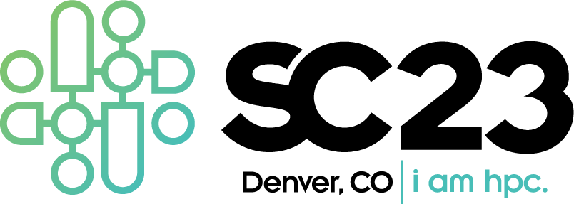

 

**Denver: Nov 12 - Nov 17**

Join us for two Panels on <a href="https://sc23.supercomputing.org/presentation/?id=pan111&sess=sess194">“Unleashing the Power within Data Democratization: Needs, Challenges, and Opportunities”</a> and <a href="https://sc23.supercomputing.org/presentation/?id=pan110&sess=sess193">“HPC and Cloud Converged Computing: Merging Infrastructures and Communities”</a> and BoFs on <a href="https://sc23.supercomputing.org/presentation/?id=bof188&sess=sess413">“A National Science Data Fabric to Democratize Data Access and Reusability”</a>

---

## [Panel: Unleashing the Power within Data Democratization: Needs, Challenges, and Opportunities](https://sc23.supercomputing.org/presentation/?id=pan111&sess=sess194)
 

**Thursday, 16 November 2023**

**1:30pm - 3pm MST**

**Location: 205-207**

 

The scientific community needs a data fabric that integrates data delivery and access to shared storage, networking, computing, and educational resources. Such a data fabric can potentially democratize data-driven scientific discovery across the growing data science community.

In this panel, we will discuss the needs, challenges, and opportunities of the data science community leveraging the existing cyberinfrastructures and software tools while strategizing on what is missing to connect an open network of institutions, including resource-disadvantaged institutions.

 

**Moderator:**

**Christine Kirkpatrick**, *San Diego Supercomputer Center (SDSC)*

**Panelists:**

- **Valerio Pascucci**, *University of Utah*
- **Michela Taufer**, *ACM*
- **Ian Foster**, *U. ChicagoArgonne National Laboratory (ANL)*
- **Ilya Baldin**, *Renaissance Computing Institute (RENCI)*
- **Franck Wuerthwein**, *San Diego Supercomputer Center (SDSC)*

---

## [Panel: HPC and Cloud Converged Computing: Merging Infrastructures and Communities](https://sc23.supercomputing.org/presentation/?id=pan110&sess=sess193)
 

**Wednesday, 15 November 2023**

**3:30pm - 5pm MST**

**Location: 205-207**

 

The end of Dennard scaling and tapering of Moore’s law has led to economic conditions that favor cloud hyperscalers. Consequently, cloud is projected to be the largest sector of computing by revenue by 2025. The tremendous growth translates into substantial investment in research and development to manage the complexity of emerging systems. Cloud technologies such as elasticity, containerization and orchestration, and automation are gaining prevalence in HPC due to their abilities to manage new composite scientific workflows. Similarly, HPC techniques for performance optimization, scheduling, and fine-grained resource management are being integrated into the cloud to improve performance. The trend of integrating technologies from each community into the other leads to Converged Computing, an environment that combines the best capabilities from both worlds. In this highly interactive panel, we invite experts from industry, national laboratories, and academia to discuss their experiences with converged computing and share their views on its future.

 

**Moderator:**

**Daniel Milroy**, *Lawrence Livermore National Laboratory*

**Panelists:**

- **Michela Taufer**, *University of Tennessee, University of Delaware*
- **Seetharami Seelam**, *IBM T. J. Watson Research Center*
- **Bill Magro**, *Google*
- **Heidi Poxon**, *Amazon Web Services (AWS)*
- **Todd Gamblin**, *Lawrence Livermore National Laboratory*

---

## [BoF: A National Science Data Fabric to Democratize Data Access and Reusability](https://sc23.supercomputing.org/presentation/?id=bof188&sess=sess413)
 

**Thursday, 16 November 2023**

**12:15pm - 1:15pm MST**

**Location: 601-603**

 

We are building a National Science Data Fabric (NSDF) that introduces a novel trans-disciplinary approach for integrated data delivery and access to shared storage, networking, computing, and educational resources. Such a data fabric can democratize data-driven scientific discovery across the growing data science community. In this BoF, we want to engage the data science community to discuss the challenges and opportunities of the NSDF project and other similar efforts to connect an open network of institutions, including resource-disadvantaged institutions, and develop a federated testbed configurable for individual and shared scientific use.

 

**Session Leader:**

**Valerio Pascucci**, *University of Utah*

**Additional Session Leaders:**

- **Michela Taufer**, *University of Tennessee*
- **Christine Kirkpatrick**, *San Diego Supercomputer Center (SDSC)*
- **Jakob Luettgau**, *University of Tennessee*
