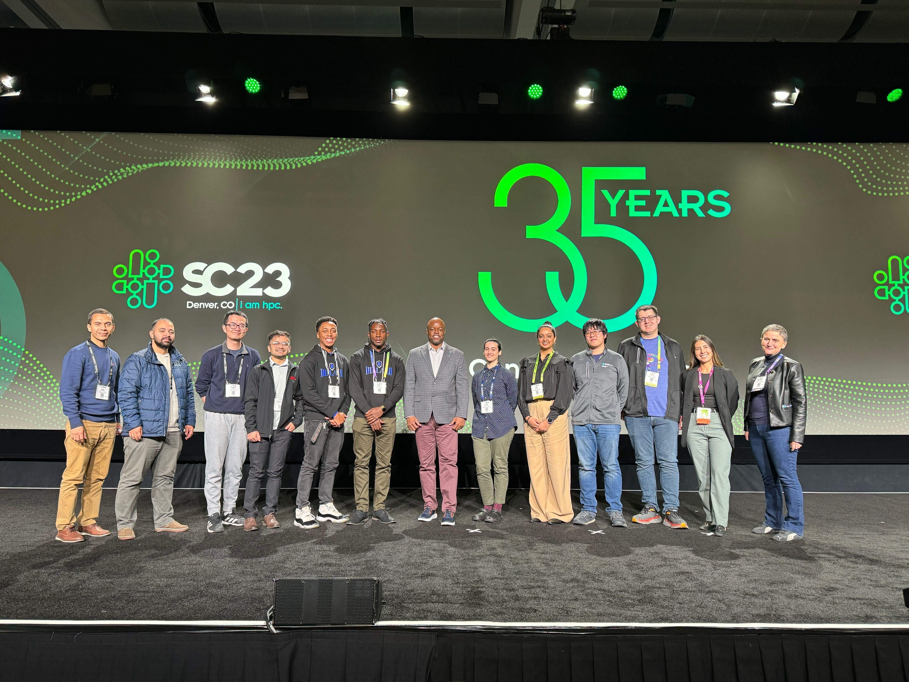

 

 

 

In response to the great success of our fellowship program at **[SC23](https://nationalsciencedatafabric.org/nsdf-travel-award-winners)**, we are delighted to announce that the National Science Data Fabric (NSDF) is currently accepting applications for new fellows to attend **[SC24](https://sc24.supercomputing.org/)** in Atlanta, GA, November 17-22, 2024. 

NSDF is providing a limited amount of travel support (up to $2,000 per award) to enable students, early career researchers, and members of Minority-Serving Institutions who would not otherwise be able to attend the event to participate in the NSDF-led **[panel](https://sc24.conference-program.com/presentation/?id=pan103&sess=sess448)** and other activities.
 
Applicants can fill out **[this form](https://forms.gle/CJVwGfyBY1UdWfbFA)** by October 1st for consideration. Awards are determined on a first come first serve basis. 

Please share this page with students or early career researchers who may be interested! 

  