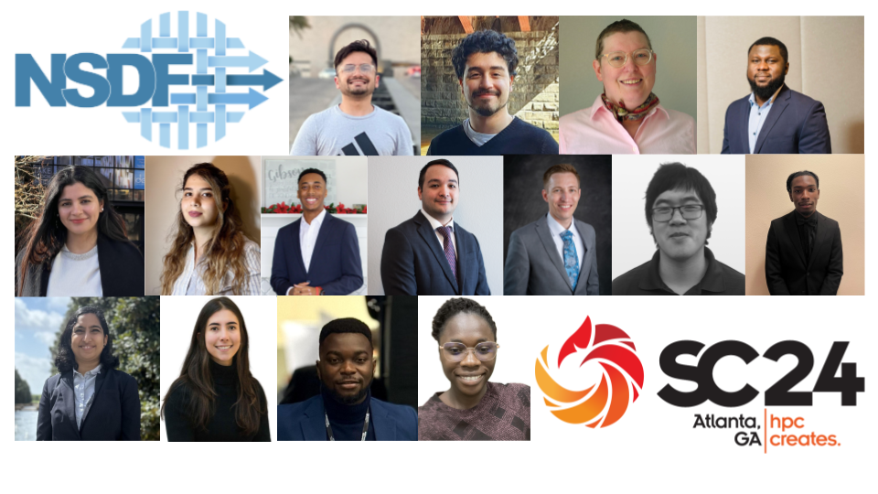

 

 

 

Top row: Aashish Panta, Alper Sahistan, Amy Roberts, Gabriel Owusu; middle row: Harshita Sahni, Hanieh Toutouni, Kaleb Gibson, Kin NG, Michael Sutherlin, Nigel Tan, Darren Petty Jr.; bottom row: Rishita Bansal, Paula Olaya, Isaac Arkorful, Sandra Eddie.

The [National Science Data Fabric](https://nationalsciencedatafabric.org/) (NSDF) is proud to announce its 2024 cohort of NSDF Fellows, awarding travel grants to fifteen outstanding individuals, more than doubling last year’s count of seven. Selected from a highly competitive pool of applicants, this diverse group of fellows—including students, early career researchers, and faculty from Minority Serving Institutions across the country—will join the SC24 community in Atlanta, November 17-22, participating in activities and learning opportunities as a connected cohort. In addition, each fellow will receive a membership to ACM’s SIGHPC, the leading high-performance computing professional society, and attend the SIGHPC annual meeting in Atlanta.

Several fellows will attend SC24 for the first time. All will engage in NSDF-sponsored sessions, including the EduHPC-24 workshop and the panel “Creating Inclusive Scientific Communities in the Information Age: Can Equity Democratize Data-Intensive Research?”

*“We are excited to support this exceptional group of NSDF Fellows at SC24,”* says Michela Taufer, NSDF co-PI and Dongarra Professor of High Performance Computing at the University of Tennessee, Knoxville. *“This fellowship reflects our commitment to democratizing data delivery by fostering a more inclusive, engaged, and well-prepared community in high-performance computing (HPC). The fellows will have the unique opportunity to gain insights from experts, connect with peers, and return with new ideas that can transform their research and communities.”*

Valerio Pascucci, NSDF PI and Professor of Computer Science at the University of Utah, adds, *“NSDF is dedicated to advancing equitable access to scientific data and infrastructure, and this fellowship program helps cultivate leaders who share this vision. Our collaborations, enriched by the perspectives of our fellows, help us collectively tackle some of the biggest challenges in data access and democratization.”*

This year’s cohort marks a significant milestone for NSDF’s commitment to diversity and equity in data access. It prepares fellows to contribute actively to discussions on data democratization, HPC, and scientific discovery at SC24 and beyond. This year’s winners are:

## Aashish Panta 

Aashish Panta  is a Ph.D. student at the University of Utah, Salt Lake City, and a graduate research assistant at the Scientific Imaging and Computing Institute. His research focuses on developing visualization tools for large-scale scientific data, with interests in cloud computing and machine learning: *“This incredible opportunity to attend SC24 through the NSDF fellowship means a lot to me. I’m really looking forward to learning from the experts, seeing the latest in supercomputing research, and bringing new ideas back to my research.”*

## Alper Sahistan 
Alper Sahistan is a Ph.D. student at SCI Institute at the University of Utah with expertise in ray tracing, volume rendering, scientific visualization, computer graphics, and data compression. He is also interested in high-performance computing and computational geometry. His current projects include a novel method for efficient Multi-channel volume rendering, ANARI-based distributed rendering, and several other projects in relation to the floating point compression library zfp and its DPC++/SYCL port: *“Visualization of large datasets has always been a problem within high-performance computing. I hope to gain new perspectives and insights on HPC while presenting a short part in the Intel booth at SC24.”*

## Amy Roberts 
Amy Roberts is an assistant professor in the CU Denver physics department.  She specializes in building analysis tools that improve access to scientific data analysis.  She is the PI of the PONDD project, which aims to provide open-source, well-supported tools for custom binary data.  She is a member of the SuperCDMS dark-matter search collaboration, where she leads the data quality efforts and efforts to provide an accessible analysis environment for SuperCDMS data.  Amy is passionate about increasing access to science through better software tools, reproducible analyses, and open science:*“Attending SC24 gives me an opportunity to connect to other researchers who are working on software infrastructure.  My research lab is almost exclusively staffed by undergraduate students and having software infrastructure in place that is well-supported is critical to advancing research at my institution.”*

## Darren Petty Jr. 

Darren Petty Jr. is an honors undergraduate senior at Dillard University, majoring in Computer Science. Alongside his academic achievements, he is a standout athlete in track and field, earning the prestigious All-American honor for his exceptional running performance. His research interests lie in operating systems, memory allocation strategies, and file system hierarchies. He is currently working on projects related to process scheduling, memory management, and analyzing directory structures in operating systems, aiming to improve system efficiency and performance: *“Attending SC24 and being part of this fellowship is an incredible opportunity to deepen my understanding of high-performance computing and network with industry leaders and researchers. It means expanding my knowledge in cutting-edge technologies, advancing my skills, and gaining valuable insights that will contribute to my academic and professional growth.”*

## Gabriel Owusu 
Gabriel Owusu  is a Doctoral Candidate in Information Systems at the Robert C. Vackar College of Business and Entrepreneurship (RCVCOBE) at the University of Texas Rio Grande Valley. He holds a Bachelor of Science in Computer Science from Kwame Nkrumah University of Science and Technology, Ghana. His research focuses on the intersection of artificial intelligence, healthcare analytics, decision support systems, big data analytics, and information security. In his current research, Gabriel is developing an AI-driven Clinical Decision Support System (AI-CDSS) to assist physicians in the early detection and progression monitoring of Alzheimer’s disease and related dementias: *“Attending SC24 provides an invaluable opportunity to connect with experts, expand my knowledge of high-performance computing (HPC), and engage in meaningful discussions at the forefront of AI and deep learning.”*

## Harshita Sahni 
Harshita Sahni is a PhD student at the University of New Mexico and a graduate researcher at Los Alamos National Laboratory. Her research focuses on applying machine learning and high-performance computing to in-situ analysis of molecular dynamics simulations. She is developing a pipeline for this in-situ analysis and creating methods for multiscale models, including all-atom and coarse-grained representations. Additionally, she is working on clustering techniques for sequences without aligning them and contributing to protein-protein interaction prediction projects: *“Receiving the NSDF fellowship and attending SC24 is an incredible opportunity for me to engage with the forefront of high-performance computing and expand my knowledge in the field. It allows me to connect with leading experts, learn about cutting-edge innovations, and apply new techniques to my research.”*

## Hanieh Toutouni
Hanieh Toutouni is a third-year PhD student and research assistant at the University of South Florida, specializing in computational science and high-performance computing. Her research focuses on optimizing GPU-accelerated algorithms for large-scale simulations, particularly in spatial indexing and molecular dynamics. She is passionate about utilizing parallel computing and machine learning to address complex challenges in scientific computing and artificial intelligence: *“Attending SC24 as an NSDF fellow is an incredible opportunity to engage with the forefront of supercomputing innovation. This fellowship provides a platform for me to expand my knowledge, network with industry leaders, and contribute to impactful advancements in high-performance computing.”*

## Kaleb Gibson 
Kaleb Gibson is a junior at Dillard University, pursuing his undergraduate studies in computer science while also serving as a residential assistant. In addition to his academic responsibilities, he is a passionate baseball player, working hard both on the field and in his role supporting fellow students in the dorms. Balancing these commitments helps him grow as a leader and athlete, as he strives for success in every area of his college experience. He is currently working on a project that teaches educators and students how to use virtual reality to improve their skills: *“Attending SC24 means a lot to me because I was able to attend last year and the experience was truly eye-opening. I was one of the youngest people there but it allowed me to be up close and personal with the brightest minds in technology and their inventions.”*

## Kin NG 
Kin NG is a postdoctoral researcher working with the Global Computing Lab under the supervision of Dr. Michela Taufer. He earned his Ph.D. in Computer Science in 2023 from the University of South Florida (USF), where he also completed his BSc in Computer Science in 2019. During his time at USF, his research focused on the intersection of computational social sciences and AI, contributing to several projects funded by U.S. agencies such as the DOE and DARPA. His research interests include AI, machine learning, graph neural networks, data science, and HPC: *“Attending SC24 will provide invaluable guidance for my career path as a researcher, and an incredible opportunity to delve deeper into topics I am passionate about and to network with individuals who share similar interests.”*

## Michael Sutherlin 
Michael Sutherlin is a research manager at Dr. Michela Taufer’s Global Computing Lab at the University of Tennessee, which is where he received his Ph.D. in English Literature. He is a member of NSDF’s User Communities Team and is working on identifying ways NSDF can better assist scientific communities access and manage their data. He is also interested in exploring HPC topics through humanistic thinking, especially in ways that promote ethical care and human flourishing: *“It is an honor to be one of the NSDF Fellows! I am thrilled at the prospect of attending SC24 and learning more about supercomputing and how scholars are helping HPC communities achieve greater equity and access.”*

## Nigel Tan 
Nigel Tan is a research scientist at the Global Computing Laboratory. He received his Ph.D. from the University of Tennessee Knoxville on August 2024. His research interests are in performance portability, data deduplication, and managing non-determinism. He is collaborating with Los Alamos National Laboratory on improving the Vector Particle-In-Cell (VPIC) project, a 3D3V, fully relativistic, kinetic, performance-first PIC code using the Kokkos performance portability framework. He also researches efficient data deduplication techniques for reducing I/O overheads and accelerating the comparison of data snapshots: *“Attending SC24 is an amazing opportunity to network and start my career on the right foot.”*

## Paula Olaya 
Paula Olaya is a research scientist in the On-prem AI Cloud team at IBM Research. She obtained her Ph.D. and M.Sc. in Computer Science at The University of Tennessee advised by Dr. Michela Taufer. Olaya’s research interests include the convergence between high-performance and cloud computing for scientific workflows to allow intrinsic reproducibility, trustworthiness, and scalability. She has been involved in projects with HPC and machine learning applications, such as protein identification through diffraction patterns, also benchmarking and analyzing performance in terms of time and power usage for FFTs and sparse matrix solvers at the architecture and algorithm level for an astrophysics application: *“SC gives you the unique opportunity to attend cutting-edge HPC research events and connect with other fellows for future collaborations. As an early career, attending SC24 means strengthening the current professional path that you are embarking on. The HPC work and community present at SC sets this conference apart from others, and thanks to the NSDF fellowship, I get to experience this.”*

## Rishita Bansal 
Rishita Bansal is a Ph.D. candidate in Computer Science at The University of Texas at Dallas, specializing in Deep Learning and Reinforcement Learning. Her research includes work on Collision Avoidance for Autonomous Vehicles and Sensor Simulation. Currently, she is focusing on computer vision applications for aerial images captured by UAVs (drones) in the agricultural sector, supported by a USDA-funded project:  *“I am grateful for the NSDF fellowship, which enables me to attend the SC 24 conference. This presents a valuable opportunity to deepen my understanding of High-Performance Computing (HPC) in deep learning and its applications in agriculture.”*

## Isaac Arkorful 
Isaac Arkorful is a master's student studying Electronics Engineering at Norfolk State University, where he serves as a graduate research and teaching assistant. Isaac's research focuses on biological cell deformation quantification using image processing in dual-beam optical tweezer systems, contributing to a novel method to predict the onset of cancer early enough to allow effective preventive treatment: *“Attending SC24 would provide an invaluable opportunity to engage with leading researchers in high-performance computing and expand my knowledge of computational applications.”*

## Sandra Eddie 
Sandra Eddie is pursuing a master's degree in Electronics Engineering at Norfolk State University, where she serves as a graduate research and teaching assistant. Her research focuses on flood detection using integrated digital twin technology with LoRa and LoRaWAN. This research aims to enhance real-time environmental monitoring and disaster management: *“Attending NSDF 24 will provide a valuable opportunity to learn from leaders in data science, explore cutting-edge advancements in data infrastructure, and gain insights into emerging technologies. It will also allow me to engage with a diverse community of professionals and broaden my understanding of interdisciplinary solutions.”*

  
The award winners, many of whom will be attending SC for the first time, will also be participating at the NSDF-sponsored events at SC:

Paper: [https://sc24.conference-program.com/presentation/?id=wksp115&sess=sess285](EduHPC-24: Workshop on Education for High Performance Computing)

Panel: [Creating Inclusive Scientific Communities in the Information Age: Can Equity Democratize Data-Intensive Research, from Experimental Facilities and HPC to Scientific Discovery?](https://sc24.conference-program.com/presentation/?id=pan103&sess=sess448)

[Learn more about the NSDF](https://nationalsciencedatafabric.org/index.html): The NSDF Pilot is an NSF-funded project that connects an open network of institutions, including minority serving institutions, by deploying a federated data fabric testbed configurable for individual and shared scientific use. By offering a shared, modular, containerized data delivery environment operating at the best economies of scale, the NSDF pilot demonstrates a key technology to fill the missing middle in our current computational infrastructure. The NSDF Pilot builds a shared resource for equity in data access across a diversity of disciplines, institutions, and people. The NSDF pilot embraces the motto of the Minority Serving Cyberinfrastructure Consortium (MS-CC) of accomplishing together what we cannot do separately. The NSDF Pilot connects data sources with compute and networking components through a software stack that democratizes data delivery and empowers end users with scalable, easy-to-use, integrated, and extendable tools.

 
