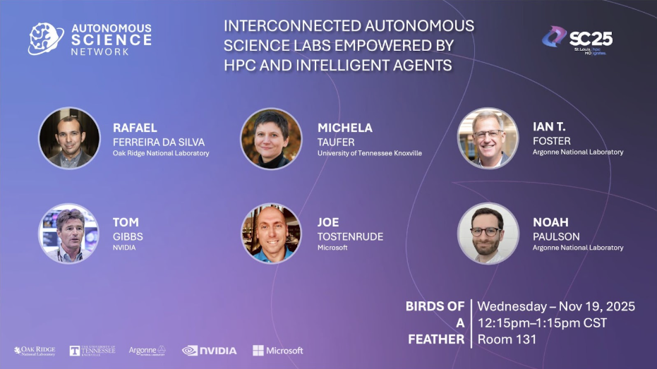

 

 

 

# NSDF Highlighted at Successful SC25 Panel on Interconnected Autonomous Science Labs

At SC25, Michela Taufer, Co-PI of the [National Science Data Fabric](https://www.linkedin.com/company/nsdf/),  (NSDF) joined a group of experts to explore how autonomous science, AI-driven experimentation, and high-performance computing (HPC) are converging to accelerate discovery. The birds of a feather talk was titled, **“Interconnected Autonomous Science Labs Empowered by HPC and Intelligent Agents,”** and was proudly sponsored by the University of Tennessee, Argonne National Laboratory, NVIDIA, Microsoft, and Oak Ridge National Laboratory. 

The central theme throughout the session, as Rafael Ferreira da Silva (ORNL) noted, was how “AI, robotics, and HPC can work together to automate and accelerate scientific discovery, and what it will take to build interoperable, multi-facility autonomous lab ecosystems.” Taufer’s lightning talk, **“Enabling Autonomous Labs: The National Science Data Fabric (NSDF) — Oak Ridge National Lab (ORNL) Partnership for Real-Time Scientific Discovery,”** highlighted NSDF’s leadership and advancements in this space.

# NSDF Powers Real-Time Autonomous Laboratories

Taufer discussed NSDF’s partnership with Oak Ridge National Laboratory (ORNL) to enable interconnected, real-time scientific workflows across institutions. NSDF is transforming autonomous laboratories through seamless data federation, FAIR-aligned workflows, and cross-facility orchestration. As an example of this partnership, Taufer showcased NSDF’s two breakthrough AI-guided autonomous experiments with ORNL’s Autonomous Neutron Diffraction team within INTERSECT. The successful autonomous identification of spin-flop transitions in hematite (α-Fe₂O₃) demonstrates the potential for autonomous labs capable of real-time decision-making, continuous experiment refinement, and HPC-integrated, agent-driven science.

# Contributors and Themes:

The SC25 Birds of a Feather sessions examined several important questions related to the future of autonomous labs. This includes the community gaps delaying progress towards autonomous research infrastructures, how we can move from isolated systems toward a cohesive national ecosystem, how to bring about greater data and workflow interoperability across facilities, and how to encourage FAIR standards that allow greater coordination, trust, and participation across scientific communities. These questions are challenging, but NSDF, in collaboration with the other national labs, companies, and institutions on the panel, is optimistic about the exciting scientific prospects that autonomous labs make possible. 

- **“A Community Roadmap for Interconnected Autonomous Science Laboratories for Accelerated Discovery”** – Rafael Ferreira da Silva, ORNL
- **“Enabling Autonomous Labs: The National Science Data Fabric (NSDF) — Oak Ridge National Lab (ORNL) Partnership for Real-Time Scientific Discovery”** – Michela Taufer, UTK
- **“Digital Twins: A critical component in the Autonomous Workflow Development and Operation”** – Tom Gibbs, NVIDIA
- **“The New Engines of Discovery: Physical Platforms for the Autonomous Scientific Age”** – Ian T. Foster, ANL
- **“From Simulation to Experiment: The New Era of Agentic AI-Driven Science”**  – Joe Tostenrude, Microsoft
- **“Modular Autonomous for Discovery for Science – Infrastructure for Laboratory Autonomy”** – Noah Paulson, ANL

# Watch the talks here: 

[https://drive.google.com/file/d/1a_VyMYv-49TdS_I4bAFMYMoHXMR4KZBT/view?usp=sharing](https://drive.google.com/file/d/1a_VyMYv-49TdS_I4bAFMYMoHXMR4KZBT/view?usp=sharing)

  