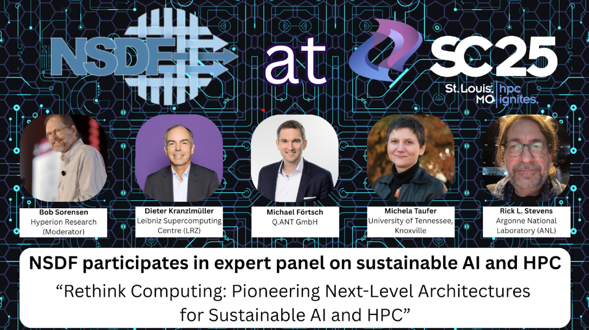

 

 

 

# NSDF Participates in Expert Panel on Sustainable AI and HPC

At SC25, the [National Science Data Fabric](https://www.linkedin.com/company/nsdf/) (NSDF) joined leading experts in high-performance computing, AI, and emerging technologies for a panel titled **“Rethink Computing: Pioneering Next-Level Architectures for Sustainable AI and HPC.”** The diverse panel included members from industry, national labs, and academic institutions, as they sought to address a significant problem in HPC: as AI and HPC workloads continue to grow, traditional electronic systems face mounting limitations in power consumption, data movement, and scalability. Thus, to push beyond exascale and allow for the future of sustainable HPC and AI, we need advanced, data-centric infrastructure to support the transition to next-generation computing architectures.  

# Points of Discussion

The panel discussion explored how photonic computing, heterogeneous digital-analog ecosystems, and emerging quantum technologies could reshape the performance and sustainability landscape. These architectures promise dramatic gains in energy efficiency, bandwidth, and computational density, which are capabilities essential for future scientific discovery and large-scale AI.
- The limits of current electronic computing and the urgent need for sustainable alternatives
- Photonic computing’s potential to deliver high-performance, low-energy processing
- Opportunities for combining digital chips (CPUs, GPUs, TPUs), analog accelerators, and quantum systems
- Challenges of hardware integration, data movement, and industrial-scale deployment
- How national research cyberinfrastructures like NSDF can accelerate adoption and ecosystem readiness

# NSDF Supporting Next-Generation HPC and AI

NSDF Principal Investigator, Michela Taufer, contributed to the conversation by exploring current infrastructures and discussing how NSDF can support and operationalize Photonic and next-gen heterogeneous systems. Current infrastructures can struggle with power consumption, data movement, and integrating with new systems. Taufer emphasized the need for a federated data fabric that will make certain the results of Photonic and next-gen heterogeneous systems remain within the user’s control while being preservable, explainable, and reusable. NSDF offers such a blueprint by connecting experiments, simulations, and AI into a sustainable and FAIR ecosystem. 

Taufer noted NSDF’s role as a national-scale, open data and computing ecosystem and highlighted examples of how NSDF is working with scientists to enable seamless data movement, workflow portability, and cross-platform experimentation. NSDF’s successes with the Oak Ridge National Laboratory serve as a key example of how NSDF adapts to scientists’ existing technology while preserving community-driven standards, transparent benchmarking, and sustainable infrastructure design. Taufer noted that NSDF already plays a significant role in these areas, making it an ideal environment for evaluating how photonic and heterogeneous architectures can be adopted within real scientific workloads. 

# Participants

Moderator
- **Bob Sorensen**, Hyperion Research

Panelists
- **Dieter Kranzlmülle**, Leibniz Supercomputing Centre (LRZ)
- **Michela Taufer**, University of Tennessee, Knoxville
- **Michael Förtsch**, Q.ANT GmbH
- **Rick L. Stevens**, Argonne National Laboratory (ANL)

NSDF’s participation underscored its commitment to shaping the future of sustainable, scalable, and data-driven computing for the scientific community.

# Watch the exciting discussion here: 

[https://drive.google.com/file/d/198jJ9KgXW6jnEl-AwkHHPABZ5pgKTM7k/view?usp=sharing](https://drive.google.com/file/d/198jJ9KgXW6jnEl-AwkHHPABZ5pgKTM7k/view?usp=sharing)

  