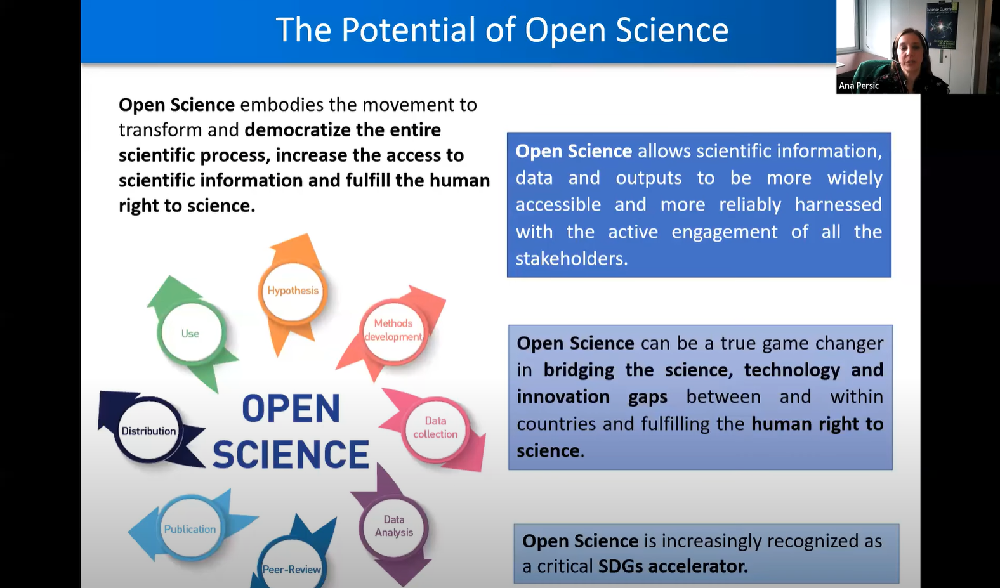

**Date** Tuesday, December 12, 2023, 2pm ET / 1pm CT / 12pm MT / 11am PT

**Title** _Big Data at Synchrotron X-ray User Facilities: Challenges and Opportunities_

**Speaker** Dr. Joel Brock, Director, Cornell High Energy Synchrotron Source (CHESS)

<!-- 
 -->
<!-- 

  -->

<!-- 

<a target="_blank" href='https://youtu.be/kOHZ6I_w1ws'>Video Link</a>

  -->

**Seminar Recording**

 
<a href="https://drive.google.com/file/d/1aZ2RxffZUFAuxXP4e800iu8hoWczm1Dr/view?usp=share_link" target="_blank">Recording</a>

<!-- **Join the Webinar:**<a target="_blank" href='https://ucsd.zoom.us/j/98999749335#success'> Zoom Link</a> -->

**Abstract:** Modern synchrotron x-ray facilities provide unique techniques for studying the structure and behavior of matter at the microstructural, molecular, and atomic levels. The Cornell High Energy Synchrotron Source (CHESS), a ring-shaped synchrotron, 768 meters in circumference and 5 stories underneath the Cornell University campus, delivers highly collimated x-ray beams over a billion times more intense than a conventional laboratory source to seven (7) experimental stations. These experimental stations each have unique instrumentation, opening new research vistas in condensed-matter physics, materials research, structural biology, chemistry, geology, structural and functional materials, plant science and agriculture, and cultural heritage. In this talk, Dr. Brock will introduce synchrotrons, the synchrotron-based x-ray characterization techniques available at CHESS, and a few of their broad scientific applications. He will then focus ion the challenges and opportunities that big data, cyber infrastructure, machine learning, and artificial intelligence provide.

**Bio:** Dr. Brock got his B.S. in Physics from Stanford and did his Ph.D. with J. David Litster and a post-doc with Robert J. Birgeneau (both at M.I.T.). He joined the A&EP faculty in 1989. He was a NSF Young Investigator from 1992-97. He is a member of the graduate fields of Applied Physics and Materials Science & Engineering. He served as Director of Graduate Studies for the Graduate Field of Applied Physics from 1993-99. He served as Director of the School of Applied & Engineering Physics from 2000-2007. He became Director of CHESS in 2012. He currently serves on: the International Advisory Committee (IAC) for the RIKEN SPring-8 Center, Japan; the IAC for the National Synchrotron Radiation Research Center (NSRRC), Taiwan; the External Advisory Committee for the National High Magnetic Field Laboratory, Tallahassee; and, he chairs the Scientific Advisory Committee for the Stanford Synchrotron Radiation Lightsource (SSRL) at the SLAC National Accelerator Laboratory. In addition to CHESS, Brock is affiliated with the Cornell Center for Materials Research (CCMR), the Center for Alkaline-Based Energy Solutions (CABES), and the Cornell Energy Systems Institute (CESI). He is a Faculty Fellow of the Cornell Atkinson Center for Sustainability and is a Fellow of the American Physical Society.
