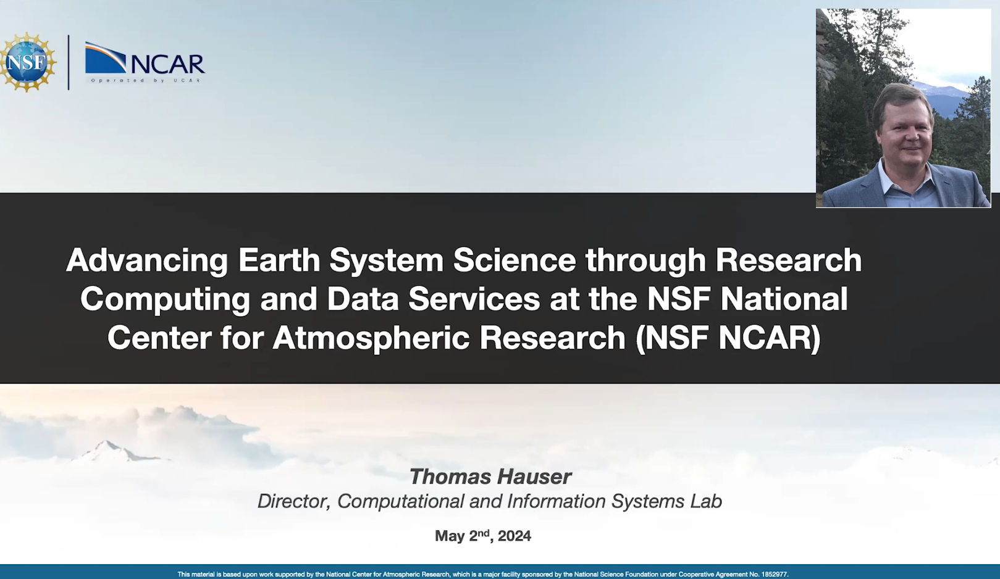
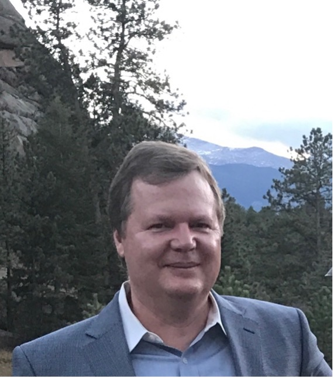

**Date** Thursday, May 2, 2024, 12pm ET / 11am CT / 10am MT / 9am PT

**Title** _Advancing Earth System Science through Research Computing and Data Services at the NSF National Center for Atmospheric Research (NSF NCAR)_

**Speaker** Dr. Thomas Hauser, Director of the Computational and Information Systems Laboratory (CISL) NSF National Center for Atmospheric Research (NCAR)

**Seminar Recording**

 
<a href="https://drive.google.com/file/d/1xw56yEfuIvFbmJVjguosvRGEbX4Urg1Z/view?usp=sharing" target="_blank">Recording</a>

**Abstract:** The NSF NCAR Computational & Information Systems Lab (CISL) provides research computing and data services to the Earth System Science community. This talk will highlight CISL's role in advancing scientific discovery by delivering high-performance computing environments, managing data repositories, and developing innovative computational and data science tools. In addition to HPC systems, CISL offers a wide range of data services, which provides access to petabytes of curated Earth science datasets. Through ongoing efforts in data assimilation, machine learning, and visualization, CISL provides researchers with tools to extract insights from the vast amounts of data generated by observations and simulations. This talk will discuss CISL's computing and data services and plans for updating the infrastructure to address the challenges of data-intensive workflows.

**Bio:** Thomas Hauser is the director of the Computational and Information Systems Laboratory (CISL) at the NSF National Center for Atmospheric Research. In this role, he is responsible for the state-of-the-art supercomputing, data, analysis, and visualization services supporting the Earth system science community. He also oversees the research and development activities in emerging technologies, software engineering, computational science, machine learning, and data assimilation to sustain progress in Earth system science. Before joining CISL, Hauser was the director of Research Computing at the University of Colorado Boulder, one of the two founding executive directors of the Center for Research Data and Digital Scholarship, and a CU Boulder Libraries faculty member. He earned his Ph.D. in mechanical engineering, specializing in computational fluid dynamics, from the University of Technology in Munich, Germany.
