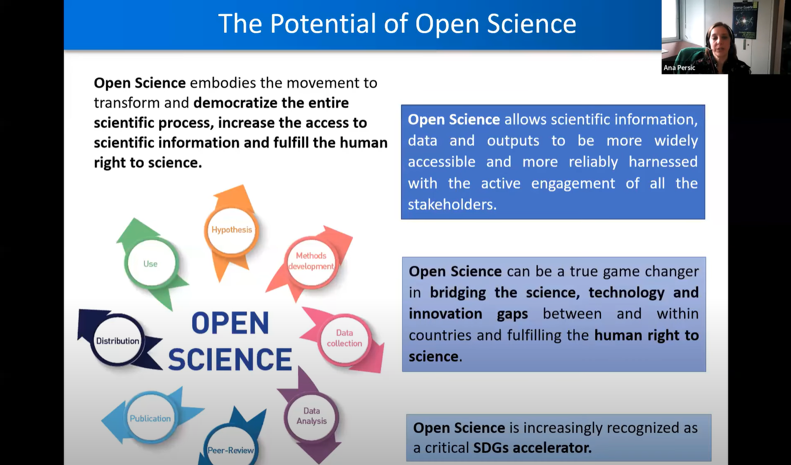

**Date** Oct 19, 2023, at 9AM HT / 12pm PT / 1pm MT / 2pm CT / 3pm ET

**Title** *Cyberinfrastructure in Paradise: Enabling Science and Community Impact at the University of Hawaii*

**Speaker** Gwen Jacobs, Director of Cyberinfrastructure, University of Hawaii

<!-- 
 -->
<!-- 

  -->

<!-- 

<a target="_blank" href='https://youtu.be/kOHZ6I_w1ws'>Video Link</a>

  -->

**Abstract:** The University of Hawai'i is a world class research institution with strengths in astronomy, ocean and atmospheric science, biomedicine, indigenous science and more across the 10 campus system.   For the last 10 years, strategic investments in cyberinfrastructure, data science, team science and multidisciplinary research have had a transformative impact on the research mission, education and workforce development and brought many benefits to the state.  This talk will highlight the strategies, lessons learned and opportunities for the future of research in Hawaii.

 

**Bio:** Dr. Gwen Jacobs serves as the Director of Cyberinfrastructure for the University of Hawai‘i System where she leads efforts to support data intensive research with advanced cyberinfrastructure for the University of Hawaiʻi research community.  She directs the State of Hawai‘i EPSCoR Program and serves as Co-Director of the Hawaiʻi Data Science Institute. Her research accomplishments and interests span computational neuroscience, informatics, software tools for data management analysis and visualization, campus cyberinfrastructure and regional and national networking initiatives. Prior to coming to UH, she served as Professor of Neuroscience, Department Head of Cell Biology and Neuroscience, Director of the Howard Hughes Medical Institute Undergraduate Biology Education program and Asst. Chief Information Officer and Director of Research Computing at Montana State University. Her work has been continuously funded by the National Science Foundation and National Institutes of Health for more than 30 years and she has been actively engaged in science policy at the national level throughout her career. Recently, she served as member and Chair of the NSF Advisory Committee for Cyberinfrastructure (2016 -2020), member of the NSF Committee of Visitors for the Office of Advanced Cyberinfrastructure, member and chair of the external advisory board for NSF Earthcube, General Chair of PEARC20 and is an active member of the Campus Research Computing Consortium.

**Join the Webinar:** <a href="https://ucsd.zoom.us/j/93591568899"> Zoom Link</a>

