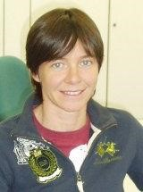

**Date** March 23 2023 - 10:30 Mountain Time

**Title** *Large (Hadron Collider) and Big (Data Science)*

**Speaker** Federica Legger, National Institute for Nuclear Physics 

<a target="_blank" href='https://drive.google.com/file/d/1ZcdikHGTy_0tRldI3xZaHEmczFntoUQg/view?usp=sharing'>**Seminar Recording**</a>

 

 

**Abstract:** Since the start of data taking at the Large Hadron Collider (LHC) at CERN in 2009, the four LHC experiments (ALICE, ATLAS, CMS and LHCb) have collected more than an Exabyte of physics data. Storing and processing such a large amount of data requires a distributed computing infrastructure, the Worldwide LHC Computing Grid (WLCG), made up of almost 150 computing facilities spread in 42 countries around the world. The current computing infrastructures are expected to grow by an order of magnitude in size and complexity for the HL-LHC (the high luminosity upgrade of the LHC) era (2030->). In this talk, I will review the challenges of designing, deploying and operating a distributed and heterogeneous computing infrastructure, composed of on-premises data centers, public and private clouds, HPC centers. We will discover how machine learning and artificial intelligence techniques can be exploited to address such complex challenges, from data taking to data processing to data analysis in WLCG..

**Bio:** Dr. Federica Legger is an associate researcher at INFN (National Institute for Nuclear Physics). She studied Physics at the University of Turin in Italy, and graduated from EPFL (École Polytechnique Fédérale de Lausanne) in Switzerland with a thesis on the data acquisition electronics of the LHCb experiment at CERN. She is currently participating in distributed computing activities for the CMS experiment at the LHC (Large Hadron Collider) and for the Virgo experiment at EGO (European Gravitational Observatory). She is leading the Operational Intelligence initiative for WLCG (World LHC Computing Grid), a cross-experiment effort from the HEP (High Energy Physics) community that targets the reduction of operational cost of large scientific computing infrastructures through AI-powered automation. At the University of Turin, she is lecturer of the course Big Data and Machine Learning for graduate students. Within CMS, she is coordinating the Monitoring and Analytics working group, which is responsible for the management of the monitoring infrastructure, integration of new data sources, and the coordination of analytics tasks. Previously, she held the same role for the ATLAS experiment. In ATLAS, she held coordination roles in both distributed computing (Distributed Analysis coordinator), and physics groups for the search of Supersymmetry.

