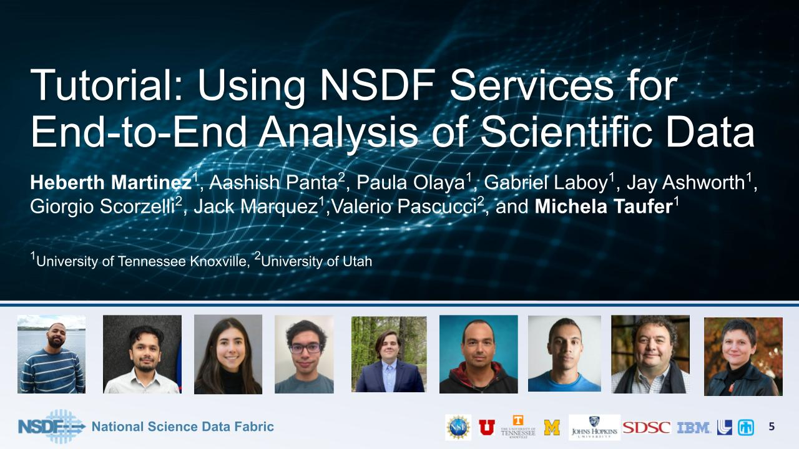

**Date**: Wednesday, Apr 10, 2024, at 12:30 pm ET / 11:30 am CT / 10:30 am MT / 9:30 am PT 

**Title**: National Science Data Fabric (NSDF) Webinar Tutorial: Using the NSDF Services for End-to-End Analysis and Visualization of Large Scientific Data

**Speaker**: Dr. Michela Taufer, University of Tennessee Knoxville and Dr. Valerio Pascucci, University of Utah

 

 

**Abstract:** Scientific research often involves dealing with vast amounts of data stored in various public and private remote locations. Researchers frequently prefer to review all the available data remotely before deciding which segments to download, transferring only specific portions of this data to their local computer for closer analysis and visualization. However, every step of this process is challenging: it is difficult to stream the data, identify and deploy tools for data visualization, interact dynamically with the data, explore multiple datasets simultaneously, and decide which relevant segment of data to download. 

This tutorial targets scientists who need to visualize and analyze large scientific datasets interactively. The tutorial demonstrates how the National Science Data Fabric (NSDF)’s services enable accessible, flexible, and customizable workflows for multi-faceted analysis and visualization of various datasets. The tutorial walks through workflow steps of generating large datasets through modular applications, storing this data remotely, and analyzing and visualizing the data locally to draw scientific conclusions. NSDF services allow users to stream data from public storage platforms like DataVerse or private storage platforms like Seal Storage and access an easy-to-use NSDF dashboard for immediate interaction with data. 

The tutorial highlights how to move through every step of the modular workflow, handling different data formats that are efficient for streaming, and how to use visualization for scientific inference on subsets of selected data. By deploying an earth science use case, the tutorial shows how a modular workflow can create a dataset, gather fine-resolution terrain parameters across the United States, and visualize selected regions of interest. 

Come join us to learn about using NSDF services to empower your research!

For more information, contact us at [info@nationalsciencedatafabric.org](mailto:info@nationalsciencedatafabric.org?subject=Tutorial)

**Seminar Recording**

 
<a href="https://drive.google.com/file/d/1-dB0YyPbEOFqG0jdIH6Y1Bmfq_EGEW3b/view?usp=share_link" target="_blank">Recording</a>

