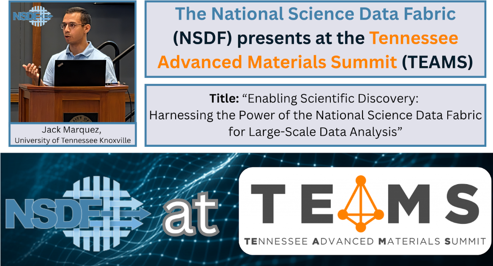

# NSDF presents at the Tennessee Advanced Materials Summit (TEAMS)

Jack Marquez, a researcher for the National Science Data Fabric (NSDF), presented recent NSDF partnerships and scientific advancements during the <a href="https://camm.utk.edu/teams/">Tennessee Advanced Materials Summit (TEAMS)</a> in Knoxville, Tennessee.

## Talk Title:
“Enabling Scientific Discovery: Harnessing the Power of the National Science Data Fabric for Large-Scale Data Analysis.”

The talk discussed how NSDF is revolutionizing scientific research and accelerating breakthroughs across disciplines. Dr. Marquez gave an overview of NSDF's services and their capabilities for addressing common pain points for analyzing material science and Earth science data.

## About TEAMS:
Hosted by the University of Tennessee, the Tennessee Advanced Materials Summit (TEAMS) is a convergence of researchers, industry leaders, and federal partners, fostering collaboration in advanced materials innovation and data-driven discovery.

## More Information:
Learn more about the summit here: [https://camm.utk.edu/teams/](https://camm.utk.edu/teams/)

Learn more about the UTK-MRSEC’s Center for Advanced Materials and Manufacturing (CAMM) here: [https://camm.utk.edu/](https://camm.utk.edu/)

Learn more about NSDF here: [https://nationalsciencedatafabric.org/](https://nationalsciencedatafabric.org/)

  