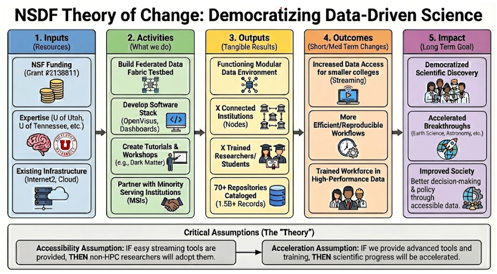

 

 

# NSDF Introduces Theory of Change for Data Science

The National Science Data Fabric (NSDF) introduces its Theory of Change—a strategic framework guiding national efforts to democratize data-driven research. By combining federated data platforms, open tools, workforce training, and partnerships with diverse institutions, NSDF expands access to advanced cyberinfrastructure for everyone.

  
