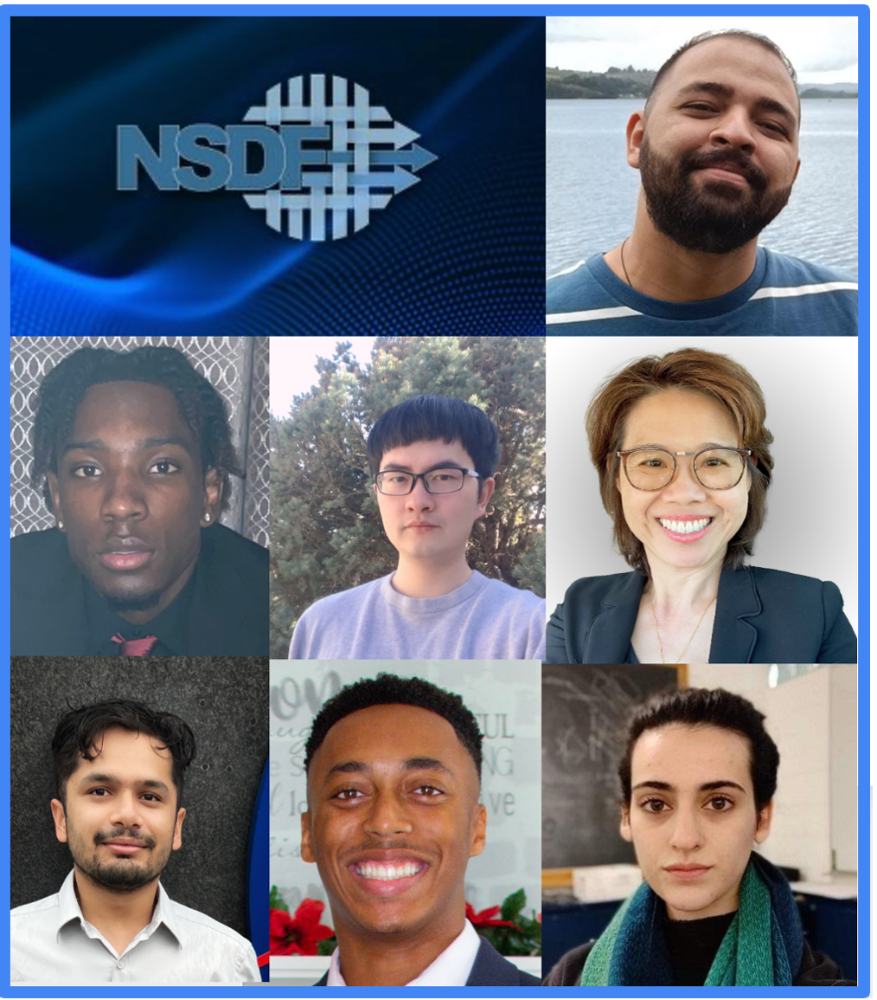

_top row: Heberth Martinez; middle row: Darren Petty Jr, Zhimin Li, Chuntida Harinnitisuk; bottom row: Aashish Panta, Kaleb Gibson, Keara Soloway_

The NSDF (<a href="https://nationalsciencedatafabric.org/index.html">National Science Data Fabric</a>) Pilot is delighted to introduce the winners of its inaugural SC travel awards. Aligned with the NSDF’s mission of democratizing data delivery, these travel awards will enable a diverse cohort of students, early career researchers, and faculty/staff at Minority-Serving Institutions to attend SC23 in Denver, November 12-17.

“We are thrilled to provide the opportunity to this year's NSDF travel award recipients—including some who will be attending the conference for the first time—to make valuable contributions to the discussion on data democratization and actively engage with the SC community,” says <a href="https://globalcomputing.group/about.html">Michela Taufer</a>, the Jack Dongarra Professor of High Performance Computing at the University of Tennessee Knoxville and NSDF co-PI, who, together with <a href="https://www.sdsc.edu/research/researcher_spotlight/kirkpatrick_christine.html">Christine Kirkpatrick</a>, the Division Director for Research Data Services at the San Diego Supercomputer Center and leader in FAIR data within the NSDF Pilot, are leading this outreach initiative.

“NSDF is actively involved in fostering partnerships and collaborations with organizations like those of our awardees that share our commitment to the democratization of data access,” adds <a href="http://www.pascucci.org">Valerio Pascucci</a>, Professor of Computer Science and SCI Faculty Member at the University of Utah and NSDF PI. This year’s winners are:

**Kaleb Gibson**, _Dillard University_
Kaleb is a sophomore Computer Science major at Dillard University in New Orleans. He is particularly interested in emerging Cloud technologies.

**Chuntida Harinnitisuk**, _University of Texas Health San Antonio (UTHSA)_
Chuntida is the Director of Enterprise Systems and Operations at UT Health San Antonio. Under her leadership, the team has collaboratively worked with organizations such as the Glenn Biggs National Institute for Alzheimer's Disease and the Greehey's Children's Cancer Research Institute to implement a cutting-edge High-Performance and Cloud Computing Facility. This facility plays a pivotal role in providing essential scientific tools, advanced computational capabilities, scalable storage resources, and a connectivity gateway, enabling seamless data transfer across the institution's network, national supercomputing centers, and cloud systems. In addition, she provided strategic leadership in designing a new $15 million modular data center, enhancing infrastructure, and empowering research communities.

**Zhimin Li**, _University of Utah_
Zhimin is a PhD student at the University of Utah. Zhimin is also a research assistant at the University of Utah’s Scientific Computing and Imaging Institute. He received his B.S. in computer science and mathematics from the University of Utah in 2016. His research interests include visualization, interpretable machine learning, and fault tolerance of high-performance computation.

**Aashish Panta**, _University of Utah_
Aashish is a PhD student at the University of Utah. He is also working as a Graduate Research Assistant at the Scientific Imaging and Computing Institute. His research interests include large-scale data management, Data Visualization, and Machine Learning. His recent works include contributing to the development of next-generation storage format for large-scale datasets, converting hundreds of terabytes of NASA climate simulation data to IDX file format, and building interactive visualization dashboards for those large-scale datasets.

**Darren Petty, Jr**, _Dillard University_
Darren is a junior Computer Science major at Dillard University in New Orleans. He is interested in cybersecurity and data science.

**Heberth Martinez**, _University of Tennessee Knoxville_
Heberth is a research scientist with the Global Computing Lab at the University of Tennessee Knoxville. He earned his B.S. in Electronic and Telecommunication Engineering and his specialization in Artificial Intelligence at the university Autonoma de Occidente (Cali, Colombia). His research interests include cloud computing, HPC, machine learning, image processing, and container technologies.

**Keara Soloway**, _Cornell High Energy Synchrotron Source (CHESS)_
Keara is a programmer at the Cornell High Energy Synchrotron Source (CHESS). She writes data analysis software for the Materials Solutions Network at CHESS (MSN-C), which consists of two X-ray beamlines studying questions in material science through a variety of X-ray techniques. Keara earned a BA in Physics from Cornell University in 2018.

The award winners, many of whom will be attending SC for the first time, will also be participating at the NSDF-sponsored events at SC:

Panel: <a href="https://sc23.supercomputing.org/presentation/?id=pan110&sess=sess193">HPC and Cloud Converged Computing: Merging Infrastructures and Communities</a>

Panel: <a href="https://sc23.supercomputing.org/presentation/?id=pan111&sess=sess194">Unleashing the Power within Data Democratization: Needs, Challenges, and Opportunities</a>

BoF: <a href="https://sc23.supercomputing.org/presentation/?id=bof188&sess=sess413">A National Science Data Fabric to Democratize Data Access and Reusability</a>

<a href="https://nationalsciencedatafabric.org/index.html">Learn more about the NSDF</a>: The NSDF Pilot is an NSF-funded project that connects an open network of institutions, including minority serving institutions, by deploying a federated data fabric testbed configurable for individual and shared scientific use. By offering a shared, modular, containerized data delivery environment operating at the best economies of scale, the NSDF pilot demonstrates a key technology to fill the missing middle in our current computational infrastructure. The NSDF Pilot builds a shared resource for equity in data access across a diversity of disciplines, institutions, and people. The NSDF pilot embraces the motto of the Minority Serving Cyberinfrastructure Consortium (MS-CC) of accomplishing together what we cannot do separately. The NSDF Pilot connects data sources with compute and networking components through a software stack that democratizes data delivery and empowers end users with scalable, easy-to-use, integrated, and extendable tools.
