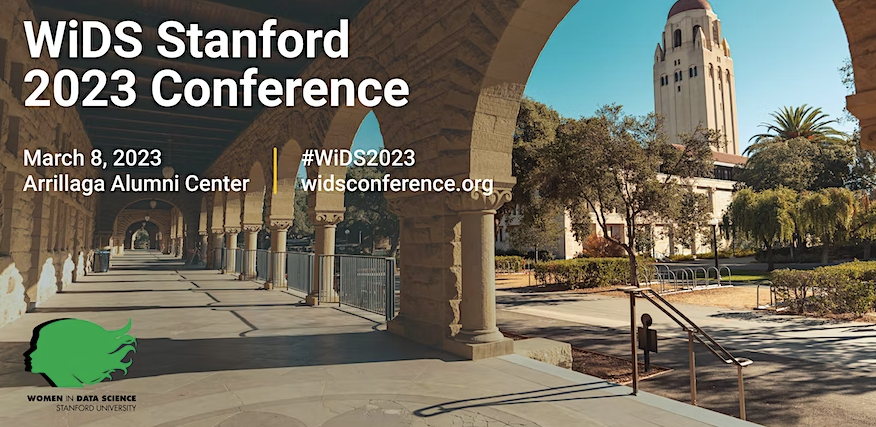

# March 8,2023 WiDS Stanford 2023 Conference

*Women in Data Science (WiDS) Stanford Conference 2023, Women in Data Science (WiDS) elevates women in the field by providing inspiration, education, community and support.*

**LINK** [Here](https://lnkd.in/eeJ2eb4e)

**Michela Taufer** (Dongarra Professor at UTK and co-PI on the NSDF project) is speaking at the annual Women in Science (WiDS) Worldwide conference on March 8, 2023, at Stanford University, a technical conference featuring outstanding women discussing their exceptional work in data science and related fields in a wide variety of research domains. 

Join her as she moderate the panel discussion on Data Democratization: a powerful means for creating sustainable and equitable communities.  

  
