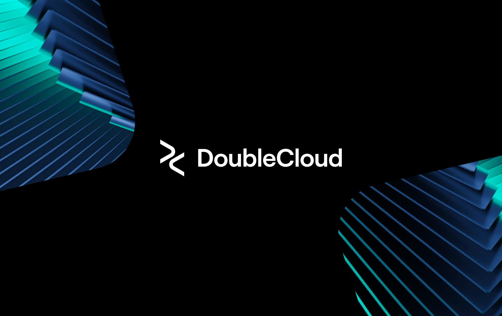

## ICECUBE NEUTRINO OBSERVATORY

The IceCube Neutrino Observatory is designed to observe the cosmos from deep within the South Pole ice. An international group of scientists responsible for the scientific research makes up the IceCube Collaboration.

[Link](https://icecube.wisc.edu/)
  

## XENON

The XENON collaboration uses multi-ton of liquid xenon detectors at the Gran Sasso Underground Laboratory in Italy to search for the elusive dark matter in the Universe.

[Link](http://www.xenon1t.org/)
  

## CORNELL HIGH ENERGY SYNCROTON SOURCE

The scientists and engineers at CHESS and in the accelerator physics and superconducting radio-frequency groups are designing, building, and testing novel state-of-the-art technologies that will push forward the capabilities for x-ray science in all disciplines.

[Link](https://www.chess.cornell.edu/)
  

## THE MINORITY SERVING - CYBERINFRASTRUCTURE CONSORTIUM (MS-CC)

The Minority Serving - Cyberinfrastructure Consortium (MS-CC) envisions a transformational partnership to promote advanced cyberinfrastructure capabilities on the campuses of Historically Black Colleges and Universities, Hispanic-Serving Institutions, Tribal Colleges and Universities, and other Minority Serving Institutions.

[Link](https://www.ms-cc.org/)

  

## THE MASSACCHUSSETS GREEN HIGH PERFORMANCE COMPUTING CENTER

The Massachusetts Green High Performance Computing Center (MGHPCC) provides state of the art infrastructure for computationally intensive research that is indispensable in the increasingly sensor and data-rich environments of modern science and engineering.

[Link](https://www.mghpcc.org/)

  

## OPEN STORAGE NETWORK

OSN is a distributed data storage service providing petabytes of shared, easily accessible storage to support active data sharing and transfer between academic institutions, communities and projects, leveraging existing NSF-funded cyberinfrastructure.

[Link](https://www.openstoragenetwork.org/)

  

## NSF BIG DATA INNOVATION HUBS

The Big Data Innovation Hubs are a nationwide network of institutions committed to accelerating innovation in data science.

[Link](https://www.nsf.gov/cise/bdspokes/index.jsp)
  

## CLOUDBANK

The CloudBank project and associated portal software, outreach and training materials, and experience in negotiating and delivering public cloud services significantly advance the state of the practice and understanding of how to use these resources in computer science research and education.

[Link](https://www.cloudbank.org/)
  

## GO FAIR US

The GO FAIR partnership provides a strategic way to develop the US research data stewardship ecosystem through partnerships with local industry on training and techniques that make data more accessible to people and machines.
  

## OPEN SCIENCE GRID

The OSG is a consortium of research collaborations, campuses, national laboratories and software providers dedicated to the advancement of all open science via the practice of distributed High Throughput Computing.

[Link](https://opensciencegrid.org/)
  

## DoubleCloud

DoubleCloud aims to significantly reduce expenses for companies in modern data stacks while providing unparalleled performance on large datasets. By leveraging fully managed, open-source technologies like Clickhouse, Kafka, Airflow on DoubleCloud platform startups and established organizations can build contemporary data infrastructures that enable data analytics with sub-second response times. This approach allows businesses to focus on creating exceptional products while benefiting from cost savings and exceptional performance offered by DoubleCloud's solutions.

[Link](https://double.cloud/)
  

