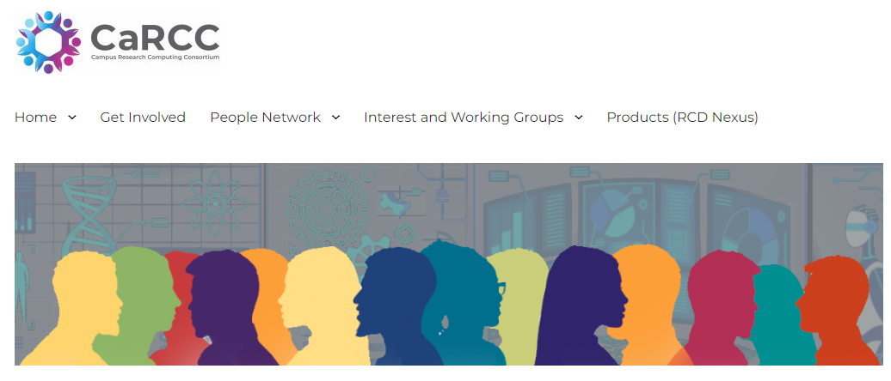
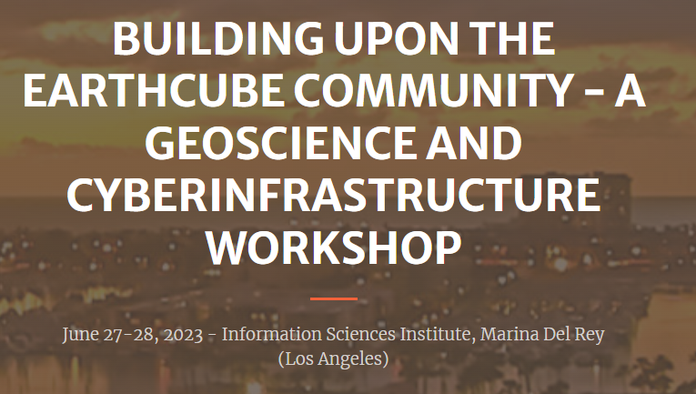
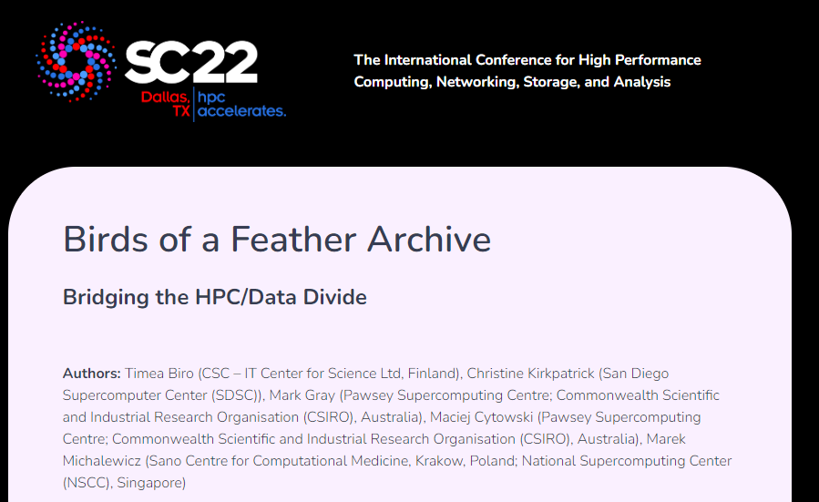

  
 

# Journals or Juried Conference Papers

Michela Taufer , Heberth Martinez , Jakob Luettgau , Lauren Whitnah , Giorgio Scorzelli , Pania Newel , Aashish Panta , Timo Bremer , Doug Fils , Christine R. Kirkpatrick , and Valerio Pascucci. **Integrating FAIR Digital Objects into the National Science Data Fabric to Revolutionize Dataflows for Scientific Discovery** *to apper*

Jakob Luettgau, Paula Olaya, Heberth Martinez, Giorgio Scorzelli, Glenn Tarcea, Jay Lofstead, Christine Kirkpatrick, Valerio Pascucci, and Michela Taufer. **NSDF-Services: Integrating Networking, Storage, and Computing Services into a Testbed for Democratization of Data Delivery**. In Proceedings of the 15th IEEE/ACM International Conference on Utility and Cloud Computing (UCC), pages 1–10, Taormina (Messina), Italy, December 2023. IEEE Computer Society. Paper, [Slides](https://docs.google.com/presentation/d/15vQ_6kJAPr8mk6HhRkww7a7wRjp2MsMZ_xNepCAI9Fc/edit#slide=id.g262a9e188d9_70_190), and Poster

Jakob Luettgau, Heberth Martinez, Glenn Tarcea, Giorgio Scorzelli, Valerio Pascucci, and Michela Taufer. **Studying Latency and Throughput Constraints for Geo-Distributed Data in the National Science Data Fabric**. In Proceedings of the 32nd International Symposium on High-Performance Parallel and Distributed Computing (HPDC '23). Association for Computing Machinery, New York, NY, USA, 325–326. June 2023. [https://doi.org/10.1145/3588195.3595948](https://doi.org/10.1145/3588195.3595948)

S. Leventhal, A. Gyulassy, V. Pascucci and M. Heimann, "**Modeling Hierarchical Topological Structure in Scientific Images with Graph Neural Networks**," 2023 IEEE International Conference on Image Processing (ICIP), Kuala Lumpur, Malaysia, 2023, pp. 2995-2999, [https://doi.org/10.1109/ICIP49359.2023.10222089](https://doi.org/10.1109/ICIP49359.2023.10222089).

Paula Olaya, Jakob Luettgau, Naweiluo Zhou, Giorgio Scorzelli, Jay Lofstead, Valerio Pascucci, and Michela Taufer. **NSDF-FUSE: A Testbed for Studying Object Storage via FUSE File Systems**. In Proceedings of the 31st International ACM Symposium on High-Performance Parallel and Distributed Computing (HPDC), pages 1–2, Minneapolis, Minnesota, June 2022. ACM. [https://doi.org/10.1145/3502181.3533709](https://doi.org/10.1145/3502181.3533709)

Glenn Tarcea, Brian Puchala, Tracy Berman, Giorgio Scorzelli, Valerio Pascucci, Michela Taufer, and John Allison. **The Materials Commons Data Repository**. In Proceedings of the 18th IEEE International Conference on e-Science (eScience), pages 1–2, Salt Lake City, Utah, USA, October 2022. IEEE Computer Society. [https://doi.org/10.1109/eScience55777.2022.00060](https://doi.org/10.1109/eScience55777.2022.00060)

D. Kennedy, P. Olaya, J. Lofstead, R. Vargas and M. Taufer, **"Augmenting Singularity to Generate Fine-grained Workflows, Record Trails, and Data Provenance,"** 2022 IEEE 18th International Conference on e-Science (e-Science), Salt Lake City, UT, USA, 2022, pp. 403-404, [https://doi.org/10.1109/eScience55777.2022.00059](https://doi.org/10.1109/eScience55777.2022.00059).

A. Venkat _et al_., "High-Quality Progressive Alignment of Large 3D Microscopy Data," 2022 IEEE 12th Symposium on Large Data Analysis and Visualization (LDAV), Oklahoma City, OK, USA, 2022, pp. 1-10, [https://doi.org/10.1109/LDAV57265.2022.9966406](https://doi.org/10.1109/LDAV57265.2022.9966406).

 Jakob Luettgau, Giorgio Scorzelli, Glenn Tarcea, Christine R. Kirkpatrick, Valerio Pascucci, and Michela Taufer. **NSDF-Catalog: Lightweight Indexing Service for Democratizing Data Delivery**. In Proceedings of the 15th IEEE/ACM International Conference on Utility and Cloud Computing (UCC), pages 1–10, Seattle, WA, USA, December 2022. IEEE Computer Society.  [https://doi.org/10.1109/UCC56403.2022.00011](https://doi.org/10.1109/UCC56403.2022.00011) [Slides](assets/pptx/ucc22.pptx)

D. Hoang, H. Bhatia, P. Lindstrom and V. Pascucci, **"Progressive Tree-Based Compression of Large-Scale Particle Data,"** in IEEE Transactions on Visualization and Computer Graphics, [https://doi.org/10.1109/TVCG.2023.3260628](https://doi.org/10.1109/TVCG.2023.3260628).

Jakob Luettgau, Giorgio Scorzelli, Valerio Pascucci, and Michela Taufer. 2023. **Development of Large-Scale Scientific Cyberinfrastructure and the Growing Opportunity to Democratize Access to Platforms and Data**. In Distributed, Ambient and Pervasive Interactions: 11th International Conference, DAPI 2023, Held as Part of the 25th HCI International Conference, HCII 2023, Copenhagen, Denmark, July 23–28, 2023, Proceedings, Part I. Springer-Verlag, Berlin, Heidelberg, 378–389. [https://doi.org/10.1007/978-3-031-34668-2_25](https://doi.org/10.1007/978-3-031-34668-2_25)

S. Leventhal, A. Gyulassy, M. Heimann and V. Pascucci, **"Exploring Classification of Topological Priors with Machine Learning for Feature Extraction,"** in _IEEE Transactions on Visualization and Computer Graphics_, [https://doi.org/10.1109/TVCG.2023.3248632](https://doi.org/10.1109/TVCG.2023.3248632).

Jack Dongarra, Bernard Tourancheau, Naweiluo Zhou, Giorgio Scorzelli, Jakob Luettgau, Rahul R Kancharla, Joshua J Kane, Robert Wheeler, Brendan P Croom, Pania Newell, Valerio Pascucci, and Michela Taufer. 2023. **Orchestration of materials science workflows for heterogeneous resources at large scale**. Int. J. High Perform. Comput. Appl. 37, 3–4 (Jul 2023), 260–271. [https://doi.org/10.1177/10943420231167800](https://doi.org/10.1177/10943420231167800)

Li, Zhimin and Menon, Harshitha and Mohror, Kathryn and Liu, Shusen and Guo, Luanzheng and Bremer, Peer-Timo and Pascucci, Valerio. **"A Visual Comparison of Silent Error Propagation,"** in _IEEE Transactions on Visualization and Computer Graphics_, [https://doi.org/10.1109/TVCG.2022.3230636](https://doi.org/10.1109/TVCG.2022.3230636).

Ke Fan, Thomas Gilray, Valerio Pascucci, Xuan Huang, Kristopher Micinski, and Sidharth Kumar. 2022. **Optimizing the Bruck Algorithm for Non-uniform All-to-all Communication**. In Proceedings of the 31st International Symposium on High-Performance Parallel and Distributed Computing (HPDC '22). Association for Computing Machinery, New York, NY, USA, 172–184. [https://doi.org/10.1145/3502181.3531468](https://doi.org/10.1145/3502181.3531468)

Jakob Luettgau, Paula Olaya, Naweiluo Zhou, Giorgio Scorzelli, Valerio Pascucci, and Michela Taufer. **NSDF-Cloud: Enabling Ad-Hoc Compute Clusters Across Academic and Commercial Clouds**. In Proceedings of the 31st International ACM Symposium on High-Performance Parallel and Distributed Computing (HPDC), pages 1–2, Minneapolis, Minnesota, June 2022. ACM. [https://doi.org/10.1145/3502181.3533710](https://doi.org/10.1145/3502181.3533710)

Morrical, Nate & Sahistan, Alper & Gudukbay, U. & Wald, Ingo & Pascucci, Valerio. (2022). **Quick Clusters: A GPU-Parallel Partitioning for Efficient Path Tracing of Unstructured Volumetric Grids**. IEEE Transactions on Visualization and Computer Graphics. PP. 1-11. [https://doi.org/10.1109/TVCG.2022.3209418](https://doi.org/10.1109/TVCG.2022.3209418). 

McDonald, T. & Shrestha, Rebika & Yi, X. & Bhatia, Harsh & Chen, De & Goswami, D. & Pascucci, Valerio & Turbyville, T. & Bremer, Peer-Timo. (2021). **Leveraging Topological Events in Tracking Graphs for Understanding Particle Diffusion**. Computer Graphics Forum. 40. 251-262. [https://doi.org/10.1111/cgf.14304](https://doi.org/10.1111/cgf.14304). 

A. Venkat, et al.,"**Towards replacing physical testing of granular materials with a Topology-based Model**" in IEEE Transactions on Visualization & Computer Graphics, vol. 28, no. 01, pp. 76-85, 2022.   [https://doi.org/10.1109/TVCG.2021.3114819](https://doi.org/10.1109/TVCG.2021.3114819)
 
 Harsh Bhatia, Duong Hoang, Nate Morrical, Valerio Pascucci, Peer-Timo Bremer, and Peter Lindstrom. 2022. **AMM: Adaptive Multilinear Meshes.** IEEE Transactions on Visualization and Computer Graphics 28, 6 (June 2022), 2350–2363. [https://doi.org/10.1109/TVCG.2022.3165392](https://doi.org/10.1109/TVCG.2022.3165392)

K. Fan, D. Hoang, S. Petruzza, T. Gilray, V. Pascucci and S. Kumar, "**Load-balancing Parallel I/O of Compressed Hierarchical Layouts**," 2021 IEEE 28th International Conference on High Performance Computing, Data, and Analytics (HiPC), Bengaluru, India, 2021, pp. 343-353, [https://doi.org/10.1109/HiPC53243.2021.00048](https://doi.org/10.1109/HiPC53243.2021.00048).

Jakob Luettgau, Paula Olaya, Naweiluo Zhou, Giorgio Scorzelli, Valerio Pascucci, and Michela Taufer. 2022. **NSDF-Cloud: Enabling Ad-Hoc Compute Clusters Across Academic and Commercial Clouds**. In Proceedings of the 31st International Symposium on High-Performance Parallel and Distributed Computing (HPDC '22). Association for Computing Machinery, New York, NY, USA, 279–280. [https://doi.org/10.1145/3502181.3533710](https://doi.org/10.1145/3502181.3533710)

Ke Fan, Thomas Gilray, Valerio Pascucci, Xuan Huang, Kristopher Micinski, and Sidharth Kumar. 2022. **Optimizing the Bruck Algorithm for Non-uniform All-to-all Communication**. In Proceedings of the 31st International Symposium on High-Performance Parallel and Distributed Computing (HPDC '22). Association for Computing Machinery, New York, NY, USA, 172–184. [https://doi.org/10.1145/3502181.3531468](https://doi.org/10.1145/3502181.3531468)

P. Klacansky, A. Gyulassy, P. -T. Bremer and V. Pascucci, "**A Study of the Locality of Persistence-Based Queries and Its Implications for the Efficiency of Localized Data Structures**," _2022 IEEE 15th Pacific Visualization Symposium (PacificVis)_, Tsukuba, Japan, 2022, pp. 121-130, [https://doi.org/10.1109/PacificVis53943.2022.00021](https://doi.org/10.1109/PacificVis53943.2022.00021).

N. Morrical, I. Wald, W. Usher and V. Pascucci, "**Accelerating Unstructured Mesh Point Location With RT Cores**," in _IEEE Transactions on Visualization and Computer Graphics_, vol. 28, no. 8, pp. 2852-2866, 1 Aug. 2022, [https://doi.org/10.1109/TVCG.2020.3042930](https://doi.org/10.1109/TVCG.2020.3042930).

Klacansky, Pavol and Miao, Haichao and Gyulassy,  Attila and  Townsend,  Andrew and Champley, Kyle and  Tringe, Joseph and Pascucci, Valerio and Bremer, Peer-Timo "**Virtual Inspection of Additively Manufactured Parts,**"  2022 IEEE 15th Pacific Visualization Symposium (PacificVis), Tsukuba, Japan, 2022, pp. 81-90, [https://doi.org/10.1109/PacificVis53943.2022.00017](https://doi.org/10.1109/PacificVis53943.2022.00017).

# Other Conference Presentations / Papers

# November 2023

Valerio Pascucci, Michela  Taufer, Christine Kirkpatrick, and Jakob Luettgau (2023).  **BOF: A  National Science Data Fabric to Democratize Data  Access and Reusability**. International Conference for High Performance Computing, Networking, Storage, and  Analysis (SC). Denver, Colorado. URL [https://sc23.supercomputing.org/proceedings/bof/bof_pages/bof188.html](https://sc23.supercomputing.org/proceedings/bof/bof_pages/bof188.html) - [Slides](assets/pptx/sc23-bof.pptx)

  
 

Valerio Pascucci, Michela  Taufer, Ian Foster, Ilya Baldin, Franck Wuerthwein (2023). **Panel: Unleashing the Power within Data Democratization: Needs, Challenges, and Opportunities** International Conference for High Performance Computing, Networking, Storage, and  Analysis (SC). Denver, Colorado. **12-17 November 2023**. URL [https://sc23.supercomputing.org/proceedings/panel/panel_pages/pan111.html](https://sc23.supercomputing.org/proceedings/panel/panel_pages/pan111.html)

<table width="100%" border="0px">
<tr>
<td align='center' width="33%">    <a href="assets/pptx/sc23-panel1.pptx">Slides</a></td>
<td align='center' width="33%">    <a href="assets/pptx/sc23-panel2.pptx">Slides</a></td>
<td align='center' width="33%">   <a href="assets/pptx/sc23-panel3.pptx">Slides</a></td>
</tr>
</table>

Daniel Milroy, Michela  Taufer, Seetharami Seelam, Bill Magro, Heidi Poxon,  Todd Gamblin. **Panel: HPC and Cloud Converged Computing: Merging Infrastructures and Communities**. International Conference for High Performance Computing, Networking, Storage, and  Analysis (SC). Denver, Colorado. Nov 2023 URL [https://sc23.supercomputing.org/proceedings/panel/panel_pages/pan110.html](https://sc23.supercomputing.org/proceedings/panel/panel_pages/pan110.html)

  
 

# September 2023

Giorgio Scorzelli and Valerio Pascucci, **NSDF@CHESS** KNIT 7: A FABRIC Community Workshop. Columbus, OH. September 27-29 2023 URL [https://whatisfabric.net/events/knit-7](https://whatisfabric.net/events/knit-7) [Slides](assets/pptx/knit23.pptx)

  
 

# August 2023

Valerio Pascucci. **The National Science Data Fabric**  Data-Joint  Annual Workshop. Houston, TX. August 2023. URL [https://datajoint.com/news/datajoint-collaborative-research-workflows-workshop](https://datajoint.com/news/datajoint-collaborative-research-workflows-workshop)

  
 

# July 2023

Natalie Meyers. **FAIR Digital Objects in Distributed Research Environments**. Throughput Computing 2023 OSG  All Hands Meeting. Madison, WI. July 11 2023. URL [https://agenda.hep.wisc.edu/event/2014/sessions/2902/#20230711](https://agenda.hep.wisc.edu/event/2014/sessions/2902/#20230711) [Slides](assets/pdf/osg23.pdf)

  
 

# June 2023

Christine Kirkpatrick. **National Science Data Fabric**. Campus Research Computing Consortium's (CaRCC) Emerging Centers. June 6, 2023. URL [https://carcc.org/2023/06/02/join-us-for-upcoming-people-network-calls-for-june-2023/](https://carcc.org/2023/06/02/join-us-for-upcoming-people-network-calls-for-june-2023/)

  
 

Valerio Pascucci, **The National Science Data Fabric: Democratizing Data Access for Science and Society,** HIGH-PERFORMANCE COMPUTING SPECIAL EDITION An International Advanced Workshop, Cetraro Italy, June 26 – 30, 2023, URL [http://www.hpcc.unical.it/hpc2023/program.htm](http://www.hpcc.unical.it/hpc2023/program.htm)

  
 

Kenton McHenry, **Ongoing Impacts from the EarthCube Technical Efforts, Building Upon the EarthCube Community** A GeoScience and Cyberinfrastructure workshop, June 27-28, 2023, Los Angeles CA, URL [https://isi-usc-edu.github.io/building-upon-the-earthcube-community/program.html](https://isi-usc-edu.github.io/building-upon-the-earthcube-community/program.html)

  
 

Paula Olaya, Jakob Luettgau, Camila Roa, Ricardo Llamas, Rodrigo Vargas, Sophia Wen, I-Hsin Chung, Seetharami Seelam, Yoonho Park, Jay Lofstead, and Michela Taufer. **Enabling Scalability in the Cloud for Scientific Workflows:  An Earth Science Use Case**.  In Proceedings of IEEE CLOUD, pages 1–10, Chicago, IL, USA, June 2023. IEEE Computer Society. URL https://conferences.computer.org/cloud/2023/

  
 

V. Pascucci, G. Scorzelli, A. Gyulassy, O. Koppe, A. Panta, D. Hoang, P. Klacansky, S. Petruzza, P.-T. Bremer M. Taufer, P. Olaya, J. Luettgau, H. Martinez, J. Marquez J. Allison, G. Tarcea, F. Wuerthwein, C. Kirkpatrick, F. Andrijauskas, K. Coakley, J. Christopher-Ohlin, W. Sun, D. Bougie, K. Soloway, R. Verberg, S. Sarker, L. Smieska, A. Woll, K. Nygren, **NSDF@CHESS: Democratizing Data**, CHESS User Meeting & Workshops, June 6th 2023 Cornell [https://indico.classe.cornell.edu/event/2187/timetable/#20230606.detailed](https://indico.classe.cornell.edu/event/2187/timetable/#20230606.detailed)

  
 

V. Pascucci, G. Scorzelli, **NSDF@CHESS Democratizing the Cornel Light Source**, 2023 Research Infrastructure Workshop, Jun 26-30 2023, Washington DC, [https://2023riworkshop.events.whova.com/Artifact/session/3142219/83479](https://2023riworkshop.events.whova.com/Artifact/session/3142219/83479)

  
 

# May 2023

Giorgio Scorzelli, Valerio Pascucci **NSDF@CHESS Democratizing Data Access at the Cornell Light Source**  MERIF 2023 Workshop May 22-24, 2023 Boston, MA. URL [https://whatisfabric.net/events/merif-2023-workshop](https://sites.google.com/a/us-ignite.org/merif-workshop-2020/2023-workshop/)

  
 

Michela  Taufer, Jay Lofstead, Christine Kirkpatrick, Jakob Luettgau, and Valerio Pascucci. **BOF:  A  National Science Data Fabric to Democratize Data  Access and Reusability**. May 2023. ISC High Performance Conference, May 24 2023, Hamburg, Germany, URL

  
 

Glenn Tarcea, **Materials Commons and FAIR Data**, ICME 2023, May 22 2023, Caribe Royale Florida, URL [https://www.tms.org/portal/downloads/meetings/2023/icme2023/ICME2023_Program.pdf](https://www.tms.org/portal/downloads/meetings/2023/icme2023/ICME2023_Program.pdf)

  
 

Christine Kirkpatrick. **Why FAIR is Worthwhile for Big Science & Easy Steps to Get Started**. National Virtual Biosecurity Bioenergy Crops Center (NVBCC) Computing and Cross-Cutting Workshops. Virtual. May 2023

# April 2023

Valerio Pascucci **Big Data Analytics for Decision Making** Advanced Modeling and Simulation (AMS) Seminars. April 20, 2023.  URL [https://www.nas.nasa.gov/pubs/ams/2023/04-20-23.html](https://www.nas.nasa.gov/pubs/ams/2023/04-20-23.html)

  
 

# March 2023

Valerio Pascucci, **The National Science Data Fabric: Democratizing Data Access for Science and Society**, Jet Propulsion Laboratory Earth Science Seminar, March 13, 2023, La Canada Flintridge, CA, URL [https://svcp.jpl.nasa.gov/cgi/mtgabstract.cgi?series=earth&meetingfile=../meetings/2023/es2023031301.txt](https://svcp.jpl.nasa.gov/cgi/mtgabstract.cgi?series=earth&meetingfile=../meetings/2023/es2023031301.txt)

  
 

# December 2022

Valerio Pascucci, **The National Science Data Fabric: Democratizing Data Access for Science and Society**, Fall 2022 Colloquia Tulane University, Dec 8 2022, New Orleans, LA, URL [https://sse.tulane.edu/cs/events](https://sse.tulane.edu/cs/events)

  
 

# November 2022

Christine Kirkpatrick. **BoF: Bridging the HPC/Data Divide** Supercomputing 2022 Conference. Dallas, TX, USA. 13-18 November 2022. URL [https://sc22.supercomputing.org/proceedings/bof/bof_pages/bof189.html](https://sc22.supercomputing.org/proceedings/bof/bof_pages/bof189.html)

  
 

Christine Kirkpatrick, John Goodhue, Melissa Cragin. **Open Storage Network**. International Conference for High Performance Computing, Networking, Storage, and  Analysis (SC). 13-18 November 2022. Dallas, 2022. URL [https://sc22.supercomputing.org/](https://sc22.supercomputing.org/)

  
 

Daniel Milroy, Marquita Ellis, Sameer Shende, Michela Taufer, Ward Harold, and Yan Fisher. **Converged Computing: Bringing Together HPC and Cloud Communities**. IEEE/ACM International Conference for High-Performance Computing, Networking, Storage, and Analysis URL Nov 2022 [https://sc22.supercomputing.org/presentation/?id=bof200&sess=sess470](https://sc22.supercomputing.org/presentation/?id=bof200&sess=sess470)

  
 

# October 2022

Nauweiluo Zhou, Jakob Luettgau, Rahul Reddy Kancharla, Joshua Kane, Brendan Croom, Robert Wheeler, Pania Newell, Giorgio Scorzelli, Valerio Pascucci, and Michela  Taufer. **A  Software Framework for Scientific Workflow Orchestration at Large Scale**. In Proceedings of the 18th IEEE International Conference on e-Science. Salt Lake City, Utah, USA. URL [https://www.escience-conference.org/2022/](https://www.escience-conference.org/2022/)

  
 

Jakob Luettgau, Giorgio Scorzelli, Nauweiluo Zhou, Glenn Tarcea, Jay Lofstead, Valerio Pascucci, and Taufer, Michela. **Toward a Lightweight Indexing Service for the National Science Data Fabric** In Proceedings of the 18th IEEE International Conference on e-Science (Science).. Salt Lake City, Utah, USA,. October 2022. URL [https://zenodo.org/records/7161703](https://zenodo.org/records/7161703)

  
 

Owen Koppe, Giorgio Scorzelli, and Valerio Pascucci **Unlocking  Analysis Ready Cloud Optimized (ARCO) file format in the OpenVisus framework**.  Proceedings of the 18th IEEE International Conference on e-Science (eScience), Salt Lake City, Utah, USA, October 2022. IEEE Computer Society.  [https://zenodo.org/record/7488814](https://zenodo.org/record/7488814)

  
 

# September 2022

Jakob Luettgau, Giorgio Scorzelli, Glenn Tarcea, Christine Kirkpatrick, Valerio Pascucci, Michela Taufer, **NSDF-Catalog: Toward a Lightweight Indexing Service for the National Science Data Fabric**, 14th JLESC Workshop, 28-30 September 2022, Urbana, IL , [https://publish.illinois.edu/14th-jlesc-workshop/agenda/](https://publish.illinois.edu/14th-jlesc-workshop/agenda/) [Slides](assets/pptx/jlesc.pptx)

  
 

# August 2022

*Valerio Pascucci, **The National Scientific Data Fabric**, PRISMS Center Annual Workshop, August 9-12, 2022, Ann Arbor, Michigan, [https://mse.engin.umich.edu/about/events/prisms-center-annual-workshop](https://mse.engin.umich.edu/about/events/prisms-center-annual-workshop)

  
 

# July 2022

Valerio Pascucci **The National Science Data Fabric: Democratizing Data Access for Science and Society**.  HIGH-PERFORMANCE COMPUTING An International Advanced Workshop, July 4-8, 2022, Cetraro Italy [http://www.hpcc.unical.it/hpc2022/program.htm](http://www.hpcc.unical.it/hpc2022/program.htm)

  
 

# November 2021

Valerio Pascucci, **The National Science Data Fabric: Democratizing Data Access for Science and Society**, APS Scientific Computation Seminar, November 29, 2021, Lemont, IL, [https://www.anl.gov/event/the-national-science-data-fabric-democratizing-data-access-for-science-and-society](https://www.anl.gov/event/the-national-science-data-fabric-democratizing-data-access-for-science-and-society)

  
 

# Software repositories

NSDF Cornell CHESS
-   [https://github.com/nsdf-fabric/chess](https://github.com/nsdf-fabric/chess)
   
NSDF Material Science Workflow 
-   [https://github.com/nsdf-fabric/nsdf-materialscience](https://github.com/nsdf-fabric/nsdf-materialscience)
-   [https://github.com/nsdf-fabric/nsdf-pania](https://github.com/nsdf-fabric/nsdf-pania)

NSDF Material Commons
-   [https://github.com/nsdf-fabric/openvisus-commons](https://github.com/nsdf-fabric/openvisus-commons)
    
NSDF Automation Services
-   [https://github.com/nsdf-fabric/automation](https://github.com/nsdf-fabric/automation)
-   [https://github.com/nsdf-fabric/nsdf-services](https://github.com/nsdf-fabric/nsdf-services)
-   [https://github.com/nsdf-fabric/vault](https://github.com/nsdf-fabric/vault)
    
NSDF Cloud services
-   [https://github.com/nsdf-fabric/nsdf-cloud](https://github.com/nsdf-fabric/nsdf-cloud)
-   [https://github.com/nsdf-fabric/nsdf-cloud-results](https://github.com/nsdf-fabric/nsdf-cloud-results)
- [https://github.com/nsdf-fabric/nsdf-chameleon](https://github.com/nsdf-fabric/nsdf-chameleon)
    
NSDF Data Transfer Services
-   [https://github.com/nsdf-fabric/nsdf-dts](https://github.com/nsdf-fabric/nsdf-dts)
-   [https://github.com/nsdf-fabric/nsdf-trafficserver](https://github.com/nsdf-fabric/nsdf-trafficserver)
    
NSDF Fuse 
-   [https://github.com/nsdf-fabric/nsdf-fuse](https://github.com/nsdf-fabric/nsdf-fuse)
-   [https://github.com/nsdf-fabric/nsdf-fuse-results](https://github.com/nsdf-fabric/nsdf-fuse-results)
    
NSDF Plugin
-   [https://github.com/nsdf-fabric/nsdf-plugin](https://github.com/nsdf-fabric/nsdf-plugin)
-   [https://github.com/nsdf-fabric/nsdf-plugin-results](https://github.com/nsdf-fabric/nsdf-plugin-results)
   
NSDF Catalog 
-   [https://github.com/nsdf-fabric/nsdf-catalog](https://github.com/nsdf-fabric/nsdf-catalog)
-   [https://github.com/nsdf-fabric/nsdf-catalog-artifacts](https://github.com/nsdf-fabric/nsdf-catalog-artifacts)
-   [https://github.com/nsdf-fabric/nsdf-catalog-graph](https://github.com/nsdf-fabric/nsdf-catalog-graph)
-   [https://github.com/nsdf-fabric/nsdf-catalog-results](https://github.com/nsdf-fabric/nsdf-catalog-results)
-   [https://github.com/nsdf-fabric/nsdf-object-catalog](https://github.com/nsdf-fabric/nsdf-object-catalog)
    
NSDF Software Stack and Software Development Procedures
-   [https://github.com/nsdf-fabric/nsdf-sdlc](https://github.com/nsdf-fabric/nsdf-sdlc)
-   [https://github.com/nsdf-fabric/nsdf-software-stack](https://github.com/nsdf-fabric/nsdf-software-stack)
    
NSDF Web Site and educational materials
-   [https://github.com/nsdf-fabric/nsdf-web](https://github.com/nsdf-fabric/nsdf-web)
- [https://github.com/nsdf-fabric/nsdf-edu](https://github.com/nsdf-fabric/nsdf-edu)

# Data Repositories

[OpenVisus Dataset These datasets were imported as a part of CEDMAVs work](https://materialscommons.org/public/openvisus/index?tag=OpenVisus)

[National Science Data Fabric Catalog](https://nationalsciencedatafabric.org/catalog3d.html)

# Websites

[NSDF Project website](https://nationalsciencedatafabric.org)

[Document guidelines, norms, and procedures for the software engineering aspects of development, evolution, and long-term operation of the NSDF software stack](https://nsdf-software-development-life-cycle-procedures.readthedocs.io).

[Multi-federation Catalog for Petabytes of Community Data -  As part of the NSF-funded National Science Data Fabric (NSDF) ](https://nationalsciencedatafabric.org/catalog3d.html)

# Press Releases

[Universities use blockchain-based storage to protect and democratize data](https://cointelegraph.com/news/universities-use-blockchain-based-storage-to-protect-and-democratize-data)
    
[Seal Storage Technology and the University of Utah Announce NASA Climate Data Democratization Partnership](https://www.prnewswire.com/in/news-releases/seal-storage-technology-and-the-university-of-utah-announce-nasa-climate-data-democratization-partnership-301795817.html)
    
[National Science Data Fabric Catalog Grows Toward AI-Integrated Scientific Innovation](https://www.hpcwire.com/off-the-wire/national-science-data-fabric-catalog-grows-toward-ai-integrated-scientific-innovation/)
    
[Partnership with National Science Data Fabric catalog to democratize data access](https://double.cloud/blog/posts/2023/07/partnership-with-nsdfc-to-democratize-data-access/)
    
[National Labs Provide a Peek into the Future of Data Sharing](https://www.clouddatainsights.com/national-labs-provide-a-peek-into-the-future-of-data-sharing/)
    
[Over 200TB of NASA Climate Data Accessible With Zero Fee](https://www.storagenewsletter.com/2023/04/19/over-200tb-of-nasa-climate-data-accessible-with-zero-fee/)
    
[National Science Data Fabric Catalog Grows toward AI-Integrated Scientific Innovation](https://sdsc.ucsd.edu/News%20Items/PR20230627_NSDF.html)
    
[International Supercomputing Conference Included Panel Led by SDSC’s Christine Kirkpatrick](https://sdsc.ucsd.edu/News%20Items/PR20230713_ISC.html)
    
[Why Scientists Need To Build Data Fabrics](https://medium.com/@binfan_alluxio/why-scientists-need-to-build-data-fabrics-d1b6fcba3ee5)

[Seal Storage Technology and the University of Utah Announce NASA Climate Data Democratization Partnership](http://cedmav.sci.utah.edu/news/82-nsdf-seal.html)

[JOHN ALLISON PART OF NATIONAL TEAM HELPING TO DEMOCRATIZE ACCESS TO DATA]( https://mse.engin.umich.edu/about/news/john-allison-part-of-national-team-helping-to-democratize-access-to-data)

# NSDF Distinguished Speaker Series

## Cornell CHESS

Joel Brock **Big Data at Synchrotron X-ray User Facilities: Challenges and Opportunities_** NSDF Distinguished Speaker Series. December 12, 2023 # URL [https://nationalsciencedatafabric.org/nsdf-seminar-series-brock](https://nationalsciencedatafabric.org/nsdf-seminar-series-brock)

  
 

## University of Hawai'i

Gwen Jacobs **Cyberinfrastructure in Paradise: Enabling Science and Community Impact at the University of Hawaii** NSDF Distinguished Speaker Series. Oct 19, 2023 URL [https://nationalsciencedatafabric.org/nsdf-seminar-series-jacobs](https://nationalsciencedatafabric.org/nsdf-seminar-series-jacobs)

  
 

## UNESCO

Ana Persic, **The Pathway to Implementing the UNESCO Recommendation on Open Science** NSDF Distinguished Speaker Series. May 23, 202 URL [https://nationalsciencedatafabric.org/nsdf-seminar-series-persic](https://nationalsciencedatafabric.org/nsdf-seminar-series-persic)

  
 

## INFN

Federica Legger **Large (Hadron Collider) and Big (Data Science)** NSDF Distinguished Speaker Series. March 23 2023 URL  [https://nationalsciencedatafabric.org/nsdf-seminar-series-legger](https://nationalsciencedatafabric.org/nsdf-seminar-series-legger)

  
 

## Globus

Ian Foster **A Global Research Data Platform: How Globus Services Enable Scientific Discovery** NSDF Distinguished Speaker Series. May 26 2022 URL [https://nationalsciencedatafabric.org/nsdf-seminar-series-foster](https://nationalsciencedatafabric.org/nsdf-seminar-series-foster)

  
 

## Pangeo

Ryan Abernathey **Pangeo Forge - Crowdsourcing Analysis Ready Data in the Cloud** NSDF Distinguished Speaker Series. April 28 2022 URL [https://nationalsciencedatafabric.org/nsdf-seminar-series-abernathey](https://nationalsciencedatafabric.org/nsdf-seminar-series-abernathey)

  
 

# NSDF All Hands Meeting Feb 2022

- [https://nationalsciencedatafabric.org/nsdf-ahm-2022-02](https://nationalsciencedatafabric.org/nsdf-ahm-2022-02)
- Feb 2022 University of Utah, Salt Lake City, UT
- 3 concurrent zoomm meetings
- 22 presentations
- 44 participants (physical or virtual)
- 6 round tables
- recordings and materials available online

Valerio Pascucci, **The NSDF Vision and Mission National Science Data Fabric (NSDF)** National Science Data Fabric (NSDF) All Hands Meeting Feb 2022. [https://zenodo.org/record/7488466](https://zenodo.org/record/7488466)	
	 
Glenn Tarcea. **Materials commons National Science Data Fabric (NSDF)** National Science Data Fabric (NSDF) All Hands Meeting Feb 2022. [https://doi.org/10.5281/zenodo.7488485](https://doi.org/10.5281/zenodo.7488485)

Steve Petruzza, **Experimental data acquisition and analysis at Advanced Photon Source Argonne National Lab** National Science Data Fabric (NSDF) All Hands Meeting Feb 2022. [https://doi.org/10.5281/zenodo.7488491](https://doi.org/10.5281/zenodo.7488491)		 

Damian Clarke, **NSDF collaboration with Minority Serving Institutions (MSI)**. National Science Data Fabric (NSDF) All Hands Meeting Feb 2022. [https://doi.org/10.5281/zenodo.7488502](https://doi.org/10.5281/zenodo.7488502)

Brian Schuster, **NSDF collaboration with Minority Serving Institutions (MSI) UTEP class with support by the NSDF** National Science Data Fabric (NSDF) All Hands Meeting Feb 2022. [https://doi.org/10.5281/zenodo.7488508](https://doi.org/10.5281/zenodo.7488508)

Ivan Rodero, **A vision of NSDF CI architecture and impact on use cases** National Science Data Fabric (NSDF) All Hands Meeting Feb 2022. [https://doi.org/10.5281/zenodo.7488519](https://doi.org/10.5281/zenodo.7488519)

Paula Olaya and Michela Taufer, **Building trust in Earth Science Findings through Data Traceability and Results Explainability** National Science Data Fabric (NSDF) All Hands Meeting Feb 2022. [https://doi.org/10.5281/zenodo.7488527](https://doi.org/10.5281/zenodo.7488527)		 

Frank Wuerthwein, **OSG use cases for NSDF: including XenonNT as an example** National Science Data Fabric (NSDF) All Hands Meeting Feb 2022. [https://doi.org/10.5281/zenodo.7488537](https://doi.org/10.5281/zenodo.7488537)

Kevin Coakley, **The NSDF Federated infrastructure**. National Science Data Fabric (NSDF) All Hands Meeting Feb 2022. [https://doi.org/10.5281/zenodo.7488544](https://doi.org/10.5281/zenodo.7488544)		 

Alex Szalay, **Integration of OSN-NSDF data movements and Astronomy use cases.** National Science Data Fabric (NSDF) All Hands Meeting Feb 2022. [https://doi.org/10.5281/zenodo.7488550](https://doi.org/10.5281/zenodo.7488550)

Chris Shelley, **Content Delivery Network (CDN): State of the Art** National Science Data Fabric (NSDF) All Hands Meeting Feb 2022. [https://doi.org/10.5281/zenodo.7488556](https://doi.org/10.5281/zenodo.7488556)		 

Jakob Luettgau , **Software development life cycle procedures** National Science Data Fabric (NSDF) All Hands Meeting Feb 2022. [https://doi.org/10.5281/zenodo.7488562](https://doi.org/10.5281/zenodo.7488562)

Naweiluo Zhou , **Workflow orchestration for Material Science** National Science Data Fabric (NSDF) All Hands Meeting Feb 2022. [https://doi.org/10.5281/zenodo.7488564](https://doi.org/10.5281/zenodo.7488564)

Paula Olaya , **Composition of a data-driven workflow in the clouds** National Science Data Fabric (NSDF) All Hands Meeting Feb 2022. [https://doi.org/10.5281/zenodo.7488576](https://doi.org/10.5281/zenodo.7488576)	

Attila Gyulassy , **Users Communities and Users Surveys** National Science Data Fabric (NSDF) All Hands Meeting Feb 2022. [https://doi.org/10.5281/zenodo.7488580](https://doi.org/10.5281/zenodo.7488580)	

Giorgio Scorzelli , **They stole $1,440 and ¢1 from NSDF** National Science Data Fabric (NSDF) All Hands Meeting Feb 2022. [https://doi.org/10.5281/zenodo.7488588](https://doi.org/10.5281/zenodo.7488588)

Michael Corn, **Intersecting Cybersecurity and Research Infrastructure National Science Data Fabric (NSDF)** National Science Data Fabric (NSDF) All Hands Meeting Feb 2022. [https://doi.org/10.5281/zenodo.7488590](https://doi.org/10.5281/zenodo.7488590)

## NSDF All Hands Meeting October 2022 

- [https://nationalsciencedatafabric.org/nsdf-ahm-2022-10](https://nationalsciencedatafabric.org/nsdf-ahm-2022-10)
- October 2022, San Diego Supercomputer Center, San Diego, CA
- 6 sessions
- 40 partecipants (physical or virtual)
- 28 presentations, 31 presenters- recordings and materials available online

Utah,Valerio Pascucci, **The NSDF vision and current progress** National Science Data Fabric (NSDF) All Hands Meeting Oct 2022. [https://doi.org/10.5281/zenodo.7488663](https://doi.org/10.5281/zenodo.7488663)	

UTK, Michela Taufer. **Working Groups: the NSDF spine and driving engine** National Science Data Fabric (NSDF) All Hands Meeting Oct 2022. [https://doi.org/10.5281/zenodo.7488689](https://doi.org/10.5281/zenodo.7488689)	

Utah, Giorgio Scorzelli. **Don’t be stupid: avoid the lock-ness** National Science Data Fabric (NSDF) All Hands Meeting Oct 2022. [https://doi.org/10.5281/zenodo.7488700](https://doi.org/10.5281/zenodo.7488700)	

Utah, Manish Parashar.**What does it mean to democratize data** National Science Data Fabric (NSDF) All Hands Meeting Oct 2022. DOI [https://doi.org/10.5281/zenodo.7488705](https://doi.org/10.5281/zenodo.7488705)	

Seal, Sal Malik. **Web3.0 Cloud Decentralized Storage** National Science Data Fabric (NSDF) All Hands Meeting Oct 2022.  [https://doi.org/10.5281/zenodo.7488710](https://doi.org/10.5281/zenodo.7488710)	

DoubleCloud, Adam Jennings. **Managed Open-Source Data Stack for Sub-Second Analytics and Queries** National Science Data Fabric (NSDF) All Hands Meeting Oct 2022.  [https://doi.org/10.5281/zenodo.7488723](https://doi.org/10.5281/zenodo.7488723)	

Kyle Chard. **Globus: A Platform for Global Data Management** National Science Data Fabric (NSDF) All Hands Meeting Oct 2022. 

Weka, Nathan Urbanowski, Sarah Johannes. **The Data Platform for Research Collaboration**	National Science Data Fabric (NSDF) All Hands Meeting Oct 2022. 

LLNL, Timo Bremer. **Democratizing Data Access at Lawrence Livermore National Laboratory**
National Science Data Fabric (NSDF) All Hands Meeting Oct 2022.  [https://doi.org/10.5281/zenodo.7488727](https://doi.org/10.5281/zenodo.7488727)	

Utah, Sara K Yeo. **The Science of Science Communication** National Science Data Fabric (NSDF) All Hands Meeting Oct 2022.  [https://doi.org/10.5281/zenodo.7488741](https://doi.org/10.5281/zenodo.7488741)	

Utah, Attila Gyulassy. **Feedback from the scientific community** National Science Data Fabric (NSDF) All Hands Meeting Oct 2022.  [https://doi.org/10.5281/zenodo.7488747](https://doi.org/10.5281/zenodo.7488747)	

SDSC, Julianne Christopher Ohlin. **NSDF Communication Framework** National Science Data Fabric (NSDF) All Hands Meeting Oct 2022.  [https://doi.org/10.5281/zenodo.7488752](https://doi.org/10.5281/zenodo.7488752)	

SDSC, Christine Kirkpatrick, Kevin Coakley. **Federated Infrastructure Updates and FAIR Digital Objects** National Science Data Fabric (NSDF) All Hands Meeting Oct 2022. [https://doi.org/10.5281/zenodo.7488768](https://doi.org/10.5281/zenodo.7488768)	

SDSC, Frank Wuerthwein. **News from the Open Science Data Federation** National Science Data Fabric (NSDF) All Hands Meeting Oct 2022.  [https://doi.org/10.5281/zenodo.7488772](https://doi.org/10.5281/zenodo.7488772)	

LLNL/IBM, Daniel Milroy. **Cloud-Native HPC with Kubernetes and the Flux Framework** National Science Data Fabric (NSDF) All Hands Meeting Oct 2022.  [https://doi.org/10.5281/zenodo.7488780](s://doi.org/10.5281/zenodo.7488780)	

UTK, Paula Olaya. **Tuning Object Storage for Scientific Workflows on Cloud Computational Services** National Science Data Fabric (NSDF) All Hands Meeting Oct 2022.  [https://doi.org/10.5281/zenodo.7488788](https://doi.org/10.5281/zenodo.7488788)	

UTK , Jakob Luettgau. **NSDF-Catalog: Toward a Lightweight Indexing Service for the National Science Data Fabric** National Science Data Fabric (NSDF) All Hands Meeting Oct 2022.  [https://doi.org/10.5281/zenodo.7488796](https://doi.org/10.5281/zenodo.7488796)	

Alluxio, Bin Fan, Shouwei Chen. **Architect a Heterogeneous Data Platform Across Clusters, Regions, and Clouds** National Science Data Fabric (NSDF) All Hands Meeting Oct 2022.  [https://doi.org/10.5281/zenodo.7488800](https://doi.org/10.5281/zenodo.7488800)	

Utah, Ivan Rodero. **Leveraging NSF CI investments for NSDF building blocks** National Science Data Fabric (NSDF) All Hands Meeting Oct 2022.  [https://doi.org/10.5281/zenodo.7488806](https://doi.org/10.5281/zenodo.7488806)	

Michigan, Glenn Tarcea. **The Materials Commons 2.0: A Collaboration Platform and Information Repository for the Global Materials Community** National Science Data Fabric (NSDF) All Hands Meeting Oct 2022.  [https://doi.org/10.5281/zenodo.7488808](https://doi.org/10.5281/zenodo.7488808)	

Utah, Owen Koppe. **Unlocking the ARCO File Format in the OpenVisus Framework and NSDF-Data-Portal Update** National Science Data Fabric (NSDF) All Hands Meeting Oct 2022.  [https://doi.org/10.5281/zenodo.7488814](https://doi.org/10.5281/zenodo.7488814)	

Utah, Bozo Vazic. **Accelerating scientific discoveries by mapping 3D imaging data to computational models for physics-based simulations** National Science Data Fabric (NSDF) All Hands Meeting Oct 2022.  [https://doi.org/10.5281/zenodo.7488820](https://doi.org/10.5281/zenodo.7488820)	

UTK, Naweiluo Zhou. **A software framework for the orchestration of materials science workflows at large scale** National Science Data Fabric (NSDF) All Hands Meeting Oct 2022.  [https://doi.org/10.5281/zenodo.7488827](https://doi.org/10.5281/zenodo.7488827)	

Utah, Aashish Panta. **Publishing NASA multi-petabytes climate datasets** National Science Data Fabric (NSDF) All Hands Meeting Oct 2022.  [https://doi.org/10.5281/zenodo.7488835](https://doi.org/10.5281/zenodo.7488835)	

UTK, Dominic Kennedy. **TRIC: Traceability and Reproducibility through Individual Containerization** National Science Data Fabric (NSDF) All Hands Meeting Oct 2022.  [https://doi.org/10.5281/zenodo.7488842](https://doi.org/10.5281/zenodo.7488842)	

Utah, Daniel Balouek. **Building data services for urgent applications** National Science Data Fabric (NSDF) All Hands Meeting Oct 2022.  [https://doi.org/10.5281/zenodo.7488778](https://doi.org/10.5281/zenodo.7488778)	

USU, Steve Petruzza. **Interactive access and exploration of scientific data products** National Science Data Fabric (NSDF) All Hands Meeting Oct 2022.  [https://doi.org/10.5281/zenodo.7488844](https://doi.org/10.5281/zenodo.7488844)

## NSDF All Hands Meeting April 2023

- URL [https://nationalsciencedatafabric.org/nsdf-ahm-2023-04](https://nationalsciencedatafabric.org/nsdf-ahm-2023-04)
- April 2023, San Diego Supercomputer Center, San Diego CA
- 6 sessions
- 43 partecipants (physical or virtual)
- 32 presentations
- recordings and materials available online

Valerio Pascucci **The state of NSDF**  National Science Data Fabric (NSDF) All Hands Meeting April 2023 [https://doi.org/10.5281/zenodo.7829832](https://doi.org/10.5281/zenodo.7829832)

Frank Wuerthwein **Updates on NRP** National Science Data Fabric (NSDF) All Hands Meeting April 2023 [https://doi.org/10.5281/zenodo.7859290](https://doi.org/10.5281/zenodo.7859290)

Maria Elena Monzani **Data-Intensive search for Dark Matter with the LUX-ZEPLIN experiment** National Science Data Fabric (NSDF) All Hands Meeting April 2023 [https://doi.org/10.5281/zenodo.7859311](https://doi.org/10.5281/zenodo.7859311)

Shouwei Chen **How to Bring Data Locality to I/O-intensive Workloads on Cloud** National Science Data Fabric (NSDF) All Hands Meeting April 2023 [https://doi.org/10.5281/zenodo.7859311](https://doi.org/10.5281/zenodo.7859311)

Aashish Panta **Testing Compressions with OpenVisus** National Science Data Fabric (NSDF) All Hands Meeting April 2023 [https://doi.org/10.5281/zenodo.7829901](https://doi.org/10.5281/zenodo.7829901)

Sal Malik **Web3 in the Real World: Decentralized Cloud Storage Use Cases** National Science Data Fabric (NSDF) All Hands Meeting April 2023 
	
Bin Fan **Efficient Data Access and Migration Across Clouds** National Science Data Fabric (NSDF) All Hands Meeting April 2023 [https://doi.org/10.5281/zenodo.7859341](https://doi.org/10.5281/zenodo.7859341)

Kenton Langstroth **Filecoin for researchers** National Science Data Fabric (NSDF) All Hands Meeting April 2023 [https://doi.org/10.5281/zenodo.7859380](https://doi.org/10.5281/zenodo.7859380)

Karen Stocks **R2R Challenges managing large data from the US Academic Research Fleet** National Science Data Fabric (NSDF) All Hands Meeting April 2023 [https://doi.org/10.5281/zenodo.7859394](https://doi.org/10.5281/zenodo.7859394)

Sean Cleveland **Needs for pacific regional CI** National Science Data Fabric (NSDF) All Hands Meeting April 2023 [https://doi.org/10.5281/zenodo.7859407](https://doi.org/10.5281/zenodo.7859407)

Amarnath Gupta **A Data Fabric For Social Good?** National Science Data Fabric (NSDF) All Hands Meeting April 2023 [https://doi.org/10.5281/zenodo.7859415](https://doi.org/10.5281/zenodo.7859415)

Peer-Timo Bremer **Distributed Data Access in the National Security Complex** National Science Data Fabric (NSDF) All Hands Meeting April 2023 [https://doi.org/10.5281/zenodo.7859479](https://doi.org/10.5281/zenodo.7859479)

Kyle Chard **Linking scientific instruments and computation: Patterns, technologies, and experiences** National Science Data Fabric (NSDF) All Hands Meeting April 2023 [https://doi.org/10.5281/zenodo.7859486](https://doi.org/10.5281/zenodo.7859486)

Fabio Andrijauskas **Open Science Data Federation** National Science Data Fabric (NSDF) All Hands Meeting April 2023 [https://doi.org/10.5281/zenodo.7859490](https://doi.org/10.5281/zenodo.7859490)

Luigi Marini **Clowder: Open Source, Customizable, Data and Workflow Management** National Science Data Fabric (NSDF) All Hands Meeting April 2023 [https://doi.org/10.5281/zenodo.7859494](https://doi.org/10.5281/zenodo.7859494)

Attila Gyulassy **Community Feedback on Data Worflows** National Science Data Fabric (NSDF) All Hands Meeting April 2023 [https://doi.org/10.5281/zenodo.7829907](https://doi.org/10.5281/zenodo.7829907)

Ivan Rodero **NSDF Authentication and Authorization Infrastructure** National Science Data Fabric (NSDF) All Hands Meeting April 2023 [https://doi.org/10.5281/zenodo.7829909](https://doi.org/10.5281/zenodo.7829909)

Jay Lofstead **Metadata Management to Aid Data Discovery** National Science Data Fabric (NSDF) All Hands Meeting April 2023 [https://doi.org/10.5281/zenodo.7859498](https://doi.org/10.5281/zenodo.7859498)

Giorgio Scorzelli **Updates on the NSDF OpenVisus** National Science Data Fabric (NSDF) All Hands Meeting April 2023 [https://doi.org/10.5281/zenodo.7829859](https://doi.org/10.5281/zenodo.7829859)

Heberth Martinez **Monitoring Latency and Throughput across Distributed Resources in NSDF** National Science Data Fabric (NSDF) All Hands Meeting April 2023 [https://doi.org/10.5281/zenodo.7829931](https://doi.org/10.5281/zenodo.7829931)

Jakob Luettgau **Updates on the NSDF Catalog** National Science Data Fabric (NSDF) All Hands Meeting April 2023 [https://doi.org/10.5281/zenodo.7829935](https://doi.org/10.5281/zenodo.7829935)

Michael Corn **Framing Research Security and a discussion of risk identification** National Science Data Fabric (NSDF) All Hands Meeting April 2023 [https://doi.org/10.5281/zenodo.7859507](https://doi.org/10.5281/zenodo.7859507)

Steve Petruzza **Portability of applications to heterogeneous systems and exascale systems** National Science Data Fabric (NSDF) All Hands Meeting April 2023 [https://doi.org/10.5281/zenodo.7829921](https://doi.org/10.5281/zenodo.7829921)

Christine Kirkpatrick **Tailoring the National Science Data Fabric to Open Science & FAIR Aims** National Science Data Fabric (NSDF) All Hands Meeting April 2023 [https://doi.org/10.5281/zenodo.7859511](https://doi.org/10.5281/zenodo.7859511)

Brian Bockelman **Kingfisher: Storage Management for Data Federations** National Science Data Fabric (NSDF) All Hands Meeting April 2023 [https://doi.org/10.5281/zenodo.7859520](https://doi.org/10.5281/zenodo.7859520)
	
Douglas Fils **Leveraging Structured Data on the Web to address FAIR Principles** National Science Data Fabric (NSDF) All Hands Meeting April 2023 [https://doi.org/10.5281/zenodo.7859526](https://doi.org/10.5281/zenodo.7859526)

Pavol Klacansky **Building a large scale community data portal with commodity hardware** National Science Data Fabric (NSDF) All Hands Meeting April 2023 [https://doi.org/10.5281/zenodo.7859528](https://doi.org/10.5281/zenodo.7859528)

Owen Koppe **The NSDF-Data-Portal** National Science Data Fabric (NSDF) All Hands Meeting April 2023 [https://doi.org/10.5281/zenodo.7829871](https://doi.org/10.5281/zenodo.7829871)

Paula Olaya **Composing Scientific Workflows in the Cloud at Large Scale** National Science Data Fabric (NSDF) All Hands Meeting April 2023 [https://doi.org/10.5281/zenodo.7829927](https://doi.org/10.5281/zenodo.7829927)

Glenn Tarcea **Materials Commons Updates and Thinking Big By Thinking Small** National Science Data Fabric (NSDF) All Hands Meeting April 2023 [https://doi.org/10.5281/zenodo.7829949](https://doi.org/10.5281/zenodo.7829949)

Devin Bougie **The CHESS - NSDF Collaboration: Updates** National Science Data Fabric (NSDF) All Hands Meeting April 2023 [https://doi.org/10.5281/zenodo.7859535](https://doi.org/10.5281/zenodo.7859535)

Curt Dodds **Everything, Everywhere All at Once, All the Time - Challenges for Astronomy** National Science Data Fabric (NSDF) All Hands Meeting April 2023 [https://doi.org/10.5281/zenodo.7859539](https://doi.org/10.5281/zenodo.7859539)

