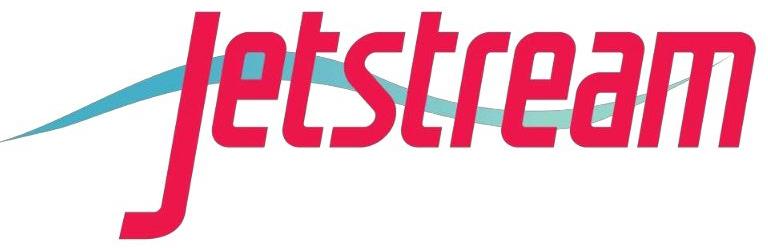
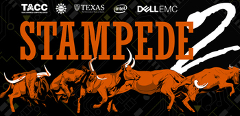
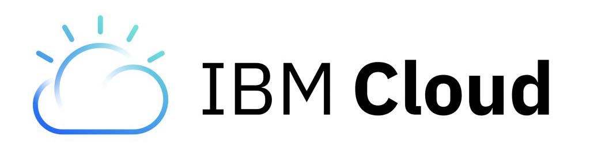
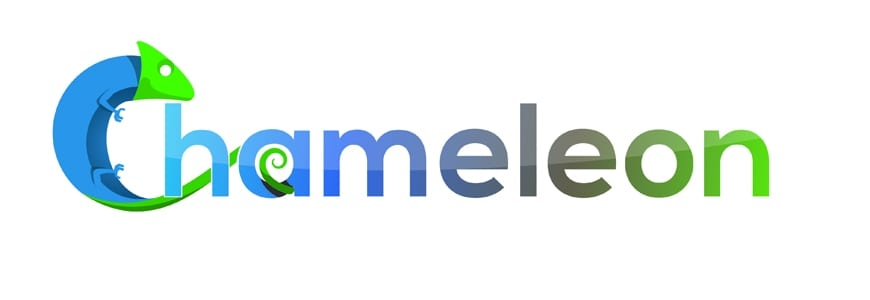

# TACC - Jetstream  

Resources: 
- 50,000 vCPU hours/40 VMs 
- public IP addresses 
- 50 TB Jetstream Storage

Storage: 
- VM block stoage only  

Locations:
- Bloomington, IN (Indiana University)Austin, TX (TACC)
- Tucson, AZ (University of Arizona)  

Links:
- [Website](https://www.tacc.utexas.edu/systems/jetstream)  
- [Compute](https://portal.xsede.org/jetstream#overview:specs-table1)  

# TACC - Stampede 2  

Resources: 
- 1,600 node hours 50 TB Archival Storage

Locations:
- Austin, TX (TACC)  

Links:
- [Website](https://www.tacc.utexas.edu/systems/stampede2)  
- [Compute](https://portal.tacc.utexas.edu/user-guides/stampede2#knl-compute-nodes)  
- [Storage](https://www.tacc.utexas.edu/systems/ranch)  

# IBM Cloud 

Resources:
-  Infinite Account

Locations:
- Dallas, TX &  Ashburn, VA (other smaller sites) 

Links:
- [Website](https://cloud.ibm.com/)  [Compute](https://www.ibm.com/cloud/compute)  
- [Storage](https://www.ibm.com/cloud/storage)  

# Chamaleon  

Resources:
- 20,000 Service Units 
  - 1 SU = 1 hour VM 128GB ram 
  - 2 SU = 1 hour storage node 32TB 
  - 50 SU = 1 hour 42 VM + 128TB storage

Storage:
- S3 Compatible Object Store (Ceph)  

Locations:
- Chicago, IL (U Chicago) 
- Austin, TX (TACC)  

Links:
- [Website](https://www.chameleoncloud.org/)  
- [Compute](https://www.chameleoncloud.org/hardware/)  

# CloudLab  

Resources:
- 15-20 Virtual Machine 2.4 Ghz 64bit ARMV8 64GIB 120GB root disk 100GiB ephemeral disk

Storage:
- VM block storage 

Locations: 
-  Salt Lake City, UT (University of Utah),  
- Madison, WI (University of Wisconsin-Madison),  
- Clemson, SC (Clemson) & smaller sites  

Links:
- [Website](https://cloudlab.us/)  
- [Compute](https://cloudlab.us/hardware.php)  

# CHPC  

Resources:
- 50TB to be expanded to 1PB 
- Virtual Machines

Locactions:
- Salt Lake City, UT (University of Utah)  

Links:
- 
[Website](https://chpc.utah.edu/) 

# CloudBank  

Resources:
- see "Non-competitive grant" for storage, VM, etc.

Locations:
- [AWS Regions](https://aws.amazon.com/about-aws/global-infrastructure/regions_az/)  

Links:
- [Website](https://www.cloudbank.org/)  
- [Compute](https://aws.amazon.com/products/compute/)  
- [Storage](https://aws.amazon.com/products/storage/)  

# Open Science Grid    

Resources:
- 148K Service Unit

Links:
- [Website](https://opensciencegrid.org/)      

# Open Storage Network     

Resources:
- 200 TB S3 compatible Object Storage

Storage:
- S3 Compatible Object Store (Ceph)  

Locations:
- San Diego, CA (SDSC)Urbana-Champaign, IL (NCSA)
- Holyoke, MA (MGHPCC)
- Chapel Hill, NC (RENCI)
- Baltimore, MD (JHU)  

Links:
- [Website](https://www.openstoragenetwork.org/)

<!--

TODO

CyVerse https://sci-visus.slite.com/app/channels/uKa9w4MB0C/notes/d4MaGkp6w		

Slate CI	Website	

SCI Server	https://sci-visus.slite.com/app/channels/uKa9w4MB0C/notes/d4MaGkp6w			
Virtual Data Colb	https://sci-visus.slite.com/app/channels/uKa9w4MB0C/notes/W0cuv7fr5M7kYp		

-->
